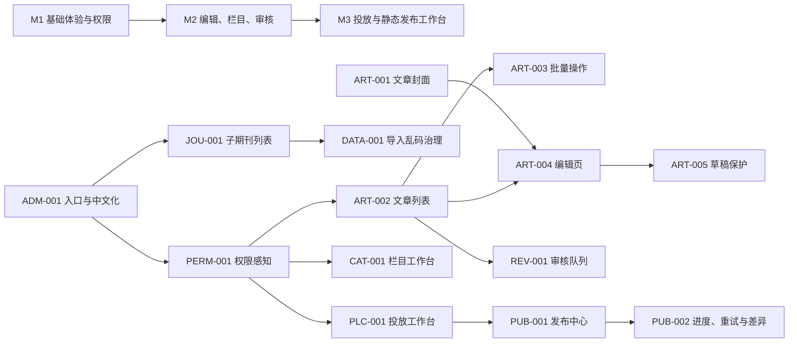

# AI Author Forum CMS 后台成熟度补齐开发任务书

> 文档状态：可直接进入开发
> 版本：V1.0
> 编制日期：2026-07-24
> 适用仓库：`E:\AI Author Forum\news-template`
> 目标版本：后台体验增强版（P0/P1）
> 参考依据：用户提供的 6 张成熟资讯 CMS 后台截图、当前 Wagtail 项目实测、`AGENTS.md`、核心业务设计与五人工作计划。

---

## 1. 文档目的

本任务书用于把当前项目从“业务闭环已具备”提升到“日常编辑、审核、运营和发布可高效使用”的成熟资讯 CMS 水平。开发人员可以按本文任务编号直接领取、实现、联调和验收，无需再二次拆解产品需求。

本文只补齐后台操作体验与运营效率，不改变项目既定架构：

- Wagtail 继续承担页面、版本、预览、审核、用户组、图片和文档能力。
- 子期刊继续使用统一 `Journal` 模型，不复制 120 套页面树。
- 审核通过与前台展示继续分离，展示必须经过 `ArticlePlacement`。
- 前台继续输出固定 HTML，不增加运行时文章查询。
- Search 继续是静态推荐页，不建设真实前台搜索系统。
- 版位只允许受控配置和同版位排序，不提供破坏模板结构的自由拖拽。
- 发布、导入、批量修改、重试、回滚等高风险动作必须审计。
- 静态页面引用的图片必须继续受删除保护。

---

## 2. 当前基线与总体结论

### 2.1 已具备的业务闭环

当前项目不是空壳，已具备以下核心能力：

1. 子期刊维护和批量导入。
2. 动态栏目树、移动、归档、重定向和影响预览。
3. 文章草稿、版本、预览、提交审核、批准、驳回和审核记录。
4. 审核状态与静态发布状态分离。
5. 通过 `ArticlePlacement` 完成版位投放。
6. 标题、摘要、图片覆盖，置顶、排序和有效期控制。
7. 固定 `LayoutSlot` 管理。
8. 全量或指定范围静态发布。
9. 逐页面结果、manifest、失败记录、重试、回滚和审计。
10. 图片引用保护。
11. 不同角色的后端权限隔离。
12. Nature 风格静态首页、期刊页和文章详情页。

截至 2026-07-24，当前数据库中有约 152 个子期刊、33 条导入静态文章、3 个正式 `ArticlePage`、17 个版位、6 条正式投放、10 个静态发布任务和 9 个 manifest。最近一次已核验的活动静态版本包含 163 个页面目标且无失败。

### 2.2 主要问题

当前差距主要不在“有没有功能”，而在以下四方面：

- **查找效率不足**：文章、子期刊、栏目和发布结果的搜索、筛选、分页、排序不足。
- **批量处理不足**：缺少行多选、受控批量操作和批量结果反馈。
- **界面组织不足**：编辑、栏目、投放、发布页面仍偏工程化，未形成高密度工作台。
- **权限感知不足**：部分无权用户仍能看到按钮，点击后才被拒绝。

因此本轮不重做 CMS，而是在现有服务、权限、审计和静态发布链路上增强管理端。

### 2.3 当前验证边界

- 已执行 `python manage.py check`，结果无系统检查问题。
- 已执行 18 个审核、投放、发布、重试、回滚、图片保护、权限和导入相关针对性测试，均通过。
- 尚未在本轮完整执行约 15 分钟的全量测试套件，后续开发不能引用“全量测试已通过”作为基线结论。
- 参考演示站当前无法稳定在线复核，本任务书以用户截图和本地项目实测为准。

---

## 3. 交付范围

### 3.1 P0：第一批必须完成

1. 合并重复静态发布入口。
2. 后台业务文案中文化与状态样式统一。
3. 修复“按钮可见但不可执行”的权限感知问题。
4. 增加文章默认封面图。
5. 升级文章列表的搜索、筛选、排序、操作列和批量操作。
6. 增加子期刊搜索、A-Z、状态筛选和分页。
7. 增加导入乱码检测并清理已确认的乱码数据。

### 3.2 P1：第二、三批完成

1. 重组文章编辑页和发布信息展示。
2. 增加离开提醒、草稿保护和快捷保存操作。
3. 升级栏目管理为左树右详情工作台。
4. 提升审核队列和版本差异查看效率。
5. 升级投放页面为受控投放工作台，支持同版位内联排序。
6. 产品化静态发布中心：实时进度、结果筛选、单页重试和版本差异。
7. 增加角色化后台首页。

### 3.3 本期明确不做

- 栏目自定义数据库字段生成器。
- 栏目独立分表。
- 120 套子期刊页面树或模板副本。
- 编辑人员自由拖拽前台布局。
- 任意模板选择和任意前端代码注入。
- 前台实时全文搜索。
- 评论系统和浏览量统计系统。
- 多语言后台、独立域名和更细粒度的单期刊管理员。

上一篇/下一篇、热门资讯侧栏、轮播图等前台能力进入 P2 待办，不作为本任务书的交付阻塞项。

---

## 4. 目标后台信息架构

后台一级业务入口建议统一为：

1. **工作台**
2. **文章管理**
   - 所有文章
   - 待审核
   - 投放同步异常
3. **栏目管理**
4. **子期刊管理**
   - 子期刊列表
   - 批量导入（仅有权限者显示）
5. **投放管理**
6. **版位管理**
7. **静态发布**
8. **栏目与导航**
9. **图片与文档**
10. **审计日志**
11. **角色权限预设**

菜单不得因同一功能同时注册 `MenuItem` 和 `ViewSet` 而出现两个入口。

---

## 5. 迭代与依赖关系



### 5.1 建议排期

| 里程碑 | 任务 | 理想人日 | 可上线条件 |
|---|---|---:|---|
| M1 | ADM-001、PERM-001、ART-001/002/003、JOU-001、DATA-001 | 10–14 | P0 验收全部通过 |
| M2 | ART-004/005、CAT-001、REV-001 | 8–12 | 编辑审核链路回归通过 |
| M3 | PLC-001、PUB-001/002、DASH-001 | 9–13 | 发布、回滚和静态验收通过 |

工期为理想开发人日，不含需求等待、外部环境故障和生产发布窗口。

---

# 6. 详细开发任务

## ADM-001：合并后台入口、中文化和状态视觉统一

- **优先级**：P0
- **负责人建议**：A
- **预估**：1–1.5 人日
- **依赖**：无

### 现状

`ai_author_forum/static_publish/wagtail_hooks.py` 同时注册了自定义“Static publishing”菜单和 `StaticPublishViewSet` 的“静态发布”菜单，造成重复入口。`templates/static_publish/center.html`、`job_detail.html` 仍有大量英文文案；部分模型 choices 和页面状态中英文混排。

### 实现要求

1. 静态发布只保留一个一级菜单，名称统一为“静态发布”。
2. 推荐保留 `register_admin_urls` 和直达发布中心的菜单；移除占位 `StaticPublishViewSet` 菜单注册，或设置 `add_to_admin_menu = False`。
3. 不删除原有 URL 名称，避免已有链接和测试失效。
4. 将自定义后台模板中的按钮、表头、空状态、错误提示、成功提示统一为中文。
5. 建立统一状态标签映射，至少覆盖：
   - 文章审核：草稿、待审核、已通过、已驳回。
   - 文章交付：待投放、已投放、已构建、已发布、已下线、失败。
   - 发布任务：排队中、执行中、部分失败、失败、成功、已回滚。
   - 导入任务：待确认、导入中、成功、部分失败、失败。
6. 状态颜色保持一致：成功绿色、处理中蓝色、警告橙色、失败红色、停用灰色。
7. 默认使用 Wagtail 组件和 CSS 变量，不复制一套独立后台设计系统。

### 主要改动文件

- `ai_author_forum/static_publish/wagtail_hooks.py`
- `ai_author_forum/static_publish/viewsets.py`
- `templates/static_publish/center.html`
- `templates/static_publish/job_detail.html`
- `templates/wagtailadmin/shared/` 下新增统一业务状态组件（如需要）
- 各业务模型 choices 或模板展示层

### 验收标准

- 同一账号登录后左侧只出现一个“静态发布”。
- 发布中心和任务详情无业务英文混排。
- 同一状态在文章列表、审核页、投放页和发布页使用相同中文与颜色。
- 菜单 URL、发布、重试和回滚接口保持兼容。

### 测试

- 新增菜单去重测试。
- 更新静态发布后台模板测试。
- 使用超级管理员和发布管理员各做一次菜单截图回归。

---

## PERM-001：权限感知菜单、按钮和操作列

- **优先级**：P0
- **负责人建议**：A
- **预估**：1.5–2 人日
- **依赖**：ADM-001

### 现状

后端权限校验有效，但部分页面只按模块访问权限展示按钮。例如内容管理员可看到“新增子期刊”和“批量导入”，点击后才收到无权限提示。

### 实现要求

1. 页面上下文必须提供细分权限标记，不得只使用 `access_*` 模块权限：
   - `can_add_journal`
   - `can_change_journal`
   - `can_import_journals`
   - `can_edit_article`
   - `can_review_article`
   - `can_manage_placement`
   - `can_publish_static`
   - `can_retry_publish`
   - `can_rollback_publish`
2. 模板按具体权限隐藏按钮、复选框、批量操作、操作列链接和危险操作。
3. 菜单 `is_shown()` 使用最小可执行权限；仅能浏览模块时可以显示列表，但不得显示新增、导入或修改按钮。
4. 后端 decorator、permission policy 和服务层权限检查全部保留，前端隐藏不能替代后端保护。
5. 超级管理员和项目总负责人始终具备完整入口。
6. 只读人员只能看到查看类入口，不显示保存、批量修改、导入、发布、重试和回滚按钮。

### 主要改动文件

- `ai_author_forum/site_settings/admin_views.py`
- `ai_author_forum/articles/wagtail_hooks.py`
- `ai_author_forum/articles/views.py`
- `ai_author_forum/journals/wagtail_hooks.py`
- `ai_author_forum/journals/viewsets.py`
- `ai_author_forum/placements/viewsets.py`
- `ai_author_forum/static_publish/views.py`
- 对应后台模板
- 角色种子和权限测试

### 角色验收矩阵

| 操作 | 内容管理员 | 审核人员 | 发布管理员 | 只读人员 | 超级管理员 |
|---|---:|---:|---:|---:|---:|
| 编辑文章 | 是 | 否/只读 | 否/只读 | 否 | 是 |
| 审核文章 | 否 | 是 | 否 | 否 | 是 |
| 新增/导入子期刊 | 按预设，默认否 | 否 | 否 | 否 | 是 |
| 管理投放 | 是 | 否 | 否/只读 | 否 | 是 |
| 发起静态发布 | 否 | 否 | 是 | 否 | 是 |
| 重试/回滚 | 否 | 否 | 是 | 否 | 是 |
| 查看审计 | 按预设 | 按预设 | 是 | 是 | 是 |

### 验收标准

- 无权按钮不出现，而不是点击后才报错。
- 手工请求无权 POST 接口仍返回 403。
- 四个本地测试角色的菜单和操作差异符合权限矩阵。
- 权限种子命令重复执行不产生重复组或权限。

---

## ART-001：文章默认封面图与图片引用保护

- **优先级**：P0
- **负责人建议**：C，A 审核迁移和权限
- **预估**：1.5–2 人日
- **依赖**：无

### 现状

正文支持图片块，投放支持 `override_image`，但 `ArticlePage` 没有文章自身默认封面，导致列表、推荐卡片和静态详情无法稳定取得统一缩略图。

### 数据模型

在 `ArticlePage` 增加：

```python
featured_image = models.ForeignKey(
    "images.CustomImage",
    null=True,
    blank=True,
    on_delete=models.PROTECT,
    related_name="+",
)
featured_image_alt = models.CharField(max_length=255, blank=True)
```

必须生成迁移。历史数据默认允许为空，不要求一次性补齐。

### 展示优先级

所有卡片和页面统一采用：

1. `ArticlePlacement.override_image`
2. `ArticlePage.featured_image`
3. `SiteSettings.default_image`
4. 固定占位图

图片替代文本采用：投放覆盖 alt（如后续增加）→ `featured_image_alt` → 图片 title → 文章标题。

### 实现要求

1. 编辑页增加“封面与摘要”区。
2. 文章列表显示 80×50 左右缩略图，空图使用占位符。
3. 静态生成上下文和前台卡片使用统一图片解析函数，禁止模板各自写不同 fallback。
4. `ai_author_forum/images/references.py` 增加 `article.featured_image` 引用检查。
5. 已被文章封面或活动静态版本引用的图片不可直接删除，并明确列出引用文章。
6. 导入字段暂不强制；若导入包提供图片映射则复用现有素材匹配流程。

### 主要改动文件

- `ai_author_forum/articles/models.py`
- `ai_author_forum/articles/migrations/`
- `ai_author_forum/articles/services.py` 或新增展示上下文 helper
- `ai_author_forum/images/references.py`
- `templates/articles/article_page.html`
- `templates/components/placements/article-card.html`
- 文章列表模板和相关测试

### 验收标准

- 可在 Wagtail 编辑页选择、替换和清空文章封面。
- 未设置投放覆盖图时，静态卡片使用文章封面。
- 删除被使用的封面图时被阻止，并显示引用来源。
- 空封面的历史文章仍可编辑、审核和生成静态页。

---

## ART-002：文章列表高级搜索、筛选、排序和操作列

- **优先级**：P0
- **负责人建议**：C
- **预估**：2–3 人日
- **依赖**：PERM-001、ART-001

### 目标页面

- `/admin/articles/`
- `/admin/articles/pending/` 或当前待审核列表 URL

### 查询参数

| 参数 | 含义 |
|---|---|
| `q` | 标题、摘要、正文、作者、关键词搜索 |
| `review_status` | 审核状态 |
| `publication_status` | 静态交付状态 |
| `article_type` | 文章类型 |
| `primary_journal` | 主属期刊 |
| `category` | 动态栏目 |
| `updated_from` / `updated_to` | 更新时间区间 |
| `ordering` | 白名单排序 |
| `p` | 页码 |

排序白名单：最近更新、最早更新、标题 A-Z、标题 Z-A、审核状态、交付状态。任何非白名单值回退到最近更新。

### 列表列定义

1. 多选框（有批量权限时显示）。
2. 封面和标题。
3. 主属期刊与栏目。
4. 文章类型。
5. 审核状态。
6. 静态交付状态。
7. 最近更新时间。
8. 最近编辑人或负责人（可取得时）。
9. 操作列。

### 单行操作

按权限显示：

- 编辑
- 查看审核/进入审核
- Wagtail 动态预览
- 静态页面预览（仅活动 manifest 中存在该路径时）
- 管理投放
- 查看版本历史

静态预览链接必须通过统一服务判断活动版本和路径是否存在，不能仅根据 `live=True` 猜测。

### 实现要求

1. 搜索优先使用 Wagtail 搜索 API；该能力仅用于后台，不改变“前台不做真实搜索”的约束。
2. 栏目筛选使用正式动态栏目关系，不能读取已退役的静态栏目字符串。
3. 所有筛选条件翻页时保留。
4. 使用 `select_related`、`prefetch_related`、`annotate` 避免每行额外查询。
5. 默认每页 25 条；允许 25/50/100，最大 100。
6. 空结果显示已应用的筛选条件和“清空筛选”。
7. 待审核页复用同一筛选组件，固定审核状态为待审核。

### 主要改动文件

- `ai_author_forum/articles/views.py`
- `ai_author_forum/articles/wagtail_hooks.py`
- `templates/wagtailadmin/articles/list.html`
- 可新增 `ai_author_forum/articles/filters.py`
- `ai_author_forum/articles/tests/test_articles.py`
- 新增后台列表测试文件（如需要）

### 验收标准

- 可按关键词、主属期刊、栏目、文章类型、审核状态、交付状态和日期组合筛选。
- 筛选后翻页和排序不丢参数。
- 操作列按权限正确显示。
- 查询数量不会随 25 行列表线性增长；测试中设置合理查询数上限。
- 输入非法排序、非法日期或不存在的 ID 不产生 500。

---

## ART-003：文章多选与受控批量操作

- **优先级**：P0
- **负责人建议**：C，A 审核权限和审计
- **预估**：2–3 人日
- **依赖**：ART-002、PERM-001

### 批量操作范围

首版支持：

1. 批量提交审核。
2. 批量设置主属期刊。
3. 批量增加动态栏目；不得静默清空已有栏目。
4. 批量设置文章类型。
5. 审核人员批量批准或驳回；必须填写审核意见并逐篇保存决定版本。

不支持从文章列表直接批量“发布到前台”。前台展示仍必须通过投放和静态发布中心。

### 接口要求

建议新增：

```text
POST /admin/articles/bulk-action/
```

请求包含 `article_ids[]`、`action`、动作参数、`comment`。一次最多处理 100 条。

### 服务层要求

1. 新增独立批量服务，不在 view 中堆积业务逻辑。
2. 禁止对审核状态直接使用 `QuerySet.update()`；必须逐篇调用现有提交、批准或驳回服务，以保留 revision 和审核记录。
3. 每篇返回成功或失败原因；部分失败不能只显示一个总错误。
4. 高风险动作写入：
   - 每篇现有业务记录。
   - 一条批次级 `AuditLog`，包含动作、选择数、成功数、失败数和对象 ID。
5. 防止用户修改无权限、已删除、状态已变化或 revision 已变化的文章。
6. 批量批准不等于投放，不创建未经确认的普通版位。

### 前端交互

- 表头支持选择当前页，不默认跨页全选。
- 选择后显示固定批量操作栏和已选数量。
- 危险操作二次确认。
- 操作结束显示逐项结果，可下载失败清单或复制失败原因。

### 验收标准

- 选择 1、25、100 条均可执行；超过 100 条被拒绝。
- 无权限用户看不到批量栏，直接 POST 返回 403。
- 批量批准后每篇都有审核记录和批准 revision。
- 部分失败时成功项提交、失败项保留并清晰反馈。
- AuditLog 可追溯操作者、时间、动作和对象集合。

---

## JOU-001：子期刊列表搜索、筛选、排序和分页

- **优先级**：P0
- **负责人建议**：B
- **预估**：1.5–2 人日
- **依赖**：PERM-001

### 现状

`templates/wagtailadmin/journals/index.html` 一次展示全部约 152 个子期刊，没有搜索、A-Z、状态筛选和分页；新增和导入按钮未完全按细分权限隐藏。

### 查询参数

- `q`：中文名、英文名、slug。
- `status`：启用、停用、归档等现有状态。
- `az`：A-Z 和 `#`。
- `ordering`：名称、A-Z、文章数、最近更新。
- `p`：页码。
- `per_page`：25/50/100。

### 实现要求

1. 列表默认每页 25 条。
2. 通过 annotate 计算正式文章数，避免逐行查询。
3. 顶部保留总数、启用数等指标，并增加当前筛选结果数。
4. “新增子期刊”“批量导入”“编辑资料”按细分权限显示。
5. 列表增加静态主页快捷入口；仅在活动 manifest 中存在时标识“已发布”。
6. slug 和 A-Z 异常数据在列表中使用警告图标提示。
7. 过滤结果为空时提供重置按钮。

### 主要改动文件

- `ai_author_forum/journals/viewsets.py`
- `ai_author_forum/journals/wagtail_hooks.py`
- `templates/wagtailadmin/journals/index.html`
- `ai_author_forum/journals/tests/test_admin_dashboard.py`

### 验收标准

- 152 个子期刊不再单页全部渲染。
- 搜索、A-Z、状态和排序可组合使用。
- 翻页保留筛选条件。
- 内容管理员不再看到无权的新增或导入按钮。

---

## DATA-001：导入编码、乱码检测与存量数据治理

- **优先级**：P0
- **负责人建议**：B，A 审核数据修复
- **预估**：1.5–2.5 人日
- **依赖**：JOU-001

### 现状

数据库中存在类似 `AI??????-????-001` 的历史导入文本。必须区分“源数据就是问号”和“文件解码错误”，不得用不可逆的猜测自动修复。

### 实现要求

1. 在导入预览阶段增加可疑文本检测：
   - Unicode replacement character `�`。
   - 连续多个 `?`。
   - 非法控制字符。
   - 明显的 UTF-8/GBK 错解码特征，仅作为警告，不自动转换。
2. 可疑内容必须在预览行中标红并阻止确认，除非超级管理员显式确认“按原文导入”；该强制确认写入审计。
3. CSV 文件支持明确编码策略：优先 UTF-8/UTF-8-SIG，必要时显式选择 GB18030；Excel 文件不做无意义的编码选择。
4. 错误报告增加字段名、原始值截断、错误类型和建议处理方式。
5. 新增只读审计命令，例如：

```text
python manage.py audit_imported_text --output output/suspicious-text.csv
```

6. 存量修复必须来自可信原始包或人工确认映射，不允许启发式批量覆写。
7. 实际修复命令默认 `--dry-run`，必须传 `--apply` 才写库，并生成备份和 `AuditLog`。

### 主要改动文件

- `ai_author_forum/journals/validators.py`
- `ai_author_forum/journals/services.py`
- `ai_author_forum/journals/forms.py`
- `ai_author_forum/journals/management/commands/`
- 导入预览模板和测试

### 验收标准

- 含 `�` 或连续问号的样例在预览阶段被识别。
- 正常中英文、标点和 AI 专有名词不被误拦截。
- dry-run 不修改数据库。
- apply 前有备份，执行后有审计和逐行结果。

---

## ART-004：文章编辑页信息架构重组

- **优先级**：P1
- **负责人建议**：C
- **预估**：2–3 人日
- **依赖**：ART-001、ADM-001

### 目标布局

使用 Wagtail 原生 `TabbedInterface`、`ObjectList`、`MultiFieldPanel` 和 action menu 扩展，不整体替换页面编辑器。

建议分区：

1. **正文内容**：标题、摘要、封面、作者、正文、关键词。
2. **归属与分类**：主属期刊、相关期刊、文章类型、动态栏目。
3. **审核与责任**：AI 合著人、AI 参与说明、责任说明、审核状态和审核记录入口。
4. **发布与 SEO**：slug、静态路径、Wagtail promote 信息。
5. **交付状态（只读）**：投放同步、构建版本、活动发布版本、失败原因、最近构建时间。

### 实现要求

1. 编辑人员首先看到内容字段，不被大量只读技术字段打断。
2. 交付状态以中文摘要卡片呈现，原始 request ID 等技术字段折叠到“诊断信息”。
3. 页面显著提示：“审核通过不等于前台发布，仍需投放并执行静态发布。”
4. 增加“保存草稿并返回列表”“保存后继续编辑”“保存并新建”快捷动作。
5. `RawHTMLBlock` 增加独立权限 `articles.use_raw_html`：
   - 默认编辑者不显示 Raw HTML 块。
   - 服务端再次验证，无权限者不能通过构造 POST 提交 Raw HTML。
6. RichText 保持受控 feature 列表，不开放任意样式和脚本。

### 验收标准

- 普通内容管理员完成新增文章时无需操作技术状态字段。
- 只读交付状态不允许表单篡改。
- 无 Raw HTML 权限的用户不能新增或保存 Raw HTML 块。
- 三种保存动作均保留 Wagtail revision 逻辑。

---

## ART-005：离开提醒、草稿保护和安全自动保存

- **优先级**：P1
- **负责人建议**：C
- **预估**：1.5–2.5 人日
- **依赖**：ART-004

### 实现要求

1. 表单变更后标记 dirty，关闭页面、刷新或跳转时提示未保存。
2. 每 30 秒把非敏感表单内容保存到浏览器本地草稿；成功正式保存后清除。
3. 若实现服务端自动保存，必须保存为 Wagtail revision，不能绕过表单校验、权限或审核状态；首版可只做本地草稿恢复。
4. 恢复草稿前展示保存时间和差异提示，不自动覆盖服务器版本。
5. 多标签页编辑同一文章时提示可能的版本冲突。
6. 正在提交审核或批准时禁用重复提交按钮。

### 验收标准

- 修改后直接离开会收到提示。
- 浏览器异常关闭后重新进入可选择恢复本地草稿。
- 正常保存后不再误报未保存。
- 本地草稿不得包含 CSRF token、上传文件二进制或用户密码等敏感信息。

---

## CAT-001：栏目管理升级为左树右详情工作台

- **优先级**：P1
- **负责人建议**：B/C 协作，A 审核权限与审计
- **预估**：3–4 人日
- **依赖**：PERM-001、ADM-001

### 页面结构

- 左侧：可搜索栏目树。
- 右侧：选中栏目的资料、状态、路径、文章数量、影响预览和操作。

### 左侧树要求

1. 名称搜索并自动展开命中路径。
2. 全部展开、全部折叠。
3. 显示启用/停用/归档状态和正式文章数量。
4. 支持快速新增根栏目或子栏目。
5. 支持上移、下移。
6. 支持受控拖动排序和移动；拖动只调用现有栏目服务，不直接改 parent/sort 字段。

### 右侧详情要求

1. 基本信息、slug、完整路径、状态。
2. 直接文章数、包含子栏目文章数。
3. 静态路径和重定向状态。
4. 移动、归档、改 slug 前先显示影响预览。
5. 可查看栏目变更审计。
6. 高风险动作要求确认并写入 AuditLog。

### 批量能力

- 批量创建同级子栏目。
- 批量启用、停用或归档。
- 不提供跨模板、跨站点的自由拖拽。

### 验收标准

- 100+ 栏目时仍可快速定位。
- 移动后栏目路径、文章关系、静态路径和重定向按现有服务正确同步。
- 无管理权限者只能查看树和详情。
- 每次移动、归档和路径变化均可在审计日志追溯。

---

## REV-001：审核队列、版本差异和决策信息增强

- **优先级**：P1
- **负责人建议**：C
- **预估**：2–3 人日
- **依赖**：ART-002、ART-004

### 实现要求

1. 待审核列表增加：提交时间、等待时长、主属期刊、栏目、提交人、当前 revision。
2. 支持按等待时长、期刊、文章类型和提交人筛选。
3. 审核详情将字段差异分为：内容、归属分类、责任声明、SEO/路径。
4. 正文 StreamField 差异以块级摘要展示；避免把整段 JSON 直接展示给审核人员。
5. 驳回意见必填；批准意见可选但推荐填写。
6. 页面明确显示批准后的下一步：“进入投放管理”，不得暗示已发布。
7. revision 在审核打开后发生变化时，提交决定必须被拒绝并提示刷新。
8. 审核操作保留 `ArticleReviewRecord`、Wagtail workflow 和 AuditLog 的一致性。

### 验收标准

- 审核人员可在一个页面完成预览、查看差异、批准或驳回。
- 决策针对明确 revision，不能误审新版本。
- 批准后文章状态为已通过，但没有投放时不出现在前台静态版位。

---

## PLC-001：受控投放工作台与同版位内联排序

- **优先级**：P1
- **负责人建议**：D
- **预估**：3–4 人日
- **依赖**：PERM-001、ART-001、REV-001

### 页面结构

1. 左区：可投放文章选择。
2. 中区：作用域、目标对象和固定版位选择。
3. 右区：标题/摘要/图片覆盖、置顶、排序、时间和实时预览。

### 实现要求

1. 文章选择只展示符合投放条件的正式 `ArticlePage`，默认排除草稿和驳回文章。
2. 版位选择展示：作用域、目标、`max_items`、当前启用数和剩余容量。
3. 保存前提示：
   - 容量超限。
   - 生效时间与失效时间错误。
   - 同文章同目标同版位重复。
   - 时间区间冲突。
4. 实时预览复用正式文章卡片组件和图片 fallback，不另写一套展示规则。
5. 同一“作用域 + 目标 + 版位”内支持拖动排序或上移/下移。
6. 排序只更新该版位内 `sort_order`；禁止把卡片拖到未授权版位，禁止改变模板结构。
7. 批量排序使用事务和行锁，避免并发产生重复顺序。
8. 每次新增、修改、停用、排序写入 AuditLog。

### 验收标准

- 运营人员能在同一页完成选文章、选版位、配置和预览。
- 超容量和时间冲突在保存前可见。
- 排序后静态生成顺序与后台预览一致。
- 没有投放权限的用户不可看到保存和拖动控件。

---

## PUB-001：静态发布中心产品化和唯一入口

- **优先级**：P1
- **负责人建议**：E，A 审核权限与审计
- **预估**：2–3 人日
- **依赖**：ADM-001、PERM-001

### 首页布局

1. 当前活动版本卡片。
2. 新建发布任务。
3. 最近任务列表。
4. 回滚入口。
5. 发布环境与输出目录健康状态。

### 实现要求

1. 发布范围中文化并解释：全站、指定路径、失败重试等。
2. 发起前展示预计目标数、影响路径类型和警告。
3. 发布和回滚按钮必须二次确认，回滚必须填写原因。
4. 最近任务支持状态、发起人、时间和范围筛选。
5. 列表显示成功/失败目标数、耗时、版本和是否为当前活动版本。
6. 对后台任务队列不可用、输出目录不可写、活动 manifest 缺失给出明确错误分类。
7. 所有任务继续走现有 Celery/服务层，不在请求线程执行全站生成。

### 验收标准

- 后台只有一个发布入口。
- 发布管理员能明确理解“生成完成”和“活动版本切换”的区别。
- 无发布权限者可按角色只读查看，但不能发起发布或回滚。
- 发布、重试、回滚均有 AuditLog。

---

## PUB-002：实时进度、逐页筛选、单页重试和版本差异

- **优先级**：P1
- **负责人建议**：E
- **预估**：3–4 人日
- **依赖**：PUB-001

### 实时进度

1. 新增只读任务状态 JSON 接口，前端每 2–5 秒轮询；本期不要求 WebSocket。
2. 返回总目标、等待、生成中、成功、失败、跳过、百分比、开始时间和耗时。
3. 任务完成或失败后停止轮询。

### 逐页结果

1. 任务详情的 targets 必须分页，默认 50 条。
2. 支持按状态、路径关键词、来源类型和错误分类筛选。
3. 错误分类至少包括：模板渲染、数据缺失、素材缺失、文件写入、校验失败、切流失败、未知错误。
4. 可复制错误详情，但页面默认展示摘要，避免超长 traceback 破坏布局。

### 单页重试

1. 允许勾选失败目标后重试，或单独重试一页。
2. 重试创建新的子任务，保留 `retry_of` 和目标路径；不得覆盖原任务记录。
3. 重试成功后仅在满足现有发布规则时进入新版本或补丁版本，不能静默修改活动目录。
4. 每页结果和重试操作写入审计。

### 版本差异

1. 回滚确认页比较“当前活动版本”和“目标版本”。
2. 基于 manifest 路径和 hash 展示新增、修改、删除、未变化数量。
3. 可展开查看路径列表；不要求展示完整 HTML 行级 diff。
4. 回滚后重新计算图片引用保护，以活动版本为准。

### 数据模型建议

如现有字段不足，可为 `StaticPublishTarget` 增加 `error_category`，为任务增加进度统计字段或通过 targets 聚合。模型变更必须带迁移；若用聚合，应为列表查询建立必要索引。

### 验收标准

- 163 个以上目标的任务详情不再一次性输出全部行。
- 任务执行时可看到持续更新的进度。
- 可筛出所有失败页并只重试选中目标。
- 回滚前能看到路径级版本差异摘要。
- 重试和回滚不破坏 manifest、活动版本和图片引用保护。

---

## DASH-001：角色化后台工作台

- **优先级**：P1
- **负责人建议**：A，各模块提供统计接口
- **预估**：1.5–2.5 人日
- **依赖**：M1、REV-001、PUB-001

### 展示内容

- 内容管理员：我的草稿、被驳回、待投放、最近编辑。
- 审核人员：待审核数、超时待审、最近审核。
- 站点运营：子期刊状态、栏目异常、版位容量或到期提醒。
- 发布管理员：最近发布、失败目标、当前活动版本、可回滚版本。
- 只读人员：只读摘要和审计入口。

### 实现要求

1. 卡片按权限显示，不查询用户无权访问的数据明细。
2. 所有数字可点击进入已带筛选参数的业务列表。
3. 避免首页进行大量逐对象查询；统计查询必须聚合并设置合理上限。
4. 工作台不替代业务列表，不新增第二套工作流状态。

### 验收标准

- 四类角色首页内容不同。
- 点击指标可直接进入对应待办列表。
- 工作台加载不因 152 个期刊或大量发布目标产生明显 N+1。

---

# 7. 公共技术规范

## 7.1 服务层边界

以下动作必须通过服务层，不允许模板或 view 直接修改核心字段：

- 审核状态变化。
- 栏目移动、归档和路径变化。
- 文章批量操作。
- 投放创建、停用和排序。
- 静态发布、重试、切流和回滚。
- 数据修复和乱码清理。

## 7.2 权限规范

每项能力至少有三层保护：

1. 菜单和按钮按权限显示。
2. view/endpoint 返回 403。
3. 服务层或模型方法防止绕过调用。

不得用“拥有模块访问权限”推导“拥有新增、导入、发布或回滚权限”。

## 7.3 审计规范

高风险 `AuditLog` 至少记录：

- `action`
- 操作者
- 对象类型与 ID
- 变更前后摘要
- 批次 ID 或 request ID
- 成功/失败
- 失败原因
- IP（可取得时）
- 时间

建议动作命名：

```text
article.bulk.submit
article.bulk.approve
article.bulk.reject
journal.import.override_suspicious_text
journal.data_repair
category.move
category.archive
placement.reorder
static_publish.start
static_publish.retry_targets
static_publish.rollback
```

## 7.4 列表和筛选规范

- 所有过滤参数使用 GET，可复制 URL。
- 所有排序字段使用白名单。
- 默认 25 行，最大 100 行。
- 翻页保留查询参数。
- 空结果提供重置。
- 查询使用 `select_related`、`prefetch_related` 和 annotate。
- 不把完整 152 个期刊和数百个发布目标一次性渲染。

## 7.5 危险操作规范

- 批量批准、批量驳回、数据修复、发布、重试、回滚必须二次确认。
- 回滚和批量驳回必须填写原因。
- 批量操作最多 100 个对象。
- 发布任务原始记录不可覆盖或删除。
- 失败项必须保留逐项结果。

## 7.6 前台与静态发布不变量

任何后台增强都必须继续满足：

1. 正式前台访问固定 HTML。
2. 静态发布具备逐页结果、manifest、失败、重试和回滚。
3. 审核通过不自动展示。
4. 未投放文章不进入受控版位。
5. 图片 fallback 和引用保护在动态预览与静态输出中一致。
6. 管理端排序不得改变固定模板结构。

---

# 8. 测试与验收计划

## 8.1 每个任务的最低检查

```powershell
python manage.py check
python manage.py makemigrations --check
python -m pytest <本任务相关测试路径>
```

涉及前端交互时增加：

```powershell
npx playwright test <相关 spec>
```

涉及静态输出时必须准备固定数据并验证静态服务器，不得只访问 Django 动态页面。

## 8.2 必须新增或扩展的测试域

| 测试域 | 核心断言 |
|---|---|
| 菜单 | 静态发布唯一入口；角色菜单不同 |
| 权限 UI | 无权按钮不渲染；直接 POST 仍 403 |
| 文章列表 | 组合筛选、排序白名单、分页保参、静态链接 |
| 批量文章 | 最大数量、部分失败、审核 revision、AuditLog |
| 封面图 | fallback 顺序、静态渲染、删除保护 |
| 子期刊列表 | 152 条分页、组合筛选、查询数 |
| 导入 | 正常中文、乱码样例、dry-run、apply 审计 |
| 编辑器 | Raw HTML 权限、保存动作、离开提醒 |
| 栏目 | 移动影响、重定向、审计、只读权限 |
| 投放 | 容量、时间冲突、同版位排序、静态顺序 |
| 发布 | 进度、targets 分页、单页重试、manifest diff |
| 回滚 | 活动版本切换、审计、图片引用重新计算 |

## 8.3 P0 验收场景

1. 内容管理员登录：能搜索、筛选、编辑和批量提交文章；看不到子期刊导入、发布和回滚按钮。
2. 审核人员登录：能筛选待审核文章并批准/驳回；不能编辑正文或发起静态发布。
3. 发布管理员登录：能看到唯一静态发布入口、发起任务、查看结果、重试和回滚。
4. 只读人员登录：可查看允许的列表和审计，不出现任何写操作。
5. 文章设置封面并投放后，静态卡片正确显示；删除该图片被引用保护阻止。
6. 子期刊列表在 152 条数据下分页正常。
7. 可疑乱码包在导入预览阶段被阻止。

## 8.4 P1 端到端验收场景

完整执行：

```text
内容管理员创建文章
→ 保存草稿
→ 提交审核
→ 审核人员查看版本差异并批准
→ 内容管理员/运营人员选择固定版位并投放
→ 发布管理员发起静态发布
→ 查看实时进度和逐页结果
→ 在独立静态服务器访问固定 HTML
→ 模拟单页失败并重试
→ 比较版本差异并回滚
→ 审计日志可追溯全部高风险动作
```

---

# 9. 发布、迁移与回滚要求

## 9.1 开发前

当前 `E:\AI Author Forum\news-template` 工作区已有大量未提交修改和未跟踪文件。开始开发时：

1. 不得执行 `git reset --hard`、`git clean` 或覆盖他人修改。
2. 先记录 `git status --short` 并明确本任务写入范围。
3. 模型迁移前备份 `db.sqlite3`。
4. 每个任务尽量使用独立提交，禁止把已有无关改动混入。

## 9.2 数据库迁移

涉及以下内容时必须迁移：

- `ArticlePage.featured_image`、`featured_image_alt`。
- 新增 Raw HTML 自定义权限（如通过模型 Meta 权限生成）。
- 发布目标错误分类或进度字段。
- 任何索引或状态字段调整。

迁移要求：

- 历史数据可向后兼容。
- 不在 schema migration 中执行高风险批量内容修复。
- 内容修复使用独立 management command，默认 dry-run。

## 9.3 上线顺序

1. 备份数据库和活动 `published/current`。
2. 部署代码与静态资源。
3. 执行迁移。
4. 执行 `check` 和针对性测试。
5. 超级管理员、内容管理员、审核人员、发布管理员、只读人员分别冒烟。
6. 执行一次指定路径静态发布。
7. 再执行全站静态发布。
8. 验证 manifest、活动版本、页面数量和图片引用。

## 9.4 回滚

- 代码回滚不得直接删除新字段或审计记录。
- 静态发布回滚使用现有 manifest/版本机制，不手工覆盖 `published/current`。
- 数据修复回滚依赖执行前备份和输出映射，不使用启发式逆转换。

---

# 10. 任务完成定义（Definition of Done）

每个任务只有同时满足以下条件才可标记完成：

1. 功能按任务验收标准实现。
2. 模型变化有迁移。
3. 权限控制覆盖 UI、接口和服务层。
4. 高风险操作有 AuditLog。
5. 自定义后台业务文案为中文。
6. 无新增自由模板或自由拖拽能力。
7. 不破坏审核、投放和静态发布分离。
8. 针对性测试通过。
9. `python manage.py check` 通过。
10. `makemigrations --check` 无遗漏。
11. 涉及静态输出时，固定 HTML 验收通过。
12. 更新相关操作文档或 README。

---

# 11. 开发领取清单

开发人员领取任务时，在提交说明中填写：

```text
任务编号：
负责人：
计划改动文件：
是否涉及模型迁移：是/否
新增或调整权限：
新增 AuditLog action：
依赖任务：
测试命令：
验收截图：
已知风险：
```

推荐首批直接开工顺序：

1. `ADM-001`
2. `PERM-001`
3. `ART-001` 与 `JOU-001` 并行
4. `ART-002`
5. `ART-003`
6. `DATA-001`
7. 完成 M1 联合验收后再进入 `ART-004`、`CAT-001`、`REV-001`
8. 最后实施 `PLC-001`、`PUB-001`、`PUB-002` 和 `DASH-001`

---

# 12. 最终验收结论标准

完成本任务书的 P0/P1 后，后台应达到以下成熟度：

- 编辑人员可以快速找到文章、批量处理内容并安全保存草稿。
- 审核人员可以基于明确 revision 高效查看差异和作出决定。
- 运营人员可以在受控版位中完成投放、容量检查、时间控制和排序。
- 发布人员可以看到实时进度、逐页结果、错误分类、重试和回滚差异。
- 152 个子期刊和后续 200 个规模下，列表仍具备可用的搜索、筛选和分页。
- 不同角色只看到能执行的菜单和按钮。
- 后台中文、状态和交互反馈统一。
- 所有增强继续服从“审核 → 投放 → 固定 HTML 发布”的业务闭环。

这代表项目达到成熟资讯 CMS 的后台操作水平，但仍保持 AI Author Forum 当前 Wagtail 架构、Nature 风格前台和静态发布技术口径，不照搬参考系统中与本项目冲突的通用 CMS 功能。
