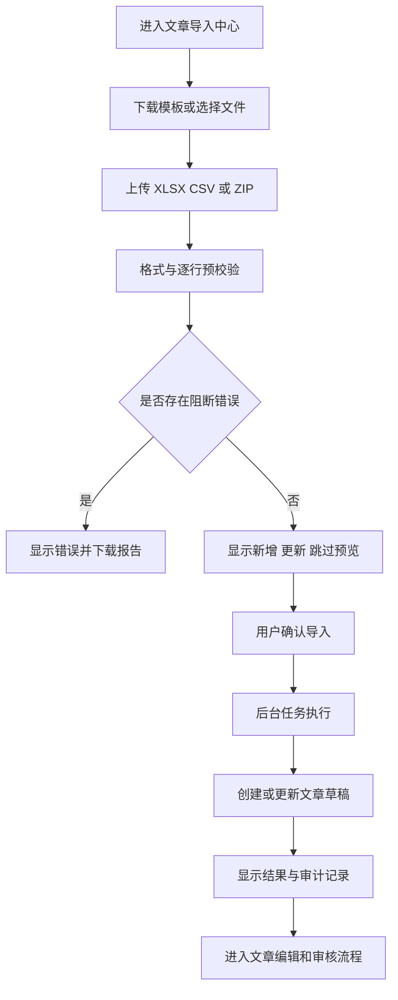

# AI Author Forum CMS：文章一键批量导入功能开发方案

> 文档状态：待评审
> 编制日期：2026-07-28
> 适用范围：`news-template` Wagtail 管理后台
> 功能归属：文章业务模块 `articles`，复用现有 `journals` 导入基础设施
> 负责人：项目总负责人 A 最终审定，文章模块负责人主实施，子期刊/权限/审计模块协同

---

## 1. 背景

当前项目已经具备以下基础能力：

- 全局 `journals/import/` 数据包导入中心；
- `articles.xlsx` / `articles.csv` 文章数据解析；
- `ArticleImportJob`、`ArticleImportRow` 逐行任务记录；
- 文章新增、按“子期刊 + slug”幂等更新、错误行隔离；
- HTML 正文、封面图、栏目关系导入；
- 导入内容同步为 canonical `ArticlePage`；
- 导入预览、确认、后台任务、错误报告和审计日志。

但是，当前产品入口仍属于“子期刊批量导入”，存在以下问题：

1. 文章管理页面没有“一键导入文章”按钮。
2. 子期刊工作台没有“导入本刊文章”按钮。
3. 文章导入与子期刊导入共用同一页面，用户难以理解操作对象。
4. 在某个子期刊上下文中导入时，仍要求每行填写 `journal_slug`，容易选错期刊。
5. 现有模板混入状态、版位、静态输出等字段，容易让运营误以为导入可以绕过审核、投放和静态发布。
6. 当前权限名为 `import_journals`，不能准确表达“允许导入文章”的权限边界。

本方案只解决**后台文章批量导入入口和文章导入闭环**，不改变“审核通过不等于上线”的核心业务规则。

---

## 2. 建设目标

### 2.1 P0 目标

建立两个文章专用入口，共用一套导入页面和服务：

1. **全局文章导入**
   - 入口：`内容生产 -> 文章管理 -> 一键导入文章`；
   - 可以在一个文件中导入多个子期刊的文章；
   - 每行必须明确 `journal_slug`，或在上传页选择统一的默认子期刊。

2. **本刊文章导入**
   - 入口：`子期刊运营 -> 子期刊工作台 -> 文章与审核 -> 导入本刊文章`；
   - 自动锁定当前子期刊；
   - 模板可以不填写 `journal_slug`；
   - 如果上传文件填写了其他子期刊，必须逐行拒绝，不能静默改写到当前期刊。

3. **统一安全流程**
   - 上传文件；
   - 预校验；
   - 逐行预览；
   - 人工确认；
   - 后台执行；
   - 查看结果和下载错误报告。

“一键导入”表示从一个专用入口完成批量处理，不表示绕过预校验、权限、审核或审计。

### 2.2 P1 目标

在 P0 稳定后补充：

- 导入任务独立列表和详情页；
- 失败行修正后仅重试失败行；
- 安全的导入撤销能力；
- 大文件分片或任务队列化；
- 导入模板版本兼容提示；
- 导入历史按子期刊、操作人、时间和状态筛选。

### 2.3 非目标

本期不实现：

- 导入即审核通过；
- 导入即创建正式前台投放；
- 导入即发布静态页面；
- 通过 Excel 自由修改前台模板；
- 真实搜索索引或运行时搜索；
- 从外部 URL 抓取文章；
- 自动创建不存在的子期刊或栏目；
- 多语言文章导入体系；
- 每个子期刊独立管理员权限模型。

---

## 3. 不可破坏的业务规则

1. 所有导入文章必须进入 `ArticlePage` 草稿状态。
2. Excel/CSV 中即使填写 `approved`、`published`，也不能获得正式审核状态。
3. 导入不能自动创建 `ArticlePlacement`。
4. 导入不能自动进入静态发布 manifest。
5. 文章必须完成：

```text
导入草稿 -> 编辑/复核 -> 提交审核 -> 审核通过 -> 配置投放 -> 静态发布
```

6. 全局导入必须验证文章所属子期刊存在。
7. 本刊导入必须锁定目标子期刊，不能通过文件内容越权写入其他子期刊。
8. 单行失败不能回滚其他正确行，但每一行必须有可追踪结果。
9. 重复导入以“目标子期刊 + slug”作为幂等键，预览时明确显示“新增”或“更新”。
10. 导入、强制按原文处理可疑文本、重试和撤销必须写入 `AuditLog`。
11. 已经被文章或静态页面引用的图片仍受素材引用检查保护。

---

## 4. 用户入口与交互方案

### 4.1 全局入口

页面：文章管理列表。

```text
管理后台
└─ 内容生产
   └─ 文章管理
      ├─ 新建文章
      └─ 一键导入文章
```

在文章列表页头部右侧增加按钮：

- 主按钮保留：`新建文章`；
- 次按钮新增：`一键导入文章`；
- 仅具有文章导入权限的用户可见。

建议按钮顺序：

```text
[新建文章] [一键导入文章]
```

目标地址：

```text
/admin/articles/import/
```

### 4.2 子期刊入口

在子期刊工作台“文章与审核”卡片增加按钮：

```text
[查看本刊文章] [导入本刊文章]
```

地址示例：

```text
/admin/articles/import/?journal=153
```

同时，当文章列表通过 `?primary_journal=<id>` 进入本刊上下文时，在“正在处理子期刊”区域增加：

```text
[返回子期刊工作台] [导入本刊文章] [管理本刊投放]
```

### 4.3 导入页面

页面标题：`文章批量导入中心`。

全局模式显示：

- 当前范围：全局文章；
- 文件上传；
- 默认子期刊，可选；
- 下载“全局文章导入模板”；
- 最近文章导入任务。

本刊模式显示：

- 当前范围：某某子期刊；
- 锁定的子期刊名称、slug；
- 文件上传；
- 下载“本刊文章导入模板”；
- 返回子期刊工作台；
- 最近本刊文章导入任务。

### 4.4 操作步骤



页面必须明确提示：

> 导入文章统一进入草稿状态，不会自动审核、投放或发布到前台。

---

## 5. 文件格式与模板设计

### 5.1 支持格式

P0 支持：

- 单个 `.xlsx`；
- 单个 `.csv`；
- `.zip` 数据包，包含文章表、HTML 和图片素材。

ZIP 推荐结构：

```text
article-import-package.zip
  articles.xlsx
  html/
    article-a.html
    article-b.html
  media/
    cover-a.jpg
    figure-a.png
  README.txt
```

为兼容现有导入引擎，后台收到单个 XLSX/CSV 时，可以在内存或受控临时目录中包装成标准文章 ZIP，再进入统一解析流程。

### 5.2 P0 字段

#### 必填字段

| 字段 | 全局导入 | 本刊导入 | 说明 |
|---|---:|---:|---|
| `journal_slug` | 是，选择默认期刊时可空 | 可省略 | 文章主属子期刊 |
| `title` | 是 | 是 | 文章标题 |
| `slug` | 是 | 是 | 同一期刊内唯一 |
| `article_type` | 是 | 是 | 受控文章类型 |
| `authors` | 是 | 是 | 作者名称 |
| `body_html` / `html_file` | 二选一 | 二选一 | 正文 HTML 或 ZIP 内 HTML 路径 |

#### 可选字段

| 字段 | 说明 |
|---|---|
| `ai_co_authors` | AI 合著者 |
| `abstract` | 摘要 |
| `keywords` | 关键词 |
| `publication_date` | 内容标注日期，不代表上线时间 |
| `cover_image` | ZIP 内图片路径或受控素材引用 |
| `primary_category_code` | 已存在的主栏目编码 |
| `primary_category_path` | 已存在的主栏目路径 |
| `related_category_codes` | 相关文章栏目编码，英文分号分隔 |
| `related_category_paths` | 相关文章栏目路径，英文分号分隔 |
| `notes` | 导入备注 |

### 5.3 不应在文章导入模板中出现的字段

文章专用模板不提供以下字段：

- `status`；
- `main_site_slot*`；
- `journal_slot*`；
- `is_pinned`；
- `static_output_path`；
- `build_version`；
- 任何直接发布或直接投放字段。

这些字段容易破坏“审核、投放、静态发布相互分离”的业务边界。

### 5.4 模板版本

模板增加元信息工作表或隐藏字段：

```text
template_type=article_import
template_version=1
scope=global|journal
journal_slug=<本刊模式时填写>
```

服务端必须校验模板类型和版本。未知高版本应拒绝，并提示下载最新模板；低版本可以进入兼容映射，但要显示警告。

---

## 6. 数据校验规则

### 6.1 文件级校验

- 文件扩展名和 MIME 类型一致；
- 限制压缩包大小和解压后总大小；
- 限制 ZIP 文件数量；
- 拒绝绝对路径、`..` 路径穿越和符号链接；
- Excel 只读取指定工作表和合理行数；
- CSV 默认只接受 UTF-8/UTF-8-SIG，可显式选择 GB18030；
- 记录源文件 SHA-256，避免误重复提交；
- 拒绝包含 `journals.xlsx` 的文章专用导入包，防止借文章入口修改子期刊配置。

### 6.2 行级校验

- 标题非空且长度符合模型约束；
- slug 格式合法；
- `article_type` 属于受控枚举；
- 作者非空；
- 正文来源至少存在一个；
- HTML 文件必须位于当前 ZIP 安全目录内；
- 封面图存在且格式、尺寸、大小合法；
- 子期刊必须存在且处于允许录入内容的状态；
- 栏目必须存在、属于文章主属子期刊，且状态允许使用；
- 主栏目最多一个；
- 相关栏目不能重复；
- 可疑乱码和异常字符必须进入报告；
- 不允许通过公式单元格、外部链接或宏执行内容。

### 6.3 本刊范围校验

本刊模式传入 `target_journal` 后：

- `journal_slug` 为空：服务端注入当前子期刊 slug；
- `journal_slug` 与当前子期刊一致：允许；
- `journal_slug` 指向其他子期刊：该行失败，错误码为 `ARTICLE_JOURNAL_SCOPE_MISMATCH`；
- 不得静默改写不一致的 slug，避免运营误把文章导入错误期刊。

### 6.4 HTML 安全校验

导入 HTML 必须经过统一安全处理：

- 拒绝 `<script>`、可执行内联事件和危险 URL scheme；
- 对 iframe、object、embed 等元素采用明确白名单；
- 外部图片不能未经下载、校验和素材登记直接写入正文；
- 保留业务允许的标题、段落、列表、表格、引用、图片等结构；
- 原始 HTML 和清洗后的 HTML 均应具备可追踪性；
- 超级管理员强制保留可疑内容时必须填写理由并写审计。

---

## 7. 权限方案

### 7.1 新增权限

建议在 `AdminRolePreset.Meta.permissions` 中新增：

```python
("import_articles", "Can import articles")
```

权限字符串：

```text
site_settings.import_articles
```

文章导入的后端入口至少同时要求：

```text
wagtailadmin.access_admin
site_settings.access_articles
site_settings.import_articles
articles.edit_article
```

如果底层创建新页面还需要 Wagtail 页面新增权限，应在服务层显式验证目标页面树权限，不依赖按钮隐藏。

### 7.2 角色矩阵

| 角色 | 全局导入文章 | 导入本刊文章 | 强制处理可疑文本 | 导入后发布 |
|---|---:|---:|---:|---:|
| 项目总负责人 | 是 | 是 | 是 | 否，仍走正式流程 |
| 超级管理员 | 是 | 是 | 是 | 否，仍走正式流程 |
| 内容管理员 | 是 | 是 | 否 | 否 |
| 审核人员 | 否 | 否 | 否 | 否 |
| 站点运营 | 默认否 | 默认否 | 否 | 否 |
| 发布管理员 | 否 | 否 | 否 | 否 |
| 只读人员 | 否 | 否 | 否 | 否 |

如后续确实需要站点运营导入文章，应通过单独授权 `import_articles` 开放，不能复用 `import_journals`。

### 7.3 可见性与后端校验

- 无权限时不显示“一键导入文章”和“导入本刊文章”；
- 用户直接访问 URL 时返回 403；
- 任务确认、状态查询、错误报告下载和重试都必须重复校验权限；
- 普通导入人员只能查看自己创建的任务；项目总负责人和超级管理员可查看全部；
- 本刊模式的任务不得通过修改 query string 切换目标子期刊。

---

## 8. 技术架构方案

### 8.1 模块职责

```text
articles/
  import_forms.py       上传、确认和筛选表单
  import_views.py       文章导入页面、确认、状态、报告
  import_services.py    文章专用编排和范围校验
  import_templates.py   文章专用 Excel/ZIP 模板
  import_permissions.py 权限判断，可并入现有权限服务
  tests/
    test_import_views.py
    test_import_services.py

journals/
  models.py             P0 暂时保留 ArticleImportJob/Row/StaticArticle
  services.py           保留兼容入口，逐步拆出文章导入实现

site_settings/
  models.py             import_articles 权限
  services.py           AuditLog 写入
```

### 8.2 P0 最小改造原则

当前文章导入数据模型位于 `journals`，已有历史数据、迁移和测试。P0 不直接搬迁模型，避免产生高风险表迁移。

P0 实现方式：

1. `articles` 新增专用视图、表单、模板和服务门面；
2. 复用现有 `ArticleImportJob`、`ArticleImportRow`；
3. 抽取或扩展现有文章导入函数，使其支持：
   - 文章专用文件；
   - `target_journal`；
   - 默认子期刊；
   - 文章专用模板字段；
4. 原 `/admin/journals/import/` 保持兼容，不立即删除；
5. 新入口不允许导入 `journals.xlsx`；
6. 后续再评估是否把文章导入模型迁到 `articles`。

### 8.3 建议服务接口

```python
@dataclass(frozen=True)
class ArticleImportContext:
    scope: Literal["global", "journal"]
    target_journal_id: int | None = None
    default_journal_id: int | None = None
    csv_encoding: str = "auto"


def preview_article_import(
    source_file,
    *,
    context: ArticleImportContext,
    operator,
) -> ArticleImportJob:
    ...


def confirm_article_import(
    preview_job: ArticleImportJob,
    *,
    operator,
    allow_suspicious_text: bool = False,
    override_reason: str = "",
) -> ArticleImportJob:
    ...


def retry_failed_article_rows(job: ArticleImportJob, *, operator) -> ArticleImportJob:
    ...
```

底层行导入接口增加受控范围参数：

```python
def import_article_rows(
    job,
    rows,
    *,
    target_journal=None,
    default_journal=None,
    dry_run=False,
    ...,
):
    ...
```

### 8.4 URL 设计

建议注册到现有 `article_admin` ViewSet：

| URL | 名称 | 用途 |
|---|---|---|
| `/admin/articles/import/` | `article_admin:import` | 上传和预览 |
| `/admin/articles/import/confirm/` | `article_admin:import_confirm` | 确认导入 |
| `/admin/articles/import/status/` | `article_admin:import_status` | 查询任务状态 |
| `/admin/articles/import/template/` | `article_admin:import_template` | 下载模板 |
| `/admin/articles/import/errors/<id>/` | `article_admin:import_errors` | 下载错误报告 |
| `/admin/articles/import/jobs/` | `article_admin:import_jobs` | P1 任务列表 |
| `/admin/articles/import/jobs/<id>/retry/` | `article_admin:import_retry` | P1 重试失败行 |

### 8.5 后台任务

P0 可以继续复用现有独立管理命令进程，但命令名称应逐步从通用期刊包导入中拆出：

```text
python manage.py import_article_package \
  --package <path> \
  --operator-id <id> \
  --preview-job-id <id> \
  --target-journal-id <id>
```

要求：

- Windows 启动后台进程时继续使用隐藏窗口；
- 任务输入文件必须保存在受控队列目录；
- 子进程只接收经过校验的绝对路径；
- 任务终态必须为 `completed` 或 `failed`；
- 异常必须回写任务和审计日志；
- 后续可切换 Celery/RQ，但 P0 不强制引入新中间件。

---

## 9. 数据模型调整

### 9.1 `ArticleImportJob` 建议新增字段

| 字段 | 类型 | 说明 |
|---|---|---|
| `import_scope` | choices | `global` / `journal` |
| `target_journal` | FK nullable | 本刊导入时锁定目标 |
| `source_sha256` | CharField(64) | 源文件指纹 |
| `template_version` | PositiveIntegerField | 模板版本 |
| `confirmed_at` | DateTime nullable | 确认执行时间 |
| `confirmed_by` | FK nullable | 确认人 |

如 P0 需要严格控制改动规模，也可以先把非查询字段存入 `summary`；但 `target_journal`、`import_scope` 建议使用正式字段，便于权限过滤和历史查询。

### 9.2 `ArticleImportRow` 建议增强

建议增加或确保结果中包含：

- `action`：create / update / skip / fail；
- `article_page_id`；
- `error_code`；
- `error_field`；
- `raw_data`；
- `normalized_data`；
- `before_snapshot`，P1 撤销使用；
- `after_snapshot`，P1 审计和差异展示使用。

P0 可以继续将部分结构写入 JSON，避免一次增加过多数据库列。

### 9.3 数据迁移

需要生成 Django migration：

1. 新增 `site_settings.import_articles` 权限；
2. 增加 `ArticleImportJob` 范围字段；
3. 数据迁移：历史 `ArticleImportJob.import_scope` 设为 `global`；
4. 更新 `seed_roles`，给项目总负责人、超级管理员、内容管理员授予新权限；
5. 不自动把 `import_journals` 映射为 `import_articles`，防止权限扩大。

---

## 10. 导入处理流程

### 10.1 预览阶段

预览阶段必须：

- 创建导入任务和逐行记录；
- 解析、标准化和校验数据；
- 计算新增、更新、跳过和失败数量；
- 检查可疑文本和危险 HTML；
- 验证子期刊、栏目和素材引用；
- 不写入 `StaticArticle`、`ArticlePage`、栏目分配或投放数据；
- 输出错误报告。

### 10.2 确认阶段

确认前验证：

- 任务属于当前用户或用户是全局管理员；
- 任务仍处于可确认状态；
- 任务没有被重复确认；
- 文件哈希和预览时一致；
- 当前用户仍有导入权限；
- 本刊目标仍存在且未改变；
- 可疑文本已按权限处理。

### 10.3 写入阶段

每行使用独立事务：

1. 解析目标子期刊；
2. 根据“子期刊 + slug”查找已有导入文章；
3. 写入或更新 `StaticArticle`；
4. 保存 HTML 原始文件；
5. 更新栏目分配；
6. 调用 `sync_imported_article()` 同步 canonical `ArticlePage`；
7. 强制：
   - `review_status=draft`；
   - `live=False`；
   - `publication_status=""`；
   - 不创建 `ArticlePlacement`；
8. 保存 Wagtail revision；
9. 写入行结果。

单行失败时回滚该行事务，继续处理后续行。

### 10.4 重复数据策略

P0 固定使用幂等更新策略：

```text
唯一业务键 = primary_journal + slug
```

预览必须显示：

- 新增；
- 更新；
- 跳过空行；
- 失败及原因。

不允许仅按标题匹配，避免同名文章误覆盖。

---

## 11. 审计与可追踪性

至少记录以下审计事件：

| 事件 | 状态 | 关键元数据 |
|---|---|---|
| 上传并预览 | started/success/failure | scope、journal、文件名、SHA-256、总行数 |
| 确认导入 | started | preview job、确认人 |
| 导入完成 | success/failure | 新增、更新、跳过、失败 |
| 强制保留可疑文本 | success | 理由、涉及行数 |
| 重试失败行 | started/success/failure | 原任务、新任务、行号 |
| 撤销导入 | started/success/failure | 被撤销文章、阻断原因 |

审计日志不能记录完整正文或敏感文件内容，但要记录足以定位源文件和任务的信息。

---

## 12. UI 状态与错误提示

### 12.1 预览指标

页面顶部展示：

```text
总行数 | 新增 | 更新 | 跳过 | 失败 | 可疑文本
```

### 12.2 逐行信息

每行至少展示：

- Excel 行号；
- 文章标题；
- slug；
- 目标子期刊；
- 动作；
- 状态；
- 错误字段；
- 错误信息；
- 修正建议。

### 12.3 常见错误码

| 错误码 | 含义 |
|---|---|
| `ARTICLE_REQUIRED_FIELD_MISSING` | 缺少必填字段 |
| `ARTICLE_JOURNAL_NOT_FOUND` | 子期刊不存在 |
| `ARTICLE_JOURNAL_SCOPE_MISMATCH` | 本刊导入文件引用其他子期刊 |
| `ARTICLE_SLUG_INVALID` | slug 不合法 |
| `ARTICLE_TYPE_INVALID` | 文章类型不合法 |
| `ARTICLE_BODY_MISSING` | 未提供正文 |
| `ARTICLE_HTML_UNSAFE` | HTML 包含危险内容 |
| `ARTICLE_HTML_FILE_NOT_FOUND` | HTML 文件不存在 |
| `ARTICLE_COVER_IMAGE_NOT_FOUND` | 封面图不存在 |
| `ARTICLE_CATEGORY_INVALID` | 栏目不存在或不属于主属期刊 |
| `ARTICLE_TEXT_SUSPICIOUS` | 检测到可疑乱码或异常文本 |
| `ARTICLE_DUPLICATE_IN_FILE` | 同一文件内重复业务键 |

错误信息必须面向运营人员，不只显示 Python 异常。

---

## 13. 测试方案

### 13.1 单元测试

- XLSX、CSV、ZIP 格式识别；
- 全局模式 `journal_slug` 校验；
- 默认子期刊注入；
- 本刊模式自动注入当前期刊；
- 本刊模式跨期刊行被拒绝；
- 新增与幂等更新；
- 文件内重复 slug；
- 未知文章类型；
- 缺失正文；
- HTML 路径穿越；
- 危险 HTML；
- 缺失封面图；
- 主栏目和相关栏目校验；
- 可疑文本阻断；
- 导入后强制草稿；
- 不创建投放；
- 不进入静态发布目标；
- 单行失败不影响其他行；
- 预览阶段不写业务数据。

### 13.2 权限测试

覆盖全部标准角色：

- 按钮是否显示；
- URL 是否允许访问；
- 是否可以确认任务；
- 是否可以查看其他人的任务；
- 是否可以下载错误报告；
- 是否可以强制处理可疑文本；
- 修改 query string 是否能越权切换子期刊。

### 13.3 集成测试

- 从文章列表进入全局导入；
- 从子期刊工作台进入本刊导入；
- 从本刊文章筛选上下文进入导入；
- 上传、预览、确认、后台处理和状态轮询；
- 导入后文章出现在正确的文章列表；
- 导入文章可以正常编辑、提交审核；
- 审核通过但未投放时不出现在静态站点；
- 投放并静态发布后才生成前台 HTML。

### 13.4 容量测试

至少覆盖：

- 100 篇单刊导入；
- 1,000 篇全局导入；
- 12,000 篇回归容量；
- 15,000 篇上限通道验证；
- 大量错误行的报告生成；
- 大量 HTML 和图片素材的数据包解压限制。

记录：

- 解析时间；
- 预览时间；
- 写入时间；
- 内存峰值；
- 数据库查询数量；
- 错误报告大小；
- 任务恢复情况。

### 13.5 回归命令

```powershell
.\.venv\Scripts\python.exe manage.py makemigrations --check --dry-run
.\.venv\Scripts\python.exe manage.py check
.\.venv\Scripts\python.exe -m pytest ai_author_forum/articles/tests -q
.\.venv\Scripts\python.exe -m pytest ai_author_forum/journals/tests/test_admin_dashboard.py -q
.\.venv\Scripts\python.exe -m pytest ai_author_forum/site_settings/tests -q
.\.venv\Scripts\ruff.exe check ai_author_forum/articles ai_author_forum/journals ai_author_forum/site_settings
.\.venv\Scripts\black.exe --check ai_author_forum/articles ai_author_forum/journals ai_author_forum/site_settings
.\.venv\Scripts\isort.exe --check-only ai_author_forum/articles ai_author_forum/journals ai_author_forum/site_settings
```

---

## 14. 开发任务拆分

### 阶段 1：权限和路由底座

- 新增 `site_settings.import_articles`；
- 更新角色初始化命令；
- 在 `article_admin` 注册导入 URL；
- 建立权限辅助函数；
- 增加权限测试。

### 阶段 2：文章专用入口和页面

- 文章列表页增加“一键导入文章”；
- 子期刊工作台增加“导入本刊文章”；
- 本刊文章上下文增加导入按钮；
- 建立文章导入中心页面；
- 建立全局/本刊两种模板下载。

### 阶段 3：服务改造

- 增加文章专用文件适配器；
- 增加 `target_journal` 和 `default_journal`；
- 拒绝文章入口中的子期刊配置文件；
- 收口文章专用字段；
- 强制草稿且禁止自动投放、发布；
- 增强错误码和 HTML 安全校验。

### 阶段 4：后台任务和审计

- 新增或改造文章导入管理命令；
- 记录源文件哈希；
- 增加确认人、目标子期刊和任务范围；
- 完成 started/success/failure 审计；
- 完成状态轮询和错误报告。

### 阶段 5：测试与验收

- 单元测试；
- 权限矩阵测试；
- 管理后台集成测试；
- Playwright 桌面端和移动端截图；
- 100/1,000/12,000/15,000 篇容量验证；
- 文档和运营模板收口。

---

## 15. 预计改动文件

```text
ai_author_forum/articles/
  import_forms.py                         新增
  import_views.py                         新增
  import_services.py                      新增
  import_templates.py                     新增
  viewsets.py                             修改：注册 URL
  views.py                                修改：文章列表上下文
  tests/test_import_views.py              新增
  tests/test_import_services.py           新增
  tests/test_admin_journal_context.py     修改

ai_author_forum/journals/
  models.py                               修改：导入任务范围字段
  services.py                             修改：目标期刊和文章专用适配
  viewsets.py                             修改：本刊导入入口
  tests/test_admin_workspace.py           修改
  migrations/                             新增迁移

ai_author_forum/site_settings/
  models.py                               修改：import_articles 权限
  permissions.py                          修改：can_import_articles
  management/commands/seed_roles.py       修改：角色授权
  tests/test_permissions_dashboard.py     修改
  migrations/                             新增迁移

templates/wagtailadmin/articles/
  list.html                               修改：全局/本刊导入按钮
  import_dashboard.html                   新增

templates/wagtailadmin/journals/
  workspace.html                          修改：导入本刊文章按钮

docs/
  article-import-operations.zh-CN.md       新增运营说明
```

实际开发时应先检查未提交改动，避免覆盖其他成员正在修改的文件。

---

## 16. 验收标准

### 16.1 全局入口

- 具有权限的用户在文章管理页看到“一键导入文章”；
- 无权限用户看不到按钮，直接访问 URL 返回 403；
- 支持 XLSX、CSV 和 ZIP；
- 可以一次导入多个子期刊的文章；
- 未填写或填写错误 `journal_slug` 时给出逐行错误。

### 16.2 本刊入口

- 子期刊工作台显示“导入本刊文章”；
- 页面明确显示并锁定当前子期刊；
- 本刊模板无需重复填写 `journal_slug`；
- 文件指定其他子期刊时逐行拒绝；
- 导入完成后文章出现在本刊文章列表。

### 16.3 安全与业务闭环

- 预览阶段不写入业务数据；
- 导入文章全部为草稿；
- 不因 Excel 状态字段获得审核通过；
- 不自动创建投放；
- 不自动触发静态发布；
- 错误行不影响正确行；
- 重复导入不产生重复文章；
- 导入全过程有任务记录和审计日志；
- 危险 HTML、路径穿越和越权期刊写入被阻止；
- 图片引用进入现有素材引用检查范围。

### 16.4 UI 验收

- 桌面端按钮位置清晰；
- 移动端按钮不溢出；
- 全局模式和本刊模式视觉上可明确区分；
- 预览表格支持大量行浏览；
- 错误报告可以下载；
- 任务执行中有状态提示，完成后不需要猜测是否成功。

---

## 17. 发布和回退方案

### 17.1 发布顺序

1. 备份数据库；
2. 部署模型与权限迁移；
3. 执行 `seed_roles` 更新标准角色；
4. 部署后端服务和 URL；
5. 部署后台模板和静态资源；
6. 执行系统检查和针对性测试；
7. 使用 5 篇测试包验收；
8. 使用 100 篇本刊包验收；
9. 再开放给内容管理员。

### 17.2 功能回退

- 文章导入按钮可以通过权限或 feature flag 暂时隐藏；
- 新入口关闭后，不影响文章手工编辑、审核、投放和静态发布；
- 原 `/admin/journals/import/` 在兼容期内保留；
- 数据库迁移只新增字段和权限，不删除历史任务；
- 已完成导入的文章仍保留为正常草稿，不随 UI 回退删除。

---

## 18. 风险与应对

| 风险 | 影响 | 应对 |
|---|---|---|
| 文章入口继续复用 journals 模型 | 模块边界不够理想 | P0 保持兼容，P1 再迁移，禁止重复建第二套导入模型 |
| Excel 状态字段被误认为可直接发布 | 绕过审核预期 | 文章专用模板移除状态和投放字段，服务端强制草稿 |
| 本刊导入写入其他期刊 | 数据越权 | target_journal 服务端锁定并逐行校验 |
| HTML 携带危险内容 | 后台或静态页安全风险 | HTML 白名单、危险属性和 URL scheme 拦截 |
| 超大 ZIP 导致磁盘或内存异常 | 服务不可用 | 文件、解压大小、文件数和行数限制 |
| 重复确认同一任务 | 重复写入或状态混乱 | 状态机、确认时间、数据库锁和幂等键 |
| 大批量同步处理超时 | 页面无响应 | 后台任务执行，页面轮询状态 |
| 更新已有文章覆盖人工修改 | 内容丢失 | 预览明确标记更新；P1 增加字段级差异和更新策略 |
| 权限继续复用 import_journals | 文章权限扩大 | 新增 import_articles，角色显式授权 |

---

## 19. 推荐实施优先级

### P0：必须上线

- 文章管理页“一键导入文章”；
- 子期刊工作台“导入本刊文章”；
- 文章专用 XLSX/CSV/ZIP；
- 全局/本刊范围校验；
- 预览、确认、后台任务、错误报告；
- 独立文章导入权限；
- 强制草稿；
- 禁止自动投放和发布；
- 审计日志；
- 单元、权限和集成测试。

### P1：上线后增强

- 任务历史中心；
- 失败行重试；
- 字段级更新差异；
- 安全撤销；
- 模板版本迁移；
- Celery/RQ 队列；
- 更完整容量监控。

---

## 20. 最终产品口径

完成本方案后，后台形成清晰的两条文章录入路径：

```text
单篇文章：文章管理 -> 新建文章
批量文章：文章管理 -> 一键导入文章
本刊批量：子期刊工作台 -> 导入本刊文章
```

三条路径最终都进入同一业务闭环：

```text
文章草稿 -> 审核 -> ArticlePlacement 投放 -> 静态 HTML 发布
```

文章导入只是提高内容录入效率，不能替代审核、投放和静态发布，也不能改变固定 HTML 前台和统一模板的项目技术口径。
