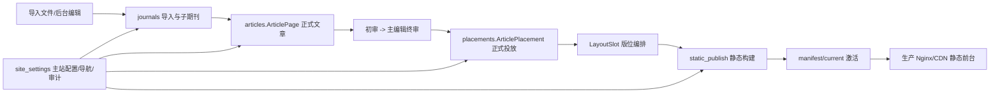

# 01 系统架构与模块边界

## 1. 架构目标

系统基于 Wagtail 二次开发，不重新建设通用 CMS。Wagtail 负责页面、编辑、图片、预览和两级 Workflow；项目业务模块负责实名账号、子期刊范围任命、文章导入、初审/终审、投放、版位和静态发布。Group 只承载“超级管理员”业务组和“子期刊编辑基础访问”技术组，子期刊角色及数据范围以 `JournalEditorAssignment` 为准。



## 2. 应用职责

| 应用 | 正式职责 | 不应承担的职责 |
| --- | --- | --- |
| `home` | 主站首页和 News Template 兼容页面 | 文章业务状态、投放关系、静态发布任务 |
| `users` | 实名账号、账号状态、首次改密、密码重置、超级管理员管理和会话撤销 | 保存子期刊角色、通过 Django superuser 标志绕过业务权限 |
| `journals` | `Journal`、子期刊配置、导入任务、导入暂存、栏目数据 | 作为正式文章前台来源、替代正式投放模型 |
| `journals.JournalEditorAssignment` | 主编辑、常务副编辑、副编辑任命、固定职责和独立公开资料 | 作为平台账号、扩展出任务书之外的角色名称 |
| `articles` | 正式 `ArticlePage`、正文、AI 合著信息、审核记录、文章状态 | 直接生成投放副本、绕过 Workflow 直接上线 |
| `placements` | 正式 `ArticlePlacement`、`LayoutSlot`、投放规则、排序置顶、生效时间 | 复制文章内容、承担文章审核 |
| `static_publish` | 静态构建、逐页结果、manifest、发布任务、重试、回滚 | 直接决定文章是否审核通过 |
| `site_settings` | SiteSettings、导航基线、角色预设、审计日志和基础配置 | 存放具体文章或投放业务数据 |
| `navigation` | 导航运行时/兼容能力 | 替代 `site_settings` 的导航基线配置 |
| `news` | 历史兼容页面 | 新增文章业务和新菜单 |

## 3. 正式模型与兼容模型

### 3.1 文章模型边界

| 模型 | 定位 | 当前要求 |
| --- | --- | --- |
| `articles.ArticlePage` | 唯一正式文章模型 | 新功能、审核、投放、静态构建只能使用它 |
| `journals.StaticArticle` | 导入暂存/兼容来源 | 导入成功后必须进入正式文章草稿链路，不能直接发布 |
| `news.ArticlePage` | 历史兼容模型 | 只读、禁止新增引用，计划退役 |

推荐导入关系：

```text
ImportJob/ImportRow
  -> StaticArticle（保存原始文件、行号、导入错误和匹配结果）
  -> articles.ArticlePage 草稿
  -> Wagtail Workflow
```

在正式转换完成之前，导入命令不得把 `StaticArticle` 直接传给静态发布服务。

### 3.2 投放模型边界

| 模型 | 定位 | 当前要求 |
| --- | --- | --- |
| `placements.ArticlePlacement` | 唯一正式投放模型 | 管理端、同步服务、静态构建使用它 |
| `journals.ArticlePlacement` | 历史/重复模型 | 禁止新增数据和新代码引用，迁移后退役 |

正式投放必须通过关系或受控标识指向 `articles.ArticlePage`。如暂时保留字符串 `target_slug`，必须增加 slug 变更保护、唯一性校验和孤儿投放巡检。

## 4. 依赖方向

推荐依赖方向：

```text
site_settings -> journals/articles/placements/static_publish（提供基础配置、权限和审计）
journals -> articles（提供导入源和子期刊上下文）
articles -> placements（文章作为投放对象）
placements -> static_publish（提供已生效版位数据）
static_publish -> articles/placements/site_settings（只读取已确认数据并回写发布结果）
```

禁止以下反向依赖：

- `articles` 复制 `placements` 的文章内容字段；
- `static_publish` 创建或修改审核结果；
- `journals` 直接修改文章的 `published` 业务状态；
- 菜单 hook 自己实现一套与 service 不同的同步逻辑；
- 旧 `news` 模型反向驱动正式文章或投放。

## 5. 跨模块接口

下列接口是模块间的最小稳定边界：

- `journals.get_active_journals()`：返回可用于前台和导入匹配的有效子期刊；
- `journals.get_journal_context(slug)`：返回子期刊、栏目、素材和导航上下文；
- `articles.get_approved_articles()`：只返回审核通过且满足前台读取条件的正式文章；
- `articles.get_article_context(slug)`：返回文章正文、作者、期刊和分类上下文；
- `placements.get_slot_items(slot_code, journal=None)`：返回已生效、已排序的投放项；
- `static_publish.build_release_snapshot()`：冻结本次构建输入，返回可追踪的 release id；
- `static_publish.activate_manifest(manifest_id)`：仅在全部必需页面通过策略检查后激活 current。

接口返回对象应使用正式模型或不可变 DTO，不能返回旧模型实例并由调用方猜测含义。

## 6. 代码入口索引

- 实名账号：`ai_author_forum/users/models.py`、`services.py`、`views.py`；
- 子期刊任命：`ai_author_forum/journals/models.py`、`editor_services.py`、`access.py`；
- 正式文章：`ai_author_forum/articles/models.py`、`review_services.py`、`workflows.py`；
- 作者投稿：`ai_author_forum/articles/author_services.py`、`author_views.py`、`ai_author_forum/journals/submission_services.py`；对象授权只来自 `ArticleAuthorship`；
- 子期刊和导入：`ai_author_forum/journals/models.py`、`importers.py`、`management/commands/`；
- 正式投放：`ai_author_forum/placements/models.py`、`services.py`；
- 静态发布：`ai_author_forum/static_publish/models.py`、`services.py`、`management/commands/build_static_site.py`；
- 菜单和权限：各应用的 `wagtail_hooks.py`、`viewsets.py`；
- 基础配置和审计：`ai_author_forum/site_settings/`。

## 7. 2026-07-23 架构收口实现

本轮实现已把兼容数据源与正式业务链路做了强制隔离：

- 每条成功导入记录在同一数据库事务内创建或更新唯一 canonical `articles.ArticlePage` 草稿，并保存 Wagtail revision；重复导入不会生成第二篇正式文章。
- `journals.StaticArticle` 继续保存来源文件、行号和兼容数据，但不再是审核、投放或静态发布输入；现有正式文章的 owner 不会被空导入用户覆盖。
- `placements.ArticlePlacement` 是唯一可新写入的正式投放模型；旧 `journals.ArticlePlacement` 仅保留迁移兼容，普通业务写入会被拒绝。
- 静态构建先在数据库一致性边界内发现并渲染全部目标，冻结为 `RenderedTargetSnapshot` 的 bytes/error，再离开读取事务写入 staging。PostgreSQL 根事务使用 `REPEATABLE READ, READ WRITE`，避免同一 release 混入两个业务时点的数据。
- release 的 `manifest.json` 与数据库 `StaticManifest` 均按不可变发布产物处理；激活和回滚前必须校验清单、路径、文件大小、SHA-256、符号链接和数据库元数据一致性。
- 业务角色收敛为平台级 `super_admin` 和期刊级 `chief_editor`、`executive_editor`、`associate_editor`。前者可维护平台但不能终审；终审只接受文章主属期刊的有效主编辑任命。
- 审核固定为 `draft -> submitted -> pending_final -> approved` 两级流程，每条 `ArticleReviewRecord` 绑定 revision 且不可更新或删除。终审后的正文或作者声明变化会重置审核。

因此正式数据流固定为：导入暂存 -> canonical 草稿/revision -> 审核 -> 正式投放 -> 冻结构建快照 -> 不可变 manifest -> current 激活。任何兼容模型都不能跨越该链路直接进入前台。

## 8. 作者投稿架构边界

作者工作台是 canonical `ArticlePage` 的受控草稿入口，不是第二套文章模型或发布系统。作者对象权限由 `ArticleAuthorship` 提供，作者保存产生 Wagtail revision，提交复用统一审核 service；作者不能进入完整 Wagtail 页面树，也不能获得审核、投放、导入、Raw HTML 或静态发布权限。实现和运维细节见 `09-author-submission-role-development-spec.zh-CN.md` 与 `10-author-submission-implementation-and-operations.zh-CN.md`。
