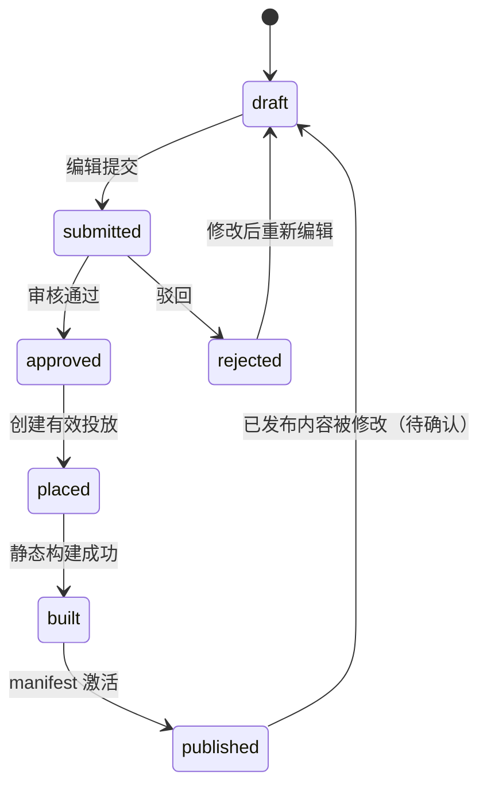

# 02 核心业务流程

## 1. 标准闭环

```text
导入预览/确认
  -> 暂存原始数据
  -> 创建正式 ArticlePage 草稿
  -> 提交 Wagtail Workflow
  -> 审核通过
  -> 创建/调整 ArticlePlacement
  -> 投放同步
  -> 静态构建
  -> 生成 manifest
  -> 激活 current
  -> 回写文章、投放和审计状态
```

关键原则：审核、投放、构建和激活是四个不同阶段。任何阶段失败，都必须能定位到具体对象和 release id。

## 2. 子期刊导入流程

### 2.1 预览阶段

1. 上传 Excel/HTML/素材包；
2. 创建 `ImportJob` 和逐行 `ImportRow`；
3. 校验必填字段、slug、文章类型、主期刊、图片和栏目；
4. 生成错误报告，不写入正式前台数据；
5. 操作员确认导入范围和覆盖策略。

### 2.2 确认导入阶段

1. 写入 `Journal`、栏目和 `StaticArticle` 暂存数据；
2. 为每一行保存原始文件、原始行号、解析结果、资产匹配状态和错误信息；
3. 调用统一转换服务创建或更新 `articles.ArticlePage` 草稿；
4. 对重复 slug 使用明确的幂等键，不允许静默覆盖已发布文章；
5. 创建导入审计日志；
6. 将文章提交 Workflow，或将文章置为待提交并在后台给出明确操作。

### 2.3 禁止路径

以下路径禁止继续保留：

```text
导入成功 -> StaticArticle -> --publish-static-site -> 前台发布
```

因为它绕过了正式 `ArticlePage`、审核和投放。`--publish-static-site` 只能发布已审核、已投放的正式文章集合；如果没有正式文章，应失败并给出可操作错误。

## 3. 文章审核流程



当前项目同时存在 Wagtail Workflow 和自定义审核页面。二者必须共用同一个状态变更 service：

- Workflow action 负责权限和 Wagtail revision；
- 自定义审核页面负责业务视图和审核意见；
- 最终都调用统一的 `approve_article()` / `reject_article()`；
- 审核通过只改变审核状态并记录 `approved_version`，不得自动等价为前台发布。

管理端的行内“提交审核”按钮与批量操作共用页面表单，但行内提交必须直接 POST 到文章审核入口，不得被批量操作脚本拦截。审核详情在文章状态变为 `approved` 后显示“投放文章”快捷入口；该入口创建带有文章和主属子期刊的投放草稿，仍需经过版位选择、预检查和正式执行。

## 4. 投放与版位流程

1. 内容管理员选择已审核文章；
2. 选择主站、栏目页或子期刊目标；
3. 选择 `LayoutSlot`、排序、置顶和生效时间；
4. 保存 `placements.ArticlePlacement`；
5. 校验文章审核状态、目标存在性、时间区间和重复投放策略；

投放选文支持按文章字段和子期刊 slug、名称、中文名检索；结果优先显示尚无有效投放的文章。子期刊检索结果包含主属子期刊及相关子期刊，最终目标归属仍由投放批次预检查和模型校验共同约束。
6. 执行投放同步，记录成功/失败、request id、revision id 和错误；
7. 静态构建只读取同步成功且在生效时间内的投放。

人工投放和系统栏目投放必须明确优先级。推荐规则：

1. 人工投放对同一 slot、同一文章有显式覆盖权；
2. 系统投放只补齐没有人工配置的位置；
3. 不能把同一文章重复展示在同一 slot；
4. 覆盖、取消和恢复必须写审计日志。

## 5. 静态发布流程

1. 发布管理员选择构建范围；
2. 服务冻结文章、投放、导航、站点设置和资源输入；
3. 创建 `StaticPublishJob`；
4. 逐页面渲染 HTML 和资源；
5. 写入逐页结果；
6. 生成不可变 `StaticManifest`；
7. 执行完整性、链接、资源和页面数量检查；
8. 成功才切换 `published/current`；
9. 回写文章、投放、发布任务和审计状态；
10. 失败时保留旧 current，生成失败记录并允许重试。

## 6. 回滚流程

回滚不是简单删除最新目录，必须同时处理：

- current 指向的 manifest；
- 静态发布任务状态；
- 文章 `published_version`；
- 投放同步 revision 和状态；
- 审计日志；
- 失败/重试关联的 request id。

推荐回滚策略：只切换到最近一个已验证的完整 manifest，不直接回写内容数据库为任意历史值。若数据库状态与 manifest 不一致，应标记为“需要人工修复”，而不是静默覆盖。

## 7. 失败处理原则

| 阶段 | 失败结果 | 是否影响 current |
| --- | --- | --- |
| 导入预览 | 只生成错误报告 | 否 |
| 草稿转换 | 该行失败，导入任务部分失败 | 否 |
| 审核 | 文章保持 submitted/rejected | 否 |
| 投放同步 | 文章置为 `placement_sync_status=failed` | 否 |
| 静态单页构建 | release 失败，保留旧 current | 否 |
| manifest 校验 | 不激活新版本 | 否 |
| 回滚 | 只激活已验证旧版本 | 是，切换到旧版本 |

任何“失败但仍发布”的行为都必须有明确产品批准，并不能由异常捕获后默认继续。

## 8. 2026-07-23 已实现的流程护栏

### 8.1 导入与发布前置检查

- 成功导入行会立即同步到唯一 `ArticlePage` 草稿并创建 revision；该动作与导入结果位于同一事务，任一步失败都会回滚该行的正式转换。
- 重复导入按来源记录更新同一 canonical 页面，不重复创建页面，也不把已有 owner 清空。
- 导入默认不触发静态发布。显式使用 `--publish-static-site` 时，命令会检查本次成功行均存在 canonical 页面，并检查系统中至少存在已审核、Wagtail live 且具有有效正式投放的文章；纯草稿导入会在创建发布任务前失败。

### 8.2 审核与投放同步

- Workflow 审核组统一为“审核人员”；旧 `Content Reviewers` 用户会迁移到中文组，旧组的文章审核、投放和页面权限会被移除。
- 审核通过后的栏目投放同步使用 `placement_sync_request_id` 作为稳定幂等标识。同一 revision 且同步计划不变时，不重复修改投放、不重复写 metadata，也不重复产生审计事件。
- 投放查询栏目页时必须显式传入 `target_category`；缺少目标会直接失败，不允许把多个栏目投放混合查询。
- 同一 slot 中同一文章存在多条有效投放时，人工投放覆盖系统投放；同来源保留既有排序中的首条。去重发生在 `limit` 之前，自动补位继续排除已选文章。

### 8.3 发布边界

审核通过、投放同步、静态构建和 manifest 激活保持为四个独立状态转换。任何一步失败都不得倒推或伪造前一步成功；新 release 未完整通过时必须保留旧 current。
