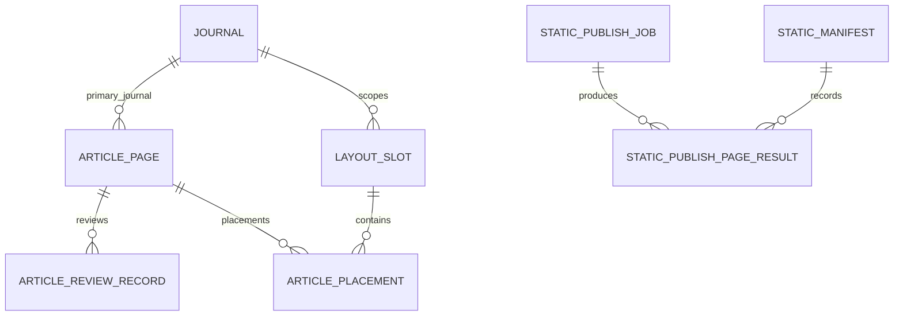

# 04 数据模型与状态机

## 1. 正式数据关系

实际字段比图中更丰富，图只表达开发边界。跨模块新增外键前，应确认是否破坏 Wagtail Page、ClusterableModel 或历史迁移兼容性。

## 2. 文章状态

正式 `articles.ArticlePage` 目前包含：

- `review_status`：`draft`、`submitted`、`approved`、`rejected`，以及历史兼容值 `published`；
- `publication_status`：`approved`、`placed`、`built`、`published`、`offline`；
- `placement_sync_status`：`pending`、`synced`、`failed`；
- `approved_version`；
- `rejected_version`；
- `placement_synced_revision_id`；
- `published_version`。

建议将 `review_status=published` 标记为只读兼容值，业务代码不再生成。文章“是否前台可见”应由已审核版本、有效投放和已激活 manifest 共同决定，不应只判断单个字段。

## 3. 推荐状态组合矩阵

| 审核状态 | 投放状态 | 同步状态 | 发布状态 | 是否允许前台生成 |
| --- | --- | --- | --- | --- |
| `draft` | `approved`/空 | `pending` | `offline` | 否 |
| `submitted` | `approved`/空 | `pending` | `offline` | 否 |
| `rejected` | 空/历史 | `pending`/`failed` | `offline` | 否 |
| `approved` | 空 | `pending` | `approved` | 否 |
| `approved` | 有效 | `synced` | `placed` | 是，进入构建输入 |
| `approved` | 有效 | `synced` | `built` | 是，等待激活 |
| `approved` | 有效 | `synced` | `published` | 是，前提是 manifest 已激活 |
| 任意 | 任意 | `failed` | `offline`/旧版本 | 否，或继续展示旧 current，需明确标记 |

当前发现的 `published + pending + approved_version=NULL + placement_synced_revision_id=NULL` 不应是合法稳定状态，应转为“数据修复/同步中”专用异常状态，或在同步完成前禁止标记 published。

## 4. 状态迁移约束

- `draft -> submitted`：内容管理员提交，正文必填、主期刊有效、资产校验通过；
- `submitted -> approved`：审核人员通过，必须绑定审核 revision；
- `submitted -> rejected`：审核人员驳回，必须有审核意见；
- `rejected -> draft`：编辑修改后重新编辑；
- `approved -> placed`：存在至少一个有效正式投放；
- `placed -> built`：静态构建产生页面并通过页面级检查；
- `built -> published`：manifest 校验通过且 current 激活成功；
- `published -> draft`：只有在“已发布内容修改必须重新审核”这一产品决策确认后才允许；
- 任何状态回退都必须记录原因和审计日志。

## 5. 投放模型语义

正式 `placements.ArticlePlacement` 当前使用 `target_type`、`target_slug`、`target_category` 等标识。期刊投放暂未直接使用 `Journal` 外键，而是字符串 slug。该设计需要补充：

- slug 修改时的级联更新策略；
- 期刊删除/停用时的投放处理；
- 目标不存在时的校验和巡检；
- 同一文章、同一版位、同一时间段的唯一性；
- 人工投放与系统投放的覆盖优先级；
- `related_journals` 是否可以出现在期刊首页、栏目页和推荐位。

短期可以保留 slug，但必须在 service 层集中解析，不允许后台表单、模板和静态生成器各自实现字符串拼接。

## 6. 数据完整性规则

- 正式投放不能指向未审核文章；
- 静态发布不能读取 `StaticArticle` 作为正式发布源；
- 已被静态页面引用的图片不能无提示删除；
- 删除或停用期刊前必须检查文章、投放、版位、导航和静态页面引用；
- 发布 manifest 必须是不可变快照；
- current 只能指向完整且通过校验的 manifest；
- 旧模型迁移期间必须禁止新增，或在 `save()`/service 层拒绝写入。

## 7. 数据修复优先级

1. 盘点 `StaticArticle` 与正式 `ArticlePage` 的可匹配键；
2. 为可匹配数据生成正式文章草稿；
3. 为正式文章补齐审核 revision 和投放同步结果；
4. 对无法自动匹配的数据进入人工修复队列；
5. 校验当前 manifest 与数据库状态；
6. 将旧模型和旧菜单标记为退役。

## 8. 2026-07-23 模型约束与数据修复

### 8.1 文章投放同步幂等字段

`articles.ArticlePage.placement_sync_request_id` 为只读、带索引的 64 字符字段，用于标识某一 revision 和同步计划对应的请求。合法完成状态至少满足：

- `approved_version_id` 指向实际审核/live/latest revision；
- `placement_sync_status=synced` 时 `placement_synced_revision_id` 不为空；
- 同一同步计划重放时 request id 不变化，且不重复审计。

迁移 `articles/0007_repair_article_approval_and_sync_state.py` 会修复已有 approved/published 文章的审核版本和投放同步字段：存在有效正式投放时标为 synced；找不到 revision 或有效投放时标为 failed 并保留可诊断错误，不把异常状态伪装为成功。

### 8.2 标识与目标完整性

- `Journal.slug` 在 `clean()` 和 `save()` 两层均禁止直接修改；只有显式、可审计的迁移流程可以临时放行。
- 新增旧 `journals.ArticlePlacement` 会被拒绝，只允许受控数据迁移代码使用内部兼容开关。
- 正式投放保存前校验目标：Journal 必须存在且 active；Section 必须属于静态栏目配置；Article 必须存在、live 且为 approved/published；Search 仅允许固定 `search` 目标；Category 同时校验 FK 和期刊边界。

这些约束采用 D-08 等待决策期间的保守行为，不等同于将待确认事项标记为已决策。
