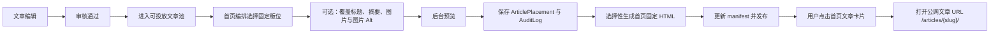

# AI Author Forum 首页占位图片文章化与后台可控投放方案

- **文档状态**：方案调研稿，未进入开发
- **编制日期**：2026-07-31
- **适用范围**：AI Author Forum 主站首页首屏 Hero 与当前 “Forum Metrics” 两个占位图片区
- **方案负责人**：项目总负责人 A / Wagtail 架构负责人
- **本次交付边界**：仅完成现状研究、架构方案和实施建议，不修改业务代码、模板、模型、迁移或服务器

---

## 1. 执行结论

本需求建议采用：

> **`LayoutSlot + ArticlePlacement + 固定文章展示模板`**

将首页红框中的图片区域从“独立占位图”改为“已审核文章的可视化投放位”。每一个可见图片区都必须对应一篇文章，图片、标题和卡片点击后统一进入该文章的固定 HTML 详情页；后台通过受控的“首页编排”界面选择文章，并可选择使用文章封面或仅对当前版位上传/替换一张展示图。

本方案不新增独立 Banner CMS，不给首页添加自由拖拽页面搭建器，也不允许运营人员把图片链接到任意外部地址。图片不是独立发布对象，而是文章在特定版位上的展示资产。

建议首页形成三类固定版位：

1. **`home_hero`**：1 篇头条文章，采用类似参考图的左文右图布局。
2. **`home_visual_stories`**：新增 1 个最多容纳 2 篇文章的视觉推荐版位，替换当前 “Forum Metrics” 两张占位图片。
3. **`home_featured`**：保留现有普通推荐文章卡片，不与前两类版位混用。

该方案复用项目现有文章审核、文章投放、图片库、权限、审计和静态发布能力，符合“审核通过不等于直接上前台”“前台固定 HTML”“后台不可自由破坏模板”的项目技术口径。

---

## 2. 对三张截图的业务理解

### 2.1 第一张：参考目标

参考页面的核心不是一张大 Banner，而是一篇完整文章在首页的重点展示：

- 左侧是文章标题和摘要；
- 右侧是文章主视觉；
- 标题和图片属于同一篇文章；
- 点击后进入文章详情；
- 版式固定，但编辑可以更换被推荐的文章和图片。

因此，AI Author Forum 应复用这种“**文章驱动的 Hero**”思路，而不是只实现“后台换图”。

### 2.2 第二张：当前 Forum Metrics 占位区

截图中的期刊封面和统计图目前是两个展示占位，不具备文章语义。目标状态应调整为两篇视觉推荐文章：

- 每张图片对应一篇文章；
- 展示文章类型、标题，可选摘要、作者和日期；
- 整个卡片或至少图片与标题可点击；
- 点击进入文章静态详情页；
- 后台可分别选择文章，并上传/选择适合该位置裁切比例的图片。

“Forum Metrics” 不再适合作为该区标题，建议改为可理解的编辑栏目名，例如：

- `Editor's Picks`
- `Featured Stories`
- `Research Highlights`

栏目标题本期可先作为模板固定文案；若确有多语言或频繁维护需求，再通过受控站点配置扩展，不应为了修改一个标题引入页面搭建器。

### 2.3 第三张：当前首页首屏占位区

截图展示的是介绍文案加右侧插画。目标状态应改为一篇头条文章：

- 左侧：文章类型、标题、摘要、作者、发布日期；
- 右侧：该文章的展示图；
- 图片与标题进入同一篇文章；
- 后台选择另一篇文章后，整组标题、摘要、图片和链接一起替换；
- 允许只对首页 Hero 使用一张不同于文章详情封面的横版图片。

### 2.4 截图、预发布环境与本地工作区并非同一模板状态

需要明确区分三个状态：

1. **截图/公网预发布页面**仍显示右侧首屏插画和 Forum Metrics 占位图。
2. **当前本地工作区**的 `templates/pages/home_page.html` 已经把首屏改成文字/导航式内容，但仍保留隐藏的 `home_hero` 数据节点；Forum Metrics 两张图片仍是硬编码占位图。
3. 项目部署快照已确认服务器与本地工作区在首页模板、文章卡片和静态发布相关文件上存在差异。

因此，正式开发前第一步必须先确认“以哪一份首页模板为实现基线”，合并本地与预发布环境差异。禁止直接用本地文件覆盖服务器，也禁止用服务器文件反向覆盖本地未审查的改动。

---

## 3. 当前能力审计

### 3.1 已具备的文章能力

`ai_author_forum/articles/models.py` 中的 `ArticlePage` 已具备：

- `featured_image`：文章主图；
- `featured_image_alt`：文章主图替代文本；
- `abstract`：文章摘要；
- 固定静态输出文件路径，例如 `/articles/{static_slug}/index.html`；公网访问 URL 由路由统一为 `/articles/{static_slug}/`。

这意味着文章详情页和首页展示不需要建立两套文章数据。

### 3.2 已具备的版位与投放能力

`ai_author_forum/placements/models.py` 已有：

- `LayoutSlot`：固定版位定义、作用域、最大数量、手工/自动填充和启用状态；
- `ArticlePlacement`：选择文章、选择版位、排序、置顶、生效/失效时间和启用状态；
- `override_title`：只覆盖该次投放的展示标题；
- `override_summary`：只覆盖该次投放的展示摘要；
- `override_image`：只覆盖该次投放的展示图片。

因此，本需求不应另建一套 `Banner`、`HomepageCard` 或 `HomepageImage` 模型。

### 3.3 已具备的后台能力

现有投放后台已经支持：

- 只选择可投放的已审核文章；
- 设置标题、摘要和图片覆盖；
- 设置排序、置顶、显示时间和状态；
- 权限检查；
- 固定卡片预览；
- 写入审计记录。

本方案主要需要优化为面向运营人员的“首页编排”入口，而不是重做一套后台。

### 3.4 已具备的图片回退规则

`ai_author_forum/articles/display.py` 当前图片选择优先级合理：

1. 当前 `ArticlePlacement.override_image`；
2. `ArticlePage.featured_image`；
3. `SiteSettings` 默认图片；
4. 固定占位图。

正式实现时应继续以这一处作为统一规则，避免 Hero、普通卡片和文章详情分别写不同的回退逻辑。

### 3.5 已具备的静态发布和图片引用保护

现有能力已覆盖：

- 投放变化后触发选择性静态发布；
- 首页投放变化可将 `/` 加入构建目标；
- 发布任务合并、失败记录和审计；
- 活跃 manifest；
- 文章封面、投放覆盖图、期刊图片和当前静态产物的引用检查。

这些能力可以直接支撑本方案，但仍需补足“文章内容变化反向刷新所有引用页面”的依赖失效验证，详见第 11 节。

### 3.6 2026-07-31 本地数据快照

本地数据审计结果：

| 数据 | 数量 |
|---|---:|
| 主站首页 | 1 |
| 子期刊 | 120 |
| 文章 | 1200 |
| Wagtail 图片 | 580 |
| 文章投放 | 1214 |

现有首页版位情况：

| 版位 | 最大数量 | 填充方式 | 当前投放 |
|---|---:|---|---:|
| `home_hero` | 1 | 手工 | 0 |
| `home_featured` | 5 | 手工 | 5 |
| `latest_ai_article` | 8 | 手工 | 8 |

`home_hero` 已定义但尚未投放文章；当前模板只输出了隐藏节点。Forum Metrics 两张图则直接引用静态占位文件，并未接入文章投放。

---

## 4. 目标与非目标

### 4.1 本期目标

- 首页首屏 Hero 始终代表一篇已审核文章。
- 当前两张占位图片改为两篇文章的视觉推荐卡片。
- 标题、摘要和图片均能从文章读取，也能在当前版位受控覆盖。
- 后台可直接选择文章，选择已有 Wagtail 图片或上传新图片。
- 点击图片、标题或卡片进入对应文章固定 HTML。
- 支持启用状态、排序和生效时间。
- 变更保留审计记录，并触发选择性静态发布。
- 图片引用继续受到删除保护。
- 桌面端和移动端保持固定、可访问的响应式布局。

### 4.2 本期非目标

- 不建设自由拖拽首页。
- 不新增任意 HTML、CSS 或 JavaScript 编辑入口。
- 不允许 Hero 指向任意外部链接。
- 不建设轮播图；首期 Hero 固定为 1 篇文章。
- 不建设真实搜索或复杂推荐算法。
- 不把 120 个子期刊复制成 120 套模板。
- 不在本次方案阶段修改代码或数据库。
- 不同时重做整个首页视觉系统；只处理用户标注的占位图片区及其必要依赖。

---

## 5. 推荐架构

### 5.1 核心关系



### 5.2 一条不可破坏的规则

> 首页图片区只能展示一篇有效文章的图片，不能脱离文章单独存在。

这条规则保证：

- 不会出现“图片已经替换，但标题、链接还是上一篇文章”的数据错配；
- 每次展示都有内容来源、审核状态、负责人和审计记录；
- 静态发布器可以建立首页到文章详情的明确依赖；
- 图片删除保护能够追踪真实引用；
- 后续替换文章时是一项原子业务操作，而不是分别改文案、图片和 URL。

---

## 6. 首页固定版位设计

### 6.1 版位矩阵

| 版位代码 | 中文名称 | 数量 | 内容来源 | 推荐布局 | 是否新增 |
|---|---|---:|---|---|---:|
| `home_hero` | 首页头条 | 1 | 已审核文章的手工投放 | 左文右图 | 否，复用现有版位 |
| `home_visual_stories` | 首页视觉推荐 | 2 | 已审核文章的手工投放 | 两列大图文章卡 | 是 |
| `home_featured` | 首页重点推荐 | 5 | 现有文章投放 | 普通文章卡 | 否，保持现状 |
| `latest_ai_article` | 最新 AI 文章 | 8 | 现有文章投放 | 列表/紧凑卡片 | 否，保持现状 |

### 6.2 `home_hero` 规则

- 必须且只能有 1 条当前有效投放。
- 只能选择已审核、可公开、拥有有效静态地址的文章。
- 默认读取文章标题、摘要和封面。
- 允许只在 Hero 中覆盖标题、摘要和横版图片。
- 图片与标题链接到同一篇文章，不配置第二个 URL。
- 不建议轮播，避免移动端、无障碍、自动播放和静态发布状态复杂化。
- 正式发布验收时不允许继续展示占位图。

### 6.3 `home_visual_stories` 规则

建议新增一个有序的两项版位，而不是分别建立 `home_visual_left` 和 `home_visual_right`：

- `scope = home`
- `max_items = 2`
- `fill_mode = manual`
- 第 1 条投放显示在左侧，第 2 条显示在右侧；
- 移动端按排序从上到下显示；
- 每条投放独立选择文章、展示图和生效时间；
- 版位不足 2 条时，预览可以提示缺项；正式发布是否阻断由第 12.4 节规则控制。

一个两项有序版位比左右两个独立版位更易维护，也能避免运营人员需要理解“左版位/右版位”的技术差异。

### 6.4 跨版位去重

建议对首页以下版位进行统一去重：

- `home_hero`
- `home_visual_stories`
- `home_featured`
- `latest_ai_article`

推荐规则：

1. Hero 优先级最高；
2. 视觉推荐次之；
3. 普通推荐再次；
4. 最新文章最后补齐；
5. 同一文章在同一发布时间窗内原则上只出现一次。

对手工编排的 Hero 和视觉推荐，后台应直接阻止重复或给出必须确认的明确错误，而不是静默隐藏。对自动/列表型版位，服务层可以按照优先级过滤重复后补齐下一篇。

---

## 7. 前端固定排版规范

### 7.1 首页 Hero

桌面端建议：

```text
┌──────────────────────────────────────────────────────────┐
│ 左侧内容区（约 40%）       │ 右侧文章图片（约 60%）       │
│                            │                              │
│ 文章类型 / Kicker          │                              │
│ 文章标题                   │        文章展示图            │
│ 文章摘要                   │                              │
│ 作者 · 日期                │                              │
│                            │                              │
└──────────────────────────────────────────────────────────┘
```

规则：

- 保持 Nature 风格的清晰分栏，不开放栅格、宽度或颜色给后台编辑；
- 标题与图片均为链接；
- 卡片外层可支持整体点击，但必须保留真实 `<a>` 链接，不能只依赖 JavaScript；
- 标题过长时限制合理行数，但不能用 CSS 隐藏到无法理解；
- 摘要为空时布局自动收紧；
- 图片使用固定比例裁切，不拉伸；
- 手机端改为图片在上、文字在下，或文字在上、图片在下的单列结构；具体顺序在设计评审时统一决定。

### 7.2 两篇视觉推荐文章

桌面端建议：

```text
Research Highlights                                      View all
────────────────────────────────────────────────────────────────
┌──────────────────────────┐  ┌──────────────────────────┐
│         文章图片          │  │         文章图片          │
├──────────────────────────┤  ├──────────────────────────┤
│ 类型                      │  │ 类型                      │
│ 文章标题                  │  │ 文章标题                  │
│ 可选摘要                  │  │ 可选摘要                  │
│ 作者 · 日期               │  │ 作者 · 日期               │
└──────────────────────────┘  └──────────────────────────┘
```

规则：

- 两个卡片使用相同图片比例和内容层级；
- 图片、标题和可选的“阅读全文”均进入对应文章；
- 不再显示 “Replaceable journal cover” 或 “Statistics chart placeholder”；
- “View all” 应链接到已有静态文章列表/栏目页，不能临时增加运行时查询；
- 移动端为单列，两张卡片按投放排序显示；
- 不把期刊封面或统计图伪装成文章，除非其本身属于某篇经过审核的文章内容。

### 7.3 组件复用

现有 `templates/components/static_article_card.html` 已具备文章 URL、投放标题和投放图片的数据契约。建议在实现时：

- 抽取或复用统一的文章展示上下文；
- 新增固定 `static_article_hero.html`；
- 新增固定 `static_visual_story_card.html`，或为现有卡片增加受控展示变体；
- 不在 `home_page.html` 内重复实现图片选择、Alt 和 URL 逻辑。

“受控展示变体”是模板代码定义的有限枚举，不是后台自由选择任意 CSS 类。

---

## 8. 后台“首页编排”体验

### 8.1 推荐菜单

在现有“投放管理”下增加一个面向业务人员的入口：

```text
投放管理
├── 首页编排
├── 全部文章投放
└── 版位管理（高权限）
```

“首页编排”不是新数据模型，而是对现有 `LayoutSlot` 和 `ArticlePlacement` 的首页过滤视图。

### 8.2 固定面板

后台页面按前台顺序展示三个固定面板：

1. 首页头条；
2. 首页视觉推荐；
3. 首页重点推荐。

每个面板显示：

- 版位名称和简易排版示意；
- 当前文章缩略图、标题、审核状态；
- 当前生效时间；
- 选择/替换文章；
- 使用文章封面；
- 覆盖当前版位图片；
- 展示标题覆盖；
- 展示摘要覆盖；
- 图片替代文本；
- 排序、开始时间、结束时间和启用状态；
- 预览；
- 保存并进入静态发布状态提示。

### 8.3 两种换图动作必须明确区分

后台必须把以下两个动作分开命名，避免误操作：

#### A. 修改文章封面

- 修改 `ArticlePage.featured_image`；
- 影响文章详情页；
- 影响所有未设置投放覆盖图的版位；
- 需要重新生成文章详情及所有引用页面。

#### B. 仅覆盖当前首页版位图片

- 修改 `ArticlePlacement.override_image`；
- 只影响当前版位；
- 适合 Hero 横版裁切、专题视觉或同一文章在不同区域使用不同构图；
- 不改变文章详情页封面。

默认选项应是“使用文章封面”。只有在版位比例或编辑表达确有需要时，才上传覆盖图。

### 8.4 文章选择限制

文章选择器必须：

- 只展示已审核且允许投放的文章；
- 支持按标题、子期刊、文章类型和日期查找；
- 明确显示是否已有封面；
- 显示该文章当前已占用的首页版位；
- 不允许把草稿、已驳回或已撤回文章直接放到首页；
- 不因审核通过自动创建首页投放。

### 8.5 预览

预览应至少提供：

- 桌面宽度 Hero 预览；
- 移动端堆叠预览；
- 图片裁切预览；
- 标题过长提示；
- 摘要过长提示；
- 缺失 Alt 文本提示；
- 同文重复投放提示；
- 生效/失效时间提示。

预览应使用与静态生成一致的模板和图片解析服务，避免“后台预览正常，生成后的静态页面不同”。

---

## 9. 数据模型建议

### 9.1 继续复用的模型

- `ArticlePage`
- `LayoutSlot`
- `ArticlePlacement`
- Wagtail Image
- `AuditLog`
- `StaticPublishJob`
- `StaticManifest`

### 9.2 建议新增的版位预设

通过数据迁移或受控初始化增加：

```text
code: home_visual_stories
name: 首页视觉推荐
scope: home
max_items: 2
fill_mode: manual
is_active: true
```

初始化必须是幂等的，不能重复创建同代码版位。

### 9.3 建议补充 `override_image_alt`

当前图片解析逻辑会尝试读取投放级 `override_image_alt`，但 `ArticlePlacement` 模型尚未正式定义该字段。建议实施时新增：

```text
override_image_alt: 可空字符串，最大长度按项目现有 Alt 规范确定
```

规则：

- 使用投放覆盖图时，应填写与该版位展示语境匹配的 Alt；
- 未填写时可回退到文章 `featured_image_alt`；
- 若最终图片仍无有效 Alt，后台提示并在发布预检中处理；
- 该正式字段不应塞入 `metadata` JSON。

### 9.4 不建议为首页增加的字段

不建议在 `HomePage` 上增加：

- `hero_title`
- `hero_summary`
- `hero_image`
- `hero_link`
- `metrics_left_image`
- `metrics_right_image`

这些字段会把文章信息复制到首页，绕过审核、投放、排期、去重和审计。

---

## 10. 图片、裁切与无障碍规范

### 10.1 图片尺寸建议

以下是编辑源图建议，不是浏览器固定输出尺寸：

| 使用位置 | 建议源图最小尺寸 | 建议方向 |
|---|---:|---|
| 首页 Hero | 1800 × 1040 px | 横向 |
| 两列视觉文章卡 | 1440 × 840 px | 横向 |
| 普通文章卡 | 延续现有规范 | 按现有组件 |

### 10.2 裁切规则

- 使用 Wagtail 图片焦点和 rendition；
- 统一使用固定比例裁切；
- 不使用 CSS 强行拉伸；
- 人物、图表和文字较多的图片应人工检查焦点；
- 后台预览应与静态生成使用同一裁切参数；
- 是否输出 WebP/AVIF 可在性能测试后决定，本方案不提前承诺格式。

### 10.3 Alt 文本

- 装饰性图片才允许空 Alt；首页文章主视觉通常不是纯装饰；
- Alt 应描述图片表达的信息，不重复完整文章标题；
- 使用投放覆盖图时优先使用投放级 Alt；
- 使用文章封面时回退到文章封面 Alt；
- 后台必须显示 Alt 缺失状态；
- 发布验收应包含键盘导航和读屏语义检查。

### 10.4 图片删除保护

无论使用文章封面还是版位覆盖图，都必须继续进入现有图片引用检查：

- 被文章引用的图片不能无提示删除；
- 被有效 `ArticlePlacement` 引用的图片不能无提示删除；
- 被当前活跃 manifest/静态输出引用的图片不能无提示删除；
- 替换图片后，旧图片只有在数据库和活跃静态发布产物均不再引用时才可安全清理。

---

## 11. 静态发布、依赖和审计

### 11.1 发布路径

首页变更后的业务链路：

```text
保存首页投放
→ 校验文章审核状态、版位容量、时间窗、重复文章和图片
→ 写入 ArticlePlacement
→ 写入 AuditLog
→ 将 / 加入选择性构建目标
→ 生成首页 HTML 和所需图片 rendition
→ 记录逐页面结果与依赖
→ 成功后更新 active manifest
→ 公网首页开始展示新文章
```

### 11.2 投放变更的刷新范围

以下操作至少重建首页 `/`：

- 替换 Hero 文章；
- 替换视觉推荐文章；
- 修改投放级标题、摘要、图片或 Alt；
- 修改排序、启用状态和生效时间；
- 到达预约开始/结束时间并触发发布任务。

### 11.3 文章变更的反向依赖

需要在实现前重点验证并补足：

> 修改文章标题、摘要、封面、Alt 或公开状态时，不仅要重建文章详情页，还要重建所有当前引用该文章的静态页面。

目标刷新范围包括：

- `/articles/{slug}/index.html`；
- 首页 `/`；
- 引用了该文章的栏目页；
- 引用了该文章的子期刊首页；
- 其他有效版位页面；
- 必要时更新静态推荐/搜索占位页中的文章摘要数据。

这应由统一依赖解析实现，不能在文章保存事件中硬编码只刷新首页。

### 11.4 失败与占位图策略

正式发布建议采用严格策略：

- Hero 缺少有效文章时，生产发布预检失败；
- Hero 文章无任何可用图片时，生产发布预检失败；
- `home_visual_stories` 少于要求数量时，默认阻断首页正式发布；若业务决定允许 1 篇，应由明确配置控制并通过设计验收；
- 构建失败时不得替换当前 active manifest；
- 保留上一版可用首页；
- 失败记录可重试；
- 发布管理员可回滚。

开发和迁移期间可短暂保留占位图作为受控兜底，但在预发布验收通过前必须删除正式页面对占位图的依赖。

### 11.5 审计记录

至少记录：

- 操作人；
- 操作时间；
- 版位；
- 原文章与新文章；
- 原图片与新图片；
- 标题/摘要覆盖变化；
- 生效时间变化；
- 发布任务编号；
- 构建结果；
- 重试或回滚结果。

普通内容编辑不能通过直接修改模板、静态文件或数据库绕过投放审计。

---

## 12. 权限方案

| 角色 | 首页文章化相关权限 |
|---|---|
| 项目总负责人 | 全部选择、修改、发布、重试、回滚、权限配置和最终决策 |
| 超级管理员 | 全局配置、首页编排、发布与回滚 |
| 内容管理员 | 选择文章、编辑投放覆盖内容、预览；是否能正式发布按现有发布权限控制 |
| 审核人员 | 审核/驳回文章、填写意见；默认不直接修改首页投放 |
| 站点运营 | 上传和维护图片、查看裁切；只有同时具备投放权限时才能把图片用于首页 |
| 发布管理员 | 执行静态生成、失败重试和回滚 |
| 只读人员 | 查看首页编排、发布记录和审计日志，不可修改 |

关键边界：

- 审核通过只表示文章进入“可投放池”；
- 首页曝光必须另行创建或修改 `ArticlePlacement`；
- 上传图片权限不等于首页投放权限；
- 修改版位定义和容量应限制为项目总负责人、超级管理员或受控技术角色。

---

## 13. 被否决的替代方案

### 13.1 直接给 `HomePage` 增加多组图片和链接字段

**不采用。**

原因：

- 复制文章标题、摘要和图片；
- 容易出现链接与内容不一致；
- 绕过文章投放和排期；
- 难以跨版位去重；
- 静态依赖和审计需要重复实现。

### 13.2 新增通用 Banner 模型

**不采用。**

原因：

- Banner 会变成独立内容对象；
- 容易允许任意外链；
- 与文章审核状态脱节；
- 重复实现 `ArticlePlacement` 已有能力。

### 13.3 使用自由 StreamField Hero/图片块

**不采用。**

原因：

- 会逐步演变成自由页面搭建器；
- 可破坏统一 Nature 风格模板；
- 运营人员可能任意调整布局和链接；
- 不符合本期受控版位约束。

### 13.4 把期刊封面和统计图直接当作首页文章

**不采用。**

原因：

- 期刊品牌/统计资产与文章推广的业务语义不同；
- 图片可能没有对应文章详情；
- 不能满足“点进去就是一篇文章”。

若未来要展示期刊数据，应单独定义受控的期刊统计模块，不应占用本次文章视觉推荐位。

### 13.5 把正式新增字段只存进 `metadata` JSON

**不采用。**

原因：

- 类型和必填校验弱；
- 后台表单体验差；
- 查询、审计和迁移困难；
- 容易出现不同模板使用不同键名。

---

## 14. 建议实施阶段

### 阶段 0：确认和冻结基线

1. 比较当前本地工作区、Git 基线和预发布服务器的首页相关文件；
2. 重点审查 `home_page.html`、`static_article_card.html` 和静态发布相关差异；
3. 确认本地未提交改动的归属；
4. 决定最终实现基线；
5. 完成数据库、媒体文件、静态产物和部署配置备份计划。

### 阶段 1：数据与模型最小改动

1. 新增 `home_visual_stories` 版位预设；
2. 增加 `override_image_alt` 正式字段和迁移；
3. 补充首页跨版位重复校验；
4. 验证迁移幂等性和回滚路径。

### 阶段 2：固定前端组件

1. 将 `home_hero` 从隐藏上下文接入可见 Hero；
2. 新增固定 Hero 文章组件；
3. 用 `home_visual_stories` 替换两张 Forum Metrics 占位图；
4. 复用统一图片解析和文章 URL；
5. 完成桌面/移动响应式和无障碍处理。

### 阶段 3：后台首页编排

1. 增加首页过滤式编排入口；
2. 提供选择/替换文章；
3. 明确区分修改文章封面与当前版位覆盖图；
4. 增加裁切、Alt、重复投放和时间窗提示；
5. 使用与静态生成一致的预览模板。

### 阶段 4：静态依赖与审计

1. 验证投放变化重建首页；
2. 补足文章内容变化到所有引用页面的反向依赖；
3. 确保图片 rendition 纳入 manifest；
4. 验证失败不替换活跃发布；
5. 验证重试、回滚和 AuditLog。

### 阶段 5：内容初始化

1. 选择并审核 1 篇 Hero 文章；
2. 选择并审核 2 篇视觉推荐文章；
3. 上传合适比例图片并设置焦点；
4. 填写 Alt；
5. 检查首页跨版位重复；
6. 生成预览并由业务负责人确认。

### 阶段 6：预发布验收与部署

1. 在预发布环境执行完整 QA；
2. 验证首页、文章详情、后台、静态页面、图片引用保护和权限；
3. 创建独立版本发布目录；
4. 不直接修改当前稳定目录；
5. 构建并切换稳定软链接；
6. 验证容器健康、Nginx、HTTPS、错误日志和回滚备份；
7. 验收完成前继续称为预发布环境，不描述为最终生产环境。

---

## 15. 测试建议

### 15.1 模型和服务测试

- 只能向首页版位投放已审核文章；
- `home_hero` 最多 1 条有效投放；
- `home_visual_stories` 最多 2 条有效投放；
- 时间窗边界使用现有半开区间规则；
- 图片解析优先级正确；
- 投放级 Alt 回退正确；
- 跨首页版位重复校验正确；
- 失效文章不会继续进入新静态发布。

### 15.2 模板测试

- Hero 标题和图片指向同一文章 URL；
- 两篇视觉推荐分别指向正确文章；
- 页面不再输出两张旧占位图；
- 无图片、无摘要、长标题时模板行为可控；
- 不产生运行时文章数据库请求；
- HTML 语义、键盘焦点和 Alt 正确。

### 15.3 静态发布测试

- 替换 Hero 后首页被重建；
- 替换视觉推荐后首页被重建；
- 修改文章封面后文章详情和所有引用页被重建；
- 构建失败时 active manifest 不变；
- 新图片资产进入 manifest；
- 旧图片在仍被活跃发布引用时不可删除；
- 重试和回滚可恢复上一版。

### 15.4 权限测试

- 审核人员可审核但不能越权投放；
- 站点运营可上传图片但不能越权发布首页；
- 内容管理员可编排和预览；
- 发布管理员可发布、重试和回滚；
- 只读人员不可提交修改；
- 项目总负责人拥有全部权限。

### 15.5 E2E 验收

至少覆盖：

1. 后台选择一篇已审核文章作为 Hero；
2. 上传一张当前版位覆盖图；
3. 设置 Alt、摘要覆盖和生效时间；
4. 预览桌面和移动布局；
5. 保存并生成静态首页；
6. 公网首页显示正确标题和图片；
7. 点击图片和标题均打开正确文章静态详情；
8. 回滚后恢复上一版 Hero；
9. 页面无 404、无控制台错误、无图片拉伸；
10. 键盘可访问所有文章链接。

---

## 16. 验收标准

满足以下全部条件后，才可认为本需求完成：

- [ ] 首页首屏不是独立占位图，而是 1 篇已审核文章的固定 Hero。
- [ ] 原 Forum Metrics 两张占位图已替换为 2 篇文章卡片。
- [ ] 每个图片、标题和卡片链接均指向正确文章固定 HTML。
- [ ] 后台可以选择/替换文章。
- [ ] 后台可以选择文章封面或上传/选择当前版位覆盖图。
- [ ] 后台清楚提示两种换图方式的影响范围。
- [ ] 投放级图片有 Alt 字段和校验。
- [ ] 同一文章不会在首页主要版位重复出现。
- [ ] 页面保持固定模板，不开放自由拖拽。
- [ ] 首页和文章详情均通过静态发布访问，不依赖前台运行时文章查询。
- [ ] 文章或图片变更可刷新所有引用静态页面。
- [ ] 构建失败不会覆盖当前可用 manifest。
- [ ] 发布、失败、重试和回滚有逐页面结果及审计记录。
- [ ] 已被文章、投放或活跃静态页面引用的图片不能无提示删除。
- [ ] 不同角色只能执行其权限范围内的操作。
- [ ] 已完成本地、预发布和部署文件差异审查。

---

## 17. 风险与待确认事项

| 风险/决策 | 建议 |
|---|---|
| 本地与预发布首页模板不一致 | 开发前先合并差异并冻结实现基线 |
| Hero 没有当前投放 | 正式发布预检阻断，保留上一版 manifest |
| 两个视觉推荐不足两篇 | 默认阻断；如业务接受单篇布局，需要单独设计评审 |
| 图片比例不合适 | 使用投放覆盖图、Wagtail 焦点和固定裁切 |
| 同一文章重复出现 | 首页上下文统一去重，手工重点版位后台阻止重复 |
| 修改文章封面但首页未刷新 | 建立文章到所有有效投放页面的反向静态依赖 |
| 运营误以为换图只影响首页 | 后台分开“修改文章封面”和“覆盖当前版位图片” |
| 大图影响性能 | 固定 rendition、响应式图片、懒加载策略和性能预算 |
| 定时投放到期后页面未更新 | 延续现有调度/队列机制并增加边界测试 |
| 旧占位图继续混入正式发布 | 预发布验收检查 HTML 和 manifest，不只做视觉检查 |

开发前需要业务负责人确认的少量事项：

1. “Forum Metrics” 最终替换成哪个栏目标题；
2. 两篇视觉推荐是否必须始终满 2 篇；
3. 移动端 Hero 是“图片在上”还是“文字在上”；
4. 内容管理员保存投放后是自动发布，还是进入发布管理员待办。

以上事项不会改变核心架构，可在视觉设计或开发计划评审时确定。

---

## 18. 预计实施影响文件

以下仅为预计影响范围，不代表本次已修改：

```text
ai_author_forum/
  placements/
    models.py
    forms.py
    services.py
    viewsets.py
    migrations/
    templates/placements/admin/
  articles/
    display.py
  static_publish/
    automatic.py
    providers.py
    tests/
  images/
    references.py
  home/ 或现有首页上下文提供模块

templates/
  pages/home_page.html
  components/static_article_hero.html
  components/static_visual_story_card.html
  components/static_article_card.html（仅在需要统一数据契约时调整）

static_src/
  sass/ 或项目现有首页样式文件

tests/
  placements/
  static publish/
  template/
  e2e/
```

所有模型改动必须带迁移；所有后台操作必须接入既有权限和审计；所有前台输出必须进入静态发布闭环。

---

## 19. 最终建议

本需求应被定义为“**首页文章视觉版位改造**”，而不是“占位图上传功能”。

推荐最终业务口径：

> 首页 Hero 和两张视觉大图均由已审核文章驱动。运营人员在 Wagtail 后台通过固定版位选择文章，默认使用文章封面，也可以为当前版位单独上传/替换图片；标题、图片和卡片统一进入对应文章的静态详情页。版式由系统固定，投放、排期、发布、失败、重试、回滚和图片引用均可审计。

该方案改动边界清晰，最大程度复用现有 `ArticlePage`、`LayoutSlot`、`ArticlePlacement`、Wagtail Image、静态发布和 `AuditLog`，同时保留后续扩展到子期刊 Hero/视觉推荐的统一能力。建议在方案确认后，先执行“模板差异归一化 + 实施任务拆分”，再进入开发。

