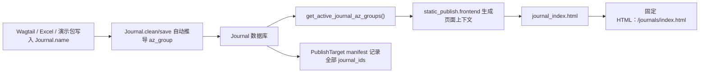

# 子期刊 A-Z 按名称首字母自动分组与排序：可执行开发文档

- **文档状态**：待开发，可直接进入实施
- **编制日期**：2026-07-23
- **负责人**：项目总负责人 A
- **建议实施人**：成员 B（`journals`）+ 成员 E（`static_publish`），由负责人 A 合并验收
- **优先级**：P0（影响 A-Z 页面业务正确性）
- **影响模块**：`journals`、`static_publish`、Wagtail 子期刊后台、Excel 导入、静态前台样式
- **目标页面**：`/journals/`
- **仓库根目录**：`E:\AI Author Forum\news-template`

---

## 1. 目标与结论

当前 A-Z 页面直接信任 `Journal.az_group` 的人工值或导入值，导致页面分组可与子期刊英文名称的真实首字母不一致。尤其是演示数据按行号循环写入 A-Z，出现名称以 `AI...` 开头的子期刊被展示在 B、C、J 等分组中的错误。

本次改造必须实现：

1. **A-Z 分组只由 `Journal.name` 自动推导**，后台用户、Excel 和演示数据均不能自行决定分组。
2. **A-Z 页面组间按 `A → Z → #` 排序**。
3. **同组内按规范化后的英文名称排序**，不使用 `sort_order`。
4. 保留数据库字段 `az_group`，但将其调整为**系统派生缓存字段**，用于兼容现有模型、迁移和依赖关系。
5. 前台仍由静态发布生成固定 HTML，不增加线上运行时数据库查询。
6. A-Z 静态页面的 manifest 必须记录全部活跃子期刊依赖，任一活跃子期刊名称、状态或 slug 变化时能够触发该页面重新生成。

最终数据流：



---

## 2. 当前问题与项目证据

### 2.1 当前实现位置

| 文件 | 当前行为 | 问题 |
|---|---|---|
| `ai_author_forum/journals/models.py` | `az_group` 是可编辑字符字段，并在 Wagtail `FieldPanel` 中展示 | 用户可以自行录入错误分组 |
| `ai_author_forum/journals/services.py` | `az_group` 是 Excel 必填列，导入时直接赋值 | Excel 成为错误的分组来源 |
| `ai_author_forum/journals/demo_packages.py` | 按数据行号循环生成 A-Z | 分组与名称无关 |
| `ai_author_forum/static_publish/frontend.py` | 直接按 `journal.az_group` 聚合 | 静态页面放大了错误数据 |
| `templates/journals/journal_index.html` | 使用传入分组渲染，右侧快捷链接硬编码 A/B/C | 空分组会产生无效链接 |
| `static_src/sass/reference.css` | 使用 CSS `columns: 3` | 浏览器先纵向再横向排版，视觉顺序与 DOM 顺序不一致 |
| `ai_author_forum/static_publish/providers.py` | A-Z 目标依赖中没有全部 `journal_ids` | 子期刊变更可能无法精确标记 A-Z 页面需要重建 |

### 2.2 本地数据抽查结果

2026-07-23 对当前本地 `db.sqlite3` 抽查：

- 活跃子期刊：152 个；
- `az_group` 与名称真实首字母不一致：143 个；
- 当前人工/演示分组覆盖 26 个字母；
- 按真实名称推导后只有 2 个分组：`A=151`、`H=1`。

该结果是正确业务规则下的预期：如果 151 个名称都以 `AI...` 开头，它们就必须归入 A，不能为了让页面看起来覆盖 26 个字母而伪造分组。

迁移完成后可使用以下脚本复核，验收要求为 `mismatches=0`：

```powershell
Set-Location 'E:\AI Author Forum\news-template'
@"
from collections import Counter
from ai_author_forum.journals.alphabet import derive_journal_az_group
from ai_author_forum.journals.models import Journal, JournalStatus

journals = list(Journal.objects.filter(status=JournalStatus.ACTIVE))
mismatches = [j for j in journals if j.az_group != derive_journal_az_group(j.name)]
print("active=", len(journals))
print("mismatches=", len(mismatches))
print("derived_groups=", Counter(derive_journal_az_group(j.name) for j in journals))
"@ | .\.venv\Scripts\python.exe manage.py shell
```

---

## 3. 范围与非目标

### 3.1 本期范围

- 从 `Journal.name` 自动推导 A-Z 分组；
- 统一 Unicode、全角字母和重音拉丁字母处理规则；
- 清理 Wagtail 后台和 Excel 中的人工分组入口；
- 修复演示数据生成逻辑；
- 新增 A-Z 专用查询、分组和排序服务；
- 静态发布上下文切换为统一服务；
- 修复 A-Z 模板快捷链接和 CSS 视觉顺序；
- 补齐 manifest 子期刊依赖；
- 完成数据迁移、兼容、单元测试、集成测试和 E2E 验收。

### 3.2 明确不做

- 不增加真实搜索；
- 不增加线上动态数据库查询；
- 不改变 `ArticlePlacement`、文章审核或文章投放逻辑；
- 不全局修改 `get_active_journals()` 的排序语义；
- 不删除 `sort_order`，它仍可供首页、后台列表或其他已有上下文使用；
- 不对名称自动跳过 `AI Author Forum`、`The` 等前缀；
- 不按 `name_cn`、slug 或中文拼音分组；
- 不建设可自由拖拽的 A-Z 页面布局；
- 不把 120 个子期刊复制为独立页面树或独立代码。

如果未来需要忽略公共前缀，必须新增显式 `sort_name` 字段和对应迁移，不允许在本次逻辑中硬编码跳过词表。

---

## 4. 不可变业务规则

### 4.1 分组来源

唯一来源：`Journal.name`。

以下字段不得影响 A-Z 分组：

```text
Journal.name_cn
Journal.slug
Journal.sort_order
Excel.az_group
用户后台选择值
```

### 4.2 首字母推导规则

处理步骤：

1. `name` 为空或只有空白时返回 `#`；
2. 去除首尾空白；
3. 使用 Unicode `NFKC` 规范化，使全角拉丁字母转换为 ASCII；
4. 使用 Unicode 分解并移除组合重音符，使 `É` 归入 E；
5. 取处理后第一个字符并转为大写；
6. 仅 `A` 至 `Z` 进入对应字母组；
7. 数字、标点、中文、Emoji 或其他非 A-Z 开头名称统一进入 `#`。

| 名称 | 分组 |
|---|---:|
| `AI Author Forum` | `A` |
| `  biology` | `B` |
| `ＡI Research` | `A` |
| `Éthique & IA` | `E` |
| `123 Computing` | `#` |
| `《智能科学》` | `#` |
| `中文期刊` | `#` |
| 空字符串（防御性处理） | `#` |

### 4.3 组间与组内顺序

组间固定顺序：

```python
("A", "B", "C", ..., "Z", "#")
```

只输出有数据的分组。页面导航、内容分区和右侧快捷链接必须使用同一个分组结果，不能分别硬编码。

同组内固定使用以下排序键：

```text
规范化并 casefold 的 name
→ 原始 name
→ slug
→ pk
```

要求：

- 排序稳定且可重复；
- 大小写差异不应造成不符合阅读预期的分散；
- 重音字符使用规范化值参与第一层比较；
- `slug` 和 `pk` 消除同名记录的不确定性；
- `sort_order` 不参与 A-Z 页面排序。

### 4.4 状态规则

- 仅 `Journal.status == active` 的子期刊进入 A-Z 页面；
- 停用子期刊不出现在分组、导航或快捷链接中；
- 活跃状态变化必须使 A-Z 静态页面进入重新发布范围。

---

## 5. 模块边界与 API 契约

### 5.1 新增纯函数模块

新增：`ai_author_forum/journals/alphabet.py`。

必须提供：

```python
def derive_journal_az_group(name: str | None) -> str:
    """根据 Journal.name 返回 A-Z 或 #，不得查询数据库。"""


def journal_name_sort_key(journal) -> tuple[str, str, str, int]:
    """返回 A-Z 页面稳定排序键。"""


def group_journals_by_initial(journals) -> list[tuple[str, list]]:
    """按 A-Z、# 返回非空分组，并在组内执行稳定名称排序。"""
```

实现约束：

- `derive_journal_az_group()` 是纯函数，不导入 Django 模型；
- 任何输入都返回长度为 1 的 `A-Z` 或 `#`；
- `journal_name_sort_key()` 建议返回：

```python
(
    normalized_name.casefold(),
    original_name,
    journal.slug.casefold(),
    journal.pk or 0,
)
```

- 规范化名称必须与首字母推导使用同一套 Unicode 和重音处理规则；
- `group_journals_by_initial()` 接受 iterable，便于纯单元测试，不访问数据库。

### 5.2 新增数据库服务

在 `ai_author_forum/journals/services.py` 新增：

```python
def get_active_journal_az_groups() -> list[tuple[str, list[Journal]]]:
    """返回静态 A-Z 页面使用的唯一分组结果。"""
```

要求：

1. 使用现有 `get_active_journals()` 获取活跃记录，保持状态过滤口径一致；
2. 物化 QuerySet 后交给 `group_journals_by_initial()`；
3. 不修改 `get_active_journals()` 现有全局排序；
4. 不在模板中再次排序；
5. 不在 `static_publish` 中复制 Unicode 和排序逻辑。

### 5.3 调用关系

```text
Journal.clean/save
  └─ derive_journal_az_group()

get_active_journal_az_groups()
  ├─ get_active_journals()
  └─ group_journals_by_initial()
       ├─ derive_journal_az_group()
       └─ journal_name_sort_key()

static_publish.frontend.get_journal_index_context()
  └─ get_active_journal_az_groups()
```

---

## 6. 数据模型改造

修改：`ai_author_forum/journals/models.py`。

### 6.1 字段与后台面板

```python
az_group = models.CharField(
    max_length=1,
    default="#",
    editable=False,
)
```

- 保留数据库列名，避免不必要的跨模块破坏；
- 从 Wagtail `panels` 中删除 `FieldPanel("az_group")`；
- 可在后台列表中只读展示，但不得出现编辑控件。

### 6.2 `clean()`

在 `clean()` 中无条件执行：

```python
self.az_group = derive_journal_az_group(self.name)
```

删除原来“用户值转大写”和“校验用户值是否为 A-Z/#”的逻辑。保留现有 slug、静态路径、图片和其他业务校验。

### 6.3 `save()` 与 `update_fields`

`save()` 必须在 `super().save()` 前重新推导，避免未调用 `full_clean()` 的路径写入旧值：

```python
previous_group = self.az_group
self.az_group = derive_journal_az_group(self.name)

update_fields = kwargs.get("update_fields")
if update_fields is not None and (
    "name" in update_fields or previous_group != self.az_group
):
    kwargs["update_fields"] = set(update_fields) | {"az_group"}
```

验收：

- `journal.name = "Beta"; journal.save(update_fields={"name"})` 后数据库 `az_group == "B"`；
- 加载历史脏数据后只保存其他字段，也能同步修正缓存；
- 不能原地修改调用方传入的 tuple/list。

### 6.4 批量写入限制

`QuerySet.update()`、`bulk_update()`、`bulk_create()` 会绕过模型钩子，因此：

- 业务代码不得单独批量更新 `name`；
- 必须批量写入时，同时计算并写入 `az_group`；
- 导入服务优先继续逐条调用模型校验和保存；
- “批量改 name 未同步 az_group”是阻断合并的问题。

---

## 7. 数据迁移与兼容策略

新增：`ai_author_forum/journals/migrations/0007_auto_journal_az_group.py`。实际文件名以 `makemigrations` 结果为准，编号承接现有 `0006`。

迁移顺序：

1. `AlterField`：增加 `default="#"`、`editable=False`；
2. `RunPython`：遍历全部 Journal，根据 `name` 回填 `az_group`；
3. 使用 `.iterator(chunk_size=500)`；
4. 仅当值变化时更新；
5. 迁移函数使用 `apps.get_model()`；
6. 迁移内复制最小、固定的规范化算法，不直接导入运行时 `Journal` 模型。

伪代码：

```python
def forwards(apps, schema_editor):
    Journal = apps.get_model("journals", "Journal")
    for journal in Journal.objects.all().iterator(chunk_size=500):
        derived = derive_for_migration(journal.name)
        if journal.az_group != derived:
            Journal.objects.filter(pk=journal.pk).update(az_group=derived)
```

回滚约束：

- `RunPython` 反向函数使用 `RunPython.noop`；
- 不恢复历史人工错误分组；
- 必须恢复旧数据时使用发布前数据库备份；
- 派生后的 A-Z/# 仍符合旧字段校验，旧应用可以读取。

SQLite 本地备份：

```powershell
Set-Location 'E:\AI Author Forum\news-template'
Copy-Item .\db.sqlite3 ".\db.sqlite3.before-journal-az-$(Get-Date -Format yyyyMMdd-HHmmss).bak"
```

生产 PostgreSQL 使用现有数据库备份流程，不执行上述文件复制命令。

---

## 8. Wagtail 后台改造

涉及：

```text
ai_author_forum/journals/models.py
ai_author_forum/journals/viewsets.py
templates/wagtailadmin/journals/index.html
```

要求：

1. 编辑页删除 `az_group` 输入控件；
2. 后台列表如展示 A-Z 列，可保留为“自动分组”只读列；
3. 帮助文案明确分组由英文名称自动生成；
4. 不增加人工修改按钮；
5. 搜索、筛选、分页和权限沿用现有 journals 权限体系；
6. 普通角色权限不得扩大；
7. 项目总负责人可修改 `name`，但不能直接覆盖派生分组。

后台验收：

- 新增 `Biology`，保存后显示 B；
- 编辑页没有 A-Z 下拉框或文本框；
- 改名为 `Ecology` 后自动显示 E；
- 只读角色不能编辑。

---

## 9. Excel 导入与演示数据

涉及：

```text
ai_author_forum/journals/services.py
ai_author_forum/journals/import_templates.py
ai_author_forum/journals/demo_packages.py
```

### 9.1 新模板

从新 Excel 模板移除 `az_group`。将：

```python
{"journal_name", "slug", "az_group"}
```

改为：

```python
{"journal_name", "slug"}
```

其他既有必填列不变。

### 9.2 旧模板兼容

旧 Excel 中存在 `az_group` 时：

- 文件仍可导入；
- 该列被忽略；
- 不因其值非法而报错；
- 不赋值给模型；
- 实际分组永远由 `journal_name` 推导；
- 可在摘要中记录一次“`az_group` 已忽略”的非阻断提示，不为每行重复告警。

删除直接赋值：

```python
journal.az_group = str(raw.get("az_group") or "#").strip().upper()
```

### 9.3 演示数据

禁止继续使用：

```python
chr(65 + ((index - 1) % 26))
```

要求：

- 新演示包不输出 `az_group`，或仅在兼容测试中输出一个会被忽略的值；
- 默认名称均以 `AI...` 开头时，全部进入 A 是正确结果；
- 测试需覆盖 A-Z 时，使用真实不同首字母名称，如 `Alpha Journal`、`Beta Journal`；
- 不允许名称以 A 开头、缓存却写 B 的伪造数据。

---

## 10. 静态发布改造

### 10.1 页面上下文

修改 `ai_author_forum/static_publish/frontend.py`。

`get_journal_index_context()` 不再自行按 `journal.az_group` 聚合，直接调用 `get_active_journal_az_groups()`。保持兼容上下文：

```python
{
    ...,
    "journal_groups": [("A", [journal1, journal2]), ...],
}
```

要求：

- 不在模板中查数据库；
- 不在 `static_publish` 复制分组算法；
- HTML 可在无 Django 服务时直接访问；
- 现有 job、逐页结果、失败重试、回滚和 AuditLog 链路不变。

### 10.2 Manifest 依赖

修改 `ai_author_forum/static_publish/providers.py`。

创建 `/journals/` target 前先物化：

```python
journals = list(get_active_journals())
```

A-Z target 依赖加入：

```python
"journal_ids": [journal.pk for journal in journals]
```

要求：

- 保留导航依赖，不得被覆盖；
- `journal_ids` 去重并保持稳定顺序；
- 活跃子期刊新增、改名、改 slug、停用时，A-Z 页面进入受影响目标；
- 子期刊详情页原依赖不变。

注意：停用记录不在当前活跃 ID 列表中。必须增加测试确认旧 manifest 或变更事件能命中 `/journals/`；若现有增量发布无法覆盖，journals 的 `status` 变化应显式加入 `/journals/` 重建路径。

---

## 11. 模板与 CSS

### 11.1 模板

修改 `templates/journals/journal_index.html`：

1. 顶部导航继续遍历 `journal_groups`；
2. 仅渲染非空分组；
3. `#` 组映射为稳定锚点 `letter-other`；
4. Quick links 不再硬编码 A/B/C，遍历同一分组数据；
5. 不在模板排序；
6. 链接保持 `/journals/{{ journal.slug }}/`；
7. 保留空数据状态；
8. 不引入 JavaScript 分组或排序。

如为安全锚点扩展数据结构，建议使用：

```python
{
    "letter": "#",
    "anchor": "letter-other",
    "items": [...],
}
```

如保留二元 tuple，则必须在模板层做最小的 `#` 锚点映射。

### 11.2 CSS

修改 `static_src/sass/reference.css`，将 CSS Columns 替换为 Grid：

```css
.c-letter-group ul {
  display: grid;
  grid-template-columns: repeat(3, minmax(0, 1fr));
  column-gap: 44px;
  margin: 0;
  padding: 0;
  list-style: none;
}
```

移动端：

```css
.c-letter-group ul {
  grid-template-columns: 1fr;
}
```

验收：桌面端按 DOM 从左到右再换行，移动端从上到下；长名称不撑破布局；键盘 Tab 顺序与视觉顺序一致。

---

## 12. 分文件实施清单

### 12.1 新增

- [ ] `ai_author_forum/journals/alphabet.py`：规范化、推导、排序、分组常量与纯函数。
- [ ] `ai_author_forum/journals/migrations/0007_auto_journal_az_group.py`：字段变更与全量回填。
- [ ] `ai_author_forum/journals/tests/test_alphabet.py`：纯单元测试。

### 12.2 修改

- [ ] `ai_author_forum/journals/models.py`：系统字段、删除面板、`clean/save/update_fields`。
- [ ] `ai_author_forum/journals/services.py`：导入兼容及 `get_active_journal_az_groups()`。
- [ ] `ai_author_forum/journals/import_templates.py`：新模板移除 `az_group`。
- [ ] `ai_author_forum/journals/demo_packages.py`：删除行号循环分组。
- [ ] `ai_author_forum/journals/viewsets.py`：只读“自动分组”文案。
- [ ] `templates/wagtailadmin/journals/index.html`：清理人工入口和文案。
- [ ] `ai_author_forum/static_publish/frontend.py`：使用统一服务。
- [ ] `ai_author_forum/static_publish/providers.py`：A-Z target 添加 journal IDs。
- [ ] `templates/journals/journal_index.html`：动态 Quick links、安全锚点、无模板排序。
- [ ] `static_src/sass/reference.css`：Columns 改 Grid。
- [ ] `ai_author_forum/journals/tests/test_models.py`：模型不变量测试。
- [ ] `ai_author_forum/journals/tests/test_services.py`：服务和导入测试。
- [ ] `ai_author_forum/static_publish/tests/test_frontend.py`：上下文测试。
- [ ] `ai_author_forum/static_publish/tests/test_providers.py`：manifest 依赖测试。
- [ ] `tests/e2e/static-publish.spec.js`：静态页面 E2E。

### 12.3 同步文档

- [ ] `E:\AI Author Forum\cms-wagtail-core-business-design.zh-CN.md`
- [ ] `E:\AI Author Forum\cms-wagtail-5-person-workplan.zh-CN.md`
- [ ] `E:\AI Author Forum\news-template\cms-wagtail-5-person-workplan.zh-CN.md`

统一口径：A-Z 分组由 `Journal.name` 自动生成，`az_group` 是系统缓存字段，运营和导入文件不可人工指定。

---

## 13. 测试矩阵

### 13.1 纯函数

| 编号 | 输入/场景 | 期望 |
|---|---|---|
| A01 | `AI Author Forum` | `A` |
| A02 | `  biology  ` | `B` |
| A03 | `ＡI Research` | `A` |
| A04 | `Éthique & IA` | `E` |
| A05 | `123 Computing` | `#` |
| A06 | `《智能科学》` | `#` |
| A07 | `中文期刊` | `#` |
| A08 | `None`、空字符串、空白 | `#` |
| A09 | 输入组 C/A/B/# | 输出 A/B/C/# |
| A10 | 同组 `Alpine`、`alpha`、`Atlas` | 按规范化名称稳定排序 |
| A11 | 同名不同 slug | 由 slug、pk 稳定消歧 |
| A12 | `sort_order` 与名称顺序相反 | 仍按名称排序 |

### 13.2 模型

| 编号 | 操作 | 期望 |
|---|---|---|
| M01 | 创建 `name="Biology"`，不传分组 | 保存为 B |
| M02 | 构造 `az_group="Z"`、名称 Alpha 后保存 | 最终为 A |
| M03 | 名称 A 改为 C，普通 `save()` | 缓存更新为 C |
| M04 | `save(update_fields={"name"})` | 名称和分组同时更新 |
| M05 | 历史脏缓存只保存其他字段 | 缓存同步纠正 |
| M06 | Wagtail 编辑表单 | 不包含可编辑 `az_group` |

### 13.3 导入

| 编号 | 场景 | 期望 |
|---|---|---|
| I01 | 新格式无 `az_group` | 成功并自动推导 |
| I02 | 旧格式 `az_group=Z`，名称 Alpha | 成功，最终 A |
| I03 | 旧格式分组非法 | 不因此失败，按名称推导 |
| I04 | 缺少 `journal_name` | 保持必填错误 |
| I05 | 更新已有 Journal 名称 | 分组同步变化 |
| I06 | 生成 120 条演示数据 | 不按行号伪造分组 |

### 13.4 服务和静态上下文固定数据

| 名称 | 状态 | sort_order | 期望组 |
|---|---|---:|---:|
| `Beta Review` | active | 1 | B |
| `Atlas Journal` | active | 999 | A |
| `Alpha Journal` | active | 500 | A |
| `Éthique AI` | active | 2 | E |
| `123 AI` | active | 0 | # |
| `Archived Biology` | inactive | 0 | 不展示 |

期望：

```text
A: Alpha Journal, Atlas Journal
B: Beta Review
E: Éthique AI
#: 123 AI
```

### 13.5 Provider/manifest

- `/journals/` target 包含所有活跃 Journal PK；
- 不包含停用 Journal PK；
- 导航依赖仍存在；
- 子期刊详情 target 依赖未破坏；
- 新增、改名、改 slug、状态变化可触发 `/journals/` 重建。

### 13.6 E2E

1. 打开静态服务器中的 `/journals/`；
2. A 导航锚点跳到 A 分区；
3. `#` 导航跳到 Other 分区；
4. DOM 文本顺序符合预期；
5. 桌面端三列 Grid，移动端单列；
6. Quick links 只包含实际分组；
7. 链接均为 `/journals/{slug}/`；
8. 关闭 Django 服务后静态页面仍可访问。

---

## 14. 开发顺序与阶段门禁

### 阶段 1：规则、模型、迁移

1. 新增 `alphabet.py` 和纯函数测试；
2. 修改模型与测试；
3. 生成、检查并执行迁移。

门禁：纯函数和模型测试通过，迁移后 `mismatches=0`。

### 阶段 2：导入、模板、演示数据

1. 修改 Excel 必填列和写入逻辑；
2. 更新模板；
3. 修复 demo package；
4. 补新旧格式测试。

门禁：新旧 Excel 均可导入，Excel 分组不能覆盖系统结果。

### 阶段 3：静态发布和 manifest

1. 新增 A-Z 查询服务；
2. 修改 frontend context；
3. 修改 provider dependencies；
4. 补 frontend/provider 测试。

门禁：静态上下文、manifest 和增量重建测试通过。

### 阶段 4：模板、CSS、E2E

1. Quick links 数据化；
2. 修复 `#` 锚点；
3. Columns 改 Grid；
4. 编译资源并构建静态站；
5. 执行 Playwright。

门禁：DOM、视觉和键盘顺序一致，无运行时数据库依赖。

### 阶段 5：文档与发布

1. 同步三份业务文档；
2. 全量回归；
3. 备份数据库；
4. 应用迁移；
5. 全量静态发布；
6. 检查 manifest、逐页结果和 AuditLog；
7. 保留上一 release。

---

## 15. 本地执行命令

均从仓库根目录执行。

### 15.1 环境检查

```powershell
Set-Location 'E:\AI Author Forum\news-template'
& .\.venv\Scripts\Activate.ps1
git status --short
python --version
node --version
npm --version
```

### 15.2 迁移与系统检查

```powershell
python manage.py makemigrations journals --name auto_journal_az_group
python manage.py makemigrations --check --dry-run
python manage.py migrate
python manage.py check
```

人工检查迁移：依赖 `0006`；只有预期字段和回填；未修改其他模型；未导入运行时 Journal。

### 15.3 定向测试

```powershell
python -m pytest ai_author_forum/journals/tests/test_alphabet.py -q
python -m pytest ai_author_forum/journals/tests/test_models.py -q
python -m pytest ai_author_forum/journals/tests/test_services.py -q
python -m pytest ai_author_forum/static_publish/tests/test_frontend.py -q
python -m pytest ai_author_forum/static_publish/tests/test_providers.py -q
```

### 15.4 模块与全量回归

```powershell
python -m pytest ai_author_forum/journals/tests -q
python -m pytest ai_author_forum/static_publish/tests -q
python -m pytest -q
```

全量测试耗时较长时，先保留定向结果再执行全量；不能以超时替代结论。

### 15.5 代码质量

```powershell
ruff check ai_author_forum/journals ai_author_forum/static_publish
black --check ai_author_forum/journals ai_author_forum/static_publish
isort --check-only ai_author_forum/journals ai_author_forum/static_publish
```

如无全局命令：

```powershell
python -m ruff check ai_author_forum/journals ai_author_forum/static_publish
python -m black --check ai_author_forum/journals ai_author_forum/static_publish
python -m isort --check-only ai_author_forum/journals ai_author_forum/static_publish
```

### 15.6 前端与静态 E2E

```powershell
npm ci
npm run build:prod
python manage.py build_static_site --path /journals/
.\.venv\Scripts\python.exe scripts\prepare_static_e2e.py
npm run test:e2e:only
```

若当前环境没有 lockfile，首次安装使用 `npm install`。发布前最终执行：

```powershell
python manage.py build_static_site
```

必须通过现有 `StaticPublishJob`、manifest、逐页结果和 AuditLog 链路，不能直接复制模板文件冒充发布。

---

## 16. 发布与回滚

### 16.1 发布步骤

1. 确认工作区只包含本需求文件；
2. 备份生产数据库；
3. 部署应用代码和编译资源；
4. 执行迁移和 `check`；
5. 一致性检查要求 `mismatches=0`；
6. 运行定向 smoke tests；
7. 通过发布管理员权限执行全量静态发布；
8. 检查 `/journals/` 逐页结果成功；
9. 检查 manifest 包含活跃 `journal_ids`；
10. 抽查 A、重音字母和 #；
11. 检查后台没有人工分组输入；
12. 检查 AuditLog；
13. 保留上一静态 release。

生产 Docker 命令：

```powershell
docker compose --env-file .env.production -f docker-compose.production.yml exec web python manage.py migrate
docker compose --env-file .env.production -f docker-compose.production.yml exec web python manage.py check
docker compose --env-file .env.production -f docker-compose.production.yml exec web python manage.py build_static_site
```

### 16.2 回滚

优先回滚静态 release：

```powershell
python manage.py build_static_site --rollback VERSION --rollback-reason "回滚到已验证的稳定版本"
```

- 回滚写 AuditLog；
- `current` 恢复上一成功 release；
- 不手工覆盖 current；
- 验证 `/journals/` 和一个详情页。

应用代码可回滚到上一版本；派生后的 A-Z/# 仍能被旧代码读取。若旧代码恢复人工编辑入口，回滚窗口应临时限制运营修改。

数据迁移不恢复历史人工错误值。必须恢复旧数据时使用发布前备份，该操作属于高风险动作并需要审计；恢复后重新生成静态站。

---

## 17. 风险与控制

| 风险 | 影响 | 控制措施 |
|---|---|---|
| 大量名称以 `AI...` 开头 | 页面几乎只有 A | 接受真实结果；验收数据使用真实不同首字母名称 |
| 批量更新绕过模型钩子 | 缓存再次失真 | 禁止单独批量改 name；一致性检查和评审门禁 |
| 迁移和运行时 Unicode 规则不同 | 首次保存发生跳组 | 相同 fixture 覆盖两套实现 |
| `#` 直接用作锚点 | 导航定位不稳定 | 映射为 `letter-other` |
| Grid 改造后长名称溢出 | 页面破版 | `minmax(0, 1fr)` + 桌面/移动 E2E |
| 停用事件漏发 A-Z | 静态页残留停用记录 | provider/增量测试，必要时显式重建 `/journals/` |
| 修改全局查询排序 | 影响其他页面 | 新增专用 A-Z 服务，禁止改全局排序 |
| 旧 Excel 无法导入 | 历史流程中断 | 接受并忽略旧列，覆盖兼容测试 |

---

## 18. 验收清单

### 18.1 业务

- [ ] 活跃子期刊按 `Journal.name` 真实首字母分组；
- [ ] `name_cn`、slug、`sort_order` 不影响 A-Z；
- [ ] 组序 A-Z、#；同组按名称稳定排序；
- [ ] 非 A-Z 开头进入 #；
- [ ] 停用记录不展示；
- [ ] 后台和 Excel 不能人工指定分组。

### 18.2 技术

- [ ] `az_group` 为系统派生缓存且有默认值；
- [ ] `save()`、`full_clean()`、`save(update_fields={"name"})` 保持一致；
- [ ] 迁移后全库 `mismatches=0`；
- [ ] 未修改 `get_active_journals()` 全局排序；
- [ ] `static_publish` 调用 journals 公共服务；
- [ ] manifest 包含 journal IDs 和导航依赖；
- [ ] 模板无数据库查询和 JS 排序；
- [ ] Grid 视觉顺序与 DOM/键盘顺序一致；
- [ ] 静态页面可脱离 Django 访问。

### 18.3 权限、审计、质量

- [ ] 未扩大普通角色权限，只读人员仍不能编辑；
- [ ] 发布、重试、回滚继续写 AuditLog；
- [ ] 项目总负责人保留最高发布与回滚权限；
- [ ] Django check 和 migration check 通过；
- [ ] journals/static_publish 定向及全量测试通过；
- [ ] Ruff、Black、isort 通过；
- [ ] 前端生产构建和 Playwright 通过；
- [ ] 三份业务文档已同步。

---

## 19. Definition of Done

只有同时满足以下条件才可关闭需求：

1. 代码、迁移、模板、样式和测试全部合并；
2. 唯一事实来源为 `Journal.name`；
3. 历史数据回填后无不一致；
4. 新旧 Excel 均通过，旧 `az_group` 永远被忽略；
5. 后台不再出现人工编辑入口；
6. A-Z 排序、锚点、Quick links 和响应式布局验收通过；
7. manifest 能追踪活跃子期刊，状态变化有测试；
8. 前台仍为固定 HTML，无运行时 Journal 查询；
9. 发布、重试、回滚和 AuditLog 未破坏；
10. 全量回归与代码质量检查通过；
11. 发布后抽查完成并保留回滚版本；
12. 核心设计文档已同步。

---

## 20. 可分派任务包

### B1：名称规则、模型和迁移

写入范围：

```text
ai_author_forum/journals/alphabet.py
ai_author_forum/journals/models.py
ai_author_forum/journals/migrations/0007_*.py
ai_author_forum/journals/tests/test_alphabet.py
ai_author_forum/journals/tests/test_models.py
```

交付：纯规则、模型不变量、历史回填、单元测试。

### B2：导入、后台和演示数据

写入范围：

```text
ai_author_forum/journals/services.py
ai_author_forum/journals/import_templates.py
ai_author_forum/journals/demo_packages.py
ai_author_forum/journals/viewsets.py
templates/wagtailadmin/journals/index.html
ai_author_forum/journals/tests/test_services.py
```

交付：新旧 Excel 兼容、后台只读展示、演示数据修复、A-Z 查询服务。

### E1：静态上下文与 manifest

写入范围：

```text
ai_author_forum/static_publish/frontend.py
ai_author_forum/static_publish/providers.py
ai_author_forum/static_publish/tests/test_frontend.py
ai_author_forum/static_publish/tests/test_providers.py
```

交付：统一上下文、完整依赖、增量发布测试。

### E2：模板、样式和 E2E

写入范围：

```text
templates/journals/journal_index.html
static_src/sass/reference.css
tests/e2e/static-publish.spec.js
```

交付：动态字母导航、安全锚点、Grid 布局、静态 E2E。

### 负责人 A：合并与发布

- 审查 API、迁移、权限和模块边界；
- 解决集成冲突；
- 执行全量测试、静态发布和 AuditLog 验收；
- 同步三份核心文档；
- 决定上线、回滚或阻断发布。

并行开发时写入范围不得重叠。`journals/services.py` 中的 A-Z 查询和 Excel 导入修改由同一开发者完成。
