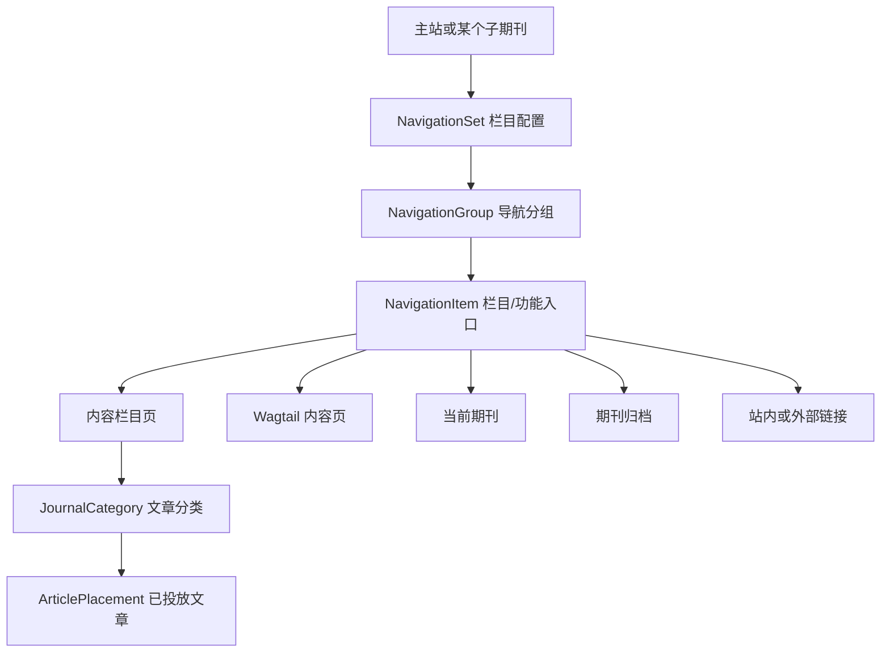

# AI Author Forum CMS 主站与子期刊栏目管理方案

- **文档状态**：业务已确认，可进入技术设计与开发
- **编制日期**：2026-07-22
- **适用项目**：AI Author Forum CMS（Django 6.0 / Wagtail 7.4）
- **方案负责人**：项目总负责人 A / Wagtail 架构负责人
- **本次修订说明**：纠正此前将“栏目管理”理解为 `JournalCategory` 下级分类的偏差。本方案中的“栏目管理”特指前台页头导航、下拉菜单及其对应功能入口的动态管理。

---

## 1. 最终业务结论

本项目的栏目管理采用以下模式：

> **主站与每一个子期刊各自拥有一套独立栏目配置；顶部是导航分组，下拉菜单中是实际栏目或功能入口；栏目结构使用统一模板展示，但栏目名称、数量、顺序、链接目标、显示状态均可独立维护。**

具体规则如下：

1. “主期刊”指 AI Author Forum 主站，不是一个特殊的 `Journal` 数据对象。
2. 主站有自己的栏目配置。
3. 每个子期刊有自己的栏目配置，允许彼此完全不同。
4. 顶部导航采用两层受控结构：
   - 第一层：导航分组，例如“探索内容”“关于本刊”“与我们合作发表”；
   - 第二层：栏目或功能入口，例如“研究文章”“新闻与评论”“当前期刊”“作者须知”“期刊信息”。
5. 新建子期刊时，从“默认子期刊栏目模板”复制一份初始栏目配置。
6. 复制后即成为该子期刊自己的配置；以后修改默认模板，不自动覆盖已经存在的子期刊。
7. 子期刊可以独立新增、隐藏、归档和删除栏目，也可以受控拖动排序。
8. 进入子期刊首页、子期刊栏目页或该子期刊文章详情页后，页头导航自动切换为该子期刊的栏目配置。
9. 栏目变更最终通过静态发布生成固定 HTML，不允许前台运行时查询文章数据库。
10. 后台不提供自由页面搭建器；运营人员只能维护受控栏目、内容、版位、排序和显示状态。

---

## 2. 截图对应的业务解释

参考提供的页面截图：

```text
探索内容
├── 研究文章
├── 新闻与评论
├── 当前期刊
├── 专题
├── 在 Facebook 上关注我们
└── 在 X 上关注我们

关于本刊
├── 期刊信息
├── 作品集
├── 关于机构
├── 关于编者
├── 继续教育学分
├── 面向广告主
├── 招聘
├── 联系
└── 数字档案

与我们合作发表
├── 作者须知
└── 语言编辑服务
```

本方案将其解释为：

| 截图元素 | 后台业务名称 | 是否一定生成栏目页 |
|---|---|---:|
| 探索内容 | 导航分组 | 否 |
| 关于本刊 | 导航分组 | 否 |
| 与我们合作发表 | 导航分组 | 否 |
| 研究文章 | 内容栏目入口 | 是 |
| 新闻与评论 | 内容栏目入口 | 是 |
| 当前期刊 | 系统功能入口 | 使用固定期刊模板 |
| 数字档案 / 浏览期刊 | 系统功能入口 | 使用固定归档模板 |
| 期刊信息 | 静态内容入口 | 使用固定内容页模板 |
| 作者须知 | 静态内容入口或站内页面入口 | 视配置而定 |
| Facebook / X | 外部链接入口 | 否 |

因此，**下拉菜单里的内容不全部是文章分类，也不全部需要生成同一种栏目页**。

---

## 3. 必须分开的四个概念

### 3.1 导航配置（Navigation Set）

表示“某个站点当前使用哪一套页头栏目结构”。

拥有者只能是以下两种之一：

```text
主站
某一个具体子期刊
```

主站和所有子期刊之间互相独立，不共享同一条实时配置。

### 3.2 导航分组（Navigation Group）

表示页头第一层，例如：

```text
探索内容
关于本刊
与我们合作发表
```

导航分组主要承担菜单组织作用，可以配置：

- 显示名称；
- 唯一标识；
- 排序；
- 是否显示；
- 是否直接跳转；
- 下拉栏目列表。

普通情况下，导航分组本身不生成内容页。

### 3.3 栏目/功能入口（Navigation Item）

表示下拉菜单中的实际入口，例如：

```text
研究文章
当前期刊
期刊信息
作者须知
Facebook
```

每一个入口必须指定一种目标类型，系统据此决定跳转地址和静态发布方式。

### 3.4 文章分类（JournalCategory）

`JournalCategory` 继续用于文章业务分类，例如：

```text
研究文章
临床研究
机器智能
新闻与评论
```

它负责：

- 文章主分类和相关分类；
- 文章筛选；
- Placement 候选范围；
- 栏目文章聚合规则；
- 分类数据迁移和审计。

它不直接等于页头菜单。一个导航入口可以关联一个文章分类，也可以指向当前期刊、Wagtail 内容页、外部链接等其他目标。

### 3.5 四者关系



---

## 4. 主站与子期刊独立规则

### 4.1 主站

主站拥有一套独立配置：

```text
主站栏目配置
├── 探索内容
├── 期刊
├── 关于论坛
└── 与我们合作
```

主站栏目只能由项目总负责人、超级管理员或具备核心导航权限的人员维护。

### 4.2 子期刊

每个子期刊拥有一套独立配置，例如：

```text
子期刊 A
├── 探索内容
│   ├── 研究文章
│   ├── 新闻与评论
│   └── 当前期刊
├── 关于本刊
│   ├── 期刊信息
│   └── 编委会
└── 投稿
    └── 作者须知

子期刊 B
├── 内容
│   ├── 临床研究
│   ├── 病例报告
│   ├── 专家观点
│   └── 视频
└── 关于
    ├── 期刊介绍
    └── 联系我们
```

子期刊 A 的修改不会影响子期刊 B，也不会影响主站。

### 4.3 默认子期刊栏目模板

新增“默认子期刊栏目模板”，作用是为新子期刊提供初始结构。

推荐流程：

```text
创建子期刊
    ↓
选择默认子期刊栏目模板
    ↓
复制导航分组和栏目入口
    ↓
生成该子期刊自己的栏目配置
    ↓
运营人员按需要增删和调整
```

复制规则：

- 复制名称、排序、目标类型和基础显示规则；
- 不与模板保持实时绑定；
- 模板后续变更不自动传播；
- 支持管理员主动执行“从模板重新复制”；
- 重新复制前必须展示影响预览；
- 默认不覆盖子期刊现有配置；
- 如选择覆盖，必须具备高风险权限并写入审计日志。

---

## 5. 栏目入口支持的目标类型

本期支持以下类型，已经能够覆盖截图中的主要场景：

| 目标类型 | 典型示例 | 后台配置 | 前台行为 |
|---|---|---|---|
| 内容栏目 | 研究文章、新闻与评论、专题 | 关联文章分类及栏目配置 | 生成固定栏目列表页 |
| Wagtail 内容页 | 期刊信息、作者须知、联系 | 选择已有 Wagtail 页面 | 跳转到对应静态内容页 |
| 当前期刊 | Current issue | 自动读取当前有效期刊数据 | 生成固定当前期刊页 |
| 期刊归档 | Browse issues、数字档案 | 使用期刊归档规则 | 生成固定归档页 |
| 站内地址 | 已有系统内部页面 | 填写受校验的相对路径 | 跳转到站内静态路径 |
| 外部地址 | Facebook、X、语言服务 | 填写 HTTPS 地址 | 新窗口或当前窗口打开 |
| 仅分组 | 只用于展开下拉菜单 | 不配置目标 | 不单独跳转 |

### 5.1 目标只能选一种

一个栏目入口不能同时关联文章分类、Wagtail 页面和外部地址。

后台根据目标类型动态显示对应字段，避免运营人员配置冲突。

### 5.2 外部链接安全

外部地址必须：

- 使用 `https://`；
- 禁止 `javascript:` 等危险协议；
- 支持配置是否新窗口打开；
- 新窗口打开时自动输出安全的 `rel` 属性；
- 发布前经过链接格式校验。

---

## 6. 内容栏目页设计

### 6.1 使用同一套固定模板

所有“内容栏目”使用同一套 Nature 风格栏目模板，不允许每个子期刊自行设计版式。

可维护的是：

- 栏目名称；
- 栏目标识；
- 栏目简介；
- 栏目封面；
- 关联文章分类；
- 筛选项；
- 推荐文章；
- 普通文章列表；
- SEO；
- 显示状态和排序。

不可维护的是：

- 页面栅格；
- 字体体系；
- 任意颜色；
- 模块宽高；
- 自由拖放页面区块；
- 任意 HTML 或脚本。

### 6.2 固定栏目模板结构

参考截图中的“研究文章”页面，栏目页建议固定为：

```text
面包屑
栏目标题
栏目简介（可选）
筛选区
├── 文章类型
└── 年份
重点推荐区（可选）
文章列表
├── 文章类型
├── 标题
├── 日期
├── 作者
├── 摘要（可选）
└── 缩略图（可选）
分页或静态查看更多
```

栏目页面固定版位建议：

| 版位代码 | 用途 | 内容来源 |
|---|---|---|
| `column_featured` | 栏目重点推荐 | `ArticlePlacement` 手工投放 |
| `column_list` | 栏目普通列表 | `ArticlePlacement` 投放并排序 |
| `column_sidebar` | 受控侧栏推荐 | 可选 Placement |

### 6.3 筛选方式

参考截图，本期支持：

- 文章类型；
- 年份。

由于前台必须是静态 HTML，筛选不能调用文章数据库。推荐方式为：

1. 静态发布时把栏目已投放文章输出到 HTML；
2. 为文章节点写入类型和年份的 `data-*` 属性；
3. 浏览器端只对当前静态页面中的条目进行筛选；
4. 不提供全文搜索接口；
5. 数据量超过单页上限时，由静态发布生成分页 HTML。

这属于静态页面筛选，不属于真实搜索系统。

### 6.4 文章与栏目的关系

建议采用以下受控规则：

- 每篇子期刊文章至少选择一个主文章分类；
- 可以选择多个相关分类；
- 导航中的“内容栏目”可以绑定一个主分类或一组受控分类；
- 文章审核通过后，只进入可投放状态；
- 审核通过不等于出现在前台；
- 必须通过 `ArticlePlacement` 投放到 `column_featured`、`column_list` 等版位后，才能进入静态栏目页；
- 可提供“按分类批量加入栏目列表”的后台操作，但其本质仍创建 Placement，并保留审计记录。

该规则保持项目既定闭环：

```text
文章编辑 → 审核通过 → 选择栏目 → 创建投放 → 静态发布
```

---

## 7. 富文本编辑器方案

可以使用富文本编辑器，但只用于“内容”，不用于自由改变页面布局。

### 7.1 适用位置

允许使用 Wagtail Draftail 受控富文本的字段：

- 栏目简介；
- 期刊信息正文；
- 作者须知正文；
- 联系方式说明；
- 其他静态说明页面正文。

### 7.2 允许功能

P0 建议开放：

```text
标题 H2/H3
粗体
斜体
有序列表
无序列表
站内链接
安全外部链接
引用
```

图片、表格、提示框等如确有需要，应使用受控 StreamField 区块，而不是直接开放任意 HTML。

### 7.3 禁止功能

不允许：

- 任意 HTML；
- JavaScript；
- iframe；
- 自定义字体和字号；
- 任意文字颜色；
- 任意背景色；
- 自由修改页面宽度；
- 自由拖放整页布局。

---

## 8. 后台栏目管理交互

### 8.1 后台菜单

建议新增独立业务菜单，而不是继续使用“新增下级分类”的页面：

```text
栏目与导航
├── 主站栏目
├── 子期刊栏目
├── 默认子期刊模板
└── 栏目变更记录
```

`JournalCategory` 保留在“文章分类”菜单中，避免与页头栏目混淆。

### 8.2 主操作界面

进入“子期刊栏目”后：

```text
选择子期刊：[BDJ In Practice ▼]

[预览栏目] [从模板复制] [发布变更]

≡ 探索内容                         [编辑] [隐藏]
   ≡ 研究文章        内容栏目       [编辑] [归档]
   ≡ 新闻与评论      内容栏目       [编辑] [归档]
   ≡ 当前期刊        系统功能       [编辑] [隐藏]
   ≡ 专题            内容栏目       [编辑] [归档]
   [+ 添加栏目]

≡ 关于本刊                         [编辑] [隐藏]
   ≡ 期刊信息        Wagtail 页面   [编辑] [归档]
   ≡ 联系            Wagtail 页面   [编辑] [归档]
   [+ 添加栏目]

[+ 添加导航分组]
```

后台必须提供明确按钮：

- 添加导航分组；
- 添加栏目；
- 编辑；
- 复制；
- 隐藏/启用；
- 归档；
- 查看引用；
- 预览；
- 发布变更。

不再把主要操作设计成含义不清楚的“新增下级”。

### 8.3 受控拖动排序

允许后台拖动，但必须受以下限制：

1. 只能在当前主站或当前子期刊的栏目配置内拖动；
2. 导航分组只能调整分组顺序；
3. 栏目入口可以在分组内排序，也可以拖入当前配置的其他分组；
4. 不允许拖出两层结构形成第三级菜单；
5. 保存时服务端重新校验排序和归属；
6. 并发编辑时进行版本检查，避免后保存者静默覆盖前一人的排序；
7. 排序变更写入审计日志；
8. 拖动只改变顺序和分组，不改变栏目目标类型或文章分类关系。

推荐使用 `Orderable`/排序字段配合 Wagtail 受控管理视图实现，不引入前台自由页面拖拽。

### 8.4 数量限制

为保证 Nature 风格页头可用性，P0 设置软限制：

- 每套栏目最多 8 个导航分组；
- 每个分组最多 20 个栏目入口；
- 最多 2 层；
- 超出软限制时不直接保存，由管理员确认并在前台预览中检查；
- 移动端自动折叠为手风琴菜单。

---

## 9. 数据模型建议

### 9.1 NavigationSet

代表一套完整栏目配置。

建议字段：

```python
class NavigationSet(models.Model):
    scope = models.CharField(choices=["main_site", "journal"])
    site = models.ForeignKey("wagtailcore.Site", ...)
    journal = models.OneToOneField("journals.Journal", null=True, blank=True, ...)
    name = models.CharField(max_length=120)
    status = models.CharField(choices=["draft", "active", "archived"])
    version = models.PositiveIntegerField(default=1)
    copied_from_template = models.ForeignKey("self", null=True, blank=True, ...)
    updated_by = models.ForeignKey(settings.AUTH_USER_MODEL, ...)
    updated_at = models.DateTimeField(auto_now=True)
```

约束：

- 主站只能有一套当前生效配置；
- 每个子期刊只能有一套当前生效配置；
- `scope=main_site` 时 `journal` 必须为空；
- `scope=journal` 时必须关联一个 `Journal`；
- 模板使用单独的模板标记，不伪装成真实子期刊。

### 9.2 NavigationGroup

建议字段：

```python
class NavigationGroup(Orderable):
    navigation_set = models.ForeignKey(NavigationSet, related_name="groups", ...)
    label = models.CharField(max_length=120)
    code = models.SlugField(max_length=120)
    is_visible = models.BooleanField(default=True)
```

### 9.3 NavigationItem

建议扩展或替换当前 `site_settings.NavigationItem`，不要在旧模型上继续堆叠无法表达子期刊范围的字段。

建议字段：

```python
class NavigationItem(Orderable):
    group = models.ForeignKey(NavigationGroup, related_name="items", ...)
    label = models.CharField(max_length=120)
    code = models.SlugField(max_length=120)
    target_type = models.CharField(...)

    category = models.ForeignKey(
        "journals.JournalCategory",
        null=True,
        blank=True,
        on_delete=models.PROTECT,
    )
    page = models.ForeignKey(
        "wagtailcore.Page",
        null=True,
        blank=True,
        on_delete=models.PROTECT,
    )
    internal_path = models.CharField(max_length=500, blank=True)
    external_url = models.URLField(blank=True)

    open_in_new_tab = models.BooleanField(default=False)
    is_visible = models.BooleanField(default=True)
    status = models.CharField(choices=["draft", "active", "hidden", "archived"])
```

必须在 `clean()` 中校验：

- 目标字段与 `target_type` 一致；
- 一个入口只能有一个目标；
- 关联分类必须属于当前子期刊；
- 主站入口不能误关联不允许公开的子期刊分类；
- 外部地址必须安全；
- 同一栏目配置中的 `code` 唯一；
- 归档目标不能继续作为活动入口发布。

### 9.4 ContentColumnConfig

内容栏目需要独有字段时，不建议把所有字段塞进 `NavigationItem`。可增加一对一配置：

```python
class ContentColumnConfig(models.Model):
    navigation_item = models.OneToOneField(NavigationItem, ...)
    intro = RichTextField(...)
    cover_image = models.ForeignKey("images.CustomImage", on_delete=models.PROTECT, ...)
    category = models.ForeignKey("journals.JournalCategory", on_delete=models.PROTECT, ...)
    enable_type_filter = models.BooleanField(default=True)
    enable_year_filter = models.BooleanField(default=True)
    page_size = models.PositiveSmallIntegerField(default=20)
    seo_title = models.CharField(max_length=160, blank=True)
    seo_description = models.TextField(blank=True)
```

这样，外部链接和当前期刊入口不会携带无意义的栏目简介、封面、筛选字段。

### 9.5 与现有模型的关系

| 现有模型 | 处理方式 |
|---|---|
| `Journal` | 继续表示子期刊；关联一套 `NavigationSet` |
| `JournalCategory` | 保留为文章分类，不再承担全部页头栏目职责 |
| `ArticleCategoryAssignment` | 继续表示文章主分类和相关分类 |
| `LayoutSlot` | 增加栏目页固定版位定义 |
| `ArticlePlacement` | 继续作为文章实际前台展示的唯一入口 |
| `SiteSettings` | 保留主站基础配置与核心导航锁定开关 |
| 现有 `NavigationItem` | 迁移主站基线数据后重构为新结构或由新模型替代 |
| `AuditLog` | 记录复制、排序、归档、覆盖、发布和回滚 |

---

## 10. 导航跟随切换规则

### 10.1 主站页面

以下页面使用主站栏目：

- 主站首页；
- A-Z 子期刊列表；
- 主站栏目页；
- 主站文章详情；
- 主站静态说明页。

### 10.2 子期刊页面

以下页面使用所属子期刊栏目：

- 子期刊首页；
- 子期刊内容栏目页；
- 当前期刊页；
- 期刊归档页；
- 子期刊静态说明页；
- 该子期刊文章详情页。

### 10.3 文章详情判定

静态发布文章详情时，根据文章的 `journal_id` 获取对应栏目配置并写入 HTML。

如果文章没有关联子期刊，则使用主站栏目。

如果子期刊栏目配置异常或未启用，发布任务应失败并给出明确错误；不建议静默使用其他子期刊导航。是否允许回退到默认模板，可作为发布管理员的显式修复操作。

---

## 11. URL 与静态路径规则

P0 推荐使用稳定且不易冲突的路径：

```text
主站栏目：
/sections/{column-slug}/

子期刊首页：
/journals/{journal-slug}/

子期刊内容栏目：
/journals/{journal-slug}/sections/{column-slug}/

子期刊当前期刊：
/journals/{journal-slug}/current-issue/

子期刊期刊归档：
/journals/{journal-slug}/issues/
```

栏目 `slug` 修改后：

- 新路径进入下一次静态发布；
- 旧路径生成 Redirect 记录或静态跳转页；
- manifest 同时记录新增、替换和废弃路径；
- 禁止直接留下无提示的 404。

---

## 12. 删除、隐藏与归档规则

按照建议规则，不把“删除”全部实现为数据库硬删除。

### 12.1 隐藏

适用于临时不在导航显示，但内容仍保留的情况：

- 菜单中不输出；
- 栏目页是否仍可直接访问由“允许直接访问”配置决定；
- 可以随时恢复；
- 写入普通变更日志。

### 12.2 归档

适用于栏目已经停止使用：

- 从活动菜单移除；
- 禁止新增 Placement；
- 保留历史配置和审计；
- 已发布地址设置跳转目标或保留历史静态页；
- 可以由有权限的管理员恢复。

### 12.3 硬删除

只有同时满足以下条件才允许：

- 从未发布；
- 没有文章分类引用；
- 没有 Placement；
- 没有静态 manifest 引用；
- 没有其他导航入口引用；
- 没有需要保留的历史路径；
- 操作者具有高风险删除权限。

### 12.4 删除前影响预览

后台必须先显示：

```text
该栏目被以下内容使用：
- 文章分类：12
- 活动投放：36
- 静态页面：8
- 导航引用：1
- 历史发布版本：5
```

存在引用时，默认只允许隐藏或归档，不显示普通硬删除按钮。

---

## 13. 静态发布闭环

栏目配置本身存储在数据库中，但前台访问必须使用静态 HTML。

### 13.1 发布影响范围

主站栏目变化会影响：

- 主站首页；
- 主站栏目页；
- 主站文章详情；
- A-Z 和其他使用主站页头的页面。

某个子期刊栏目变化会影响：

- 该子期刊首页；
- 该子期刊全部栏目页；
- 该子期刊静态说明页；
- 该子期刊当前期刊和归档页；
- 该子期刊全部文章详情页。

因此，修改页头栏目后不能只重新生成一个菜单文件，必须重新发布对应作用域内引用该页头的静态页面。

### 13.2 发布流程

```text
编辑栏目草稿
    ↓
后台预览
    ↓
校验链接、目标、引用、路径和权限
    ↓
计算受影响页面
    ↓
生成静态 HTML
    ↓
逐页面记录成功或失败
    ↓
写入 manifest
    ↓
整体成功后切换发布版本
    ↓
写入 AuditLog
```

### 13.3 失败处理

- 任意必要页面生成失败时，不切换为新活动版本；
- 保留上一版可访问静态文件；
- 支持按失败页面重试；
- 支持整批回滚；
- 发布报告展示栏目配置版本和影响页面数量。

---

## 14. 权限方案

| 角色 | 主站栏目 | 子期刊栏目 | 模板 | 排序 | 归档 | 硬删除 | 发布 |
|---|---:|---:|---:|---:|---:|---:|---:|
| 项目总负责人 | 全部 | 全部 | 全部 | 是 | 是 | 是 | 是 |
| 超级管理员 | 全部 | 全部 | 全部 | 是 | 是 | 受控 | 是 |
| 内容管理员 | 只读 | 可编辑内容栏目 | 否 | 受控 | 否 | 否 | 否 |
| 站点运营 | 否 | 可维护授权子期刊 | 否 | 是 | 按权限 | 否 | 否 |
| 审核人员 | 只读 | 只读 | 否 | 否 | 否 | 否 | 否 |
| 发布管理员 | 只读 | 只读 | 只读 | 否 | 否 | 否 | 是 |
| 只读人员 | 只读 | 只读 | 只读 | 否 | 否 | 否 | 否 |

关键约束：

- 普通编辑不能修改主站核心栏目；
- 站点运营只能维护被授权的子期刊；
- 修改默认模板需要更高权限；
- 从模板覆盖、批量归档、硬删除、发布和回滚必须审计；
- 项目总负责人保留最高操作权限。

---

## 15. 审计要求

以下操作必须记录：

- 新增导航分组；
- 新增栏目入口；
- 修改目标类型或链接；
- 拖动排序；
- 从模板复制；
- 覆盖现有配置；
- 隐藏或恢复；
- 归档或恢复；
- 硬删除；
- 修改 slug；
- 发布；
- 发布失败重试；
- 回滚。

审计内容至少包括：

```text
操作者
操作时间
主站或子期刊
栏目配置版本
对象类型和对象 ID
变更前数据
变更后数据
影响页面数量
发布任务 ID
操作结果
失败原因
```

---

## 16. 现有数据迁移方案

### 16.1 现有主站导航

将现有 `site_settings.NavigationItem` 数据迁移到：

```text
主站 NavigationSet
    → NavigationGroup
        → NavigationItem
```

迁移前输出预览报告，检查：

- 重复 slug；
- 无效父级；
- 同时配置页面和 URL；
- 无效外部地址；
- 超过两层的结构。

### 16.2 现有硬编码子期刊导航

把当前模板中写死的子期刊菜单整理成“默认子期刊栏目模板”。

现有子期刊可通过批处理初始化：

- 没有独立配置的子期刊：复制默认模板；
- 已有试验配置的子期刊：只生成差异预览，不自动覆盖；
- 初始化过程写入审计记录。

### 16.3 现有 JournalCategory

不自动把所有 `JournalCategory` 都显示在页头。

迁移原则：

- 保留现有文章分类；
- 只有运营明确选择的分类，才创建对应“内容栏目入口”；
- 已经生成的分类静态路径继续保留或建立 Redirect；
- 禁止仅因为存在分类就自动污染页头导航。

---

## 17. 后台预览要求

发布前提供桌面端和移动端预览。

预览必须能看到：

- 主导航分组顺序；
- 下拉菜单宽度和栏目数量；
- 超长栏目名称；
- 隐藏项；
- 当前栏目高亮；
- 子期刊 Logo、名称和导航组合；
- 内容栏目页筛选区域；
- 没有文章时的空状态；
- 移动端折叠菜单。

不允许仅在表格后台中保存，而不检查真实前台效果。

---

## 18. 测试方案

### 18.1 模型测试

- 主站和子期刊作用域互斥；
- 每个子期刊只有一套活动配置；
- 分组和栏目唯一标识校验；
- 最大两层结构；
- 目标类型互斥；
- 分类必须属于正确子期刊；
- 外部链接安全校验；
- 归档对象不可新增投放；
- 有引用对象不可硬删除；
- 并发版本校验。

### 18.2 后台测试

- 主站栏目和子期刊栏目菜单分离；
- 添加分组和添加栏目按钮正确；
- 受控拖动排序正确；
- 跨分组拖动正确；
- 不允许拖成第三级；
- 不同角色按钮和数据范围正确；
- 从模板复制预览正确；
- 删除影响预览正确。

### 18.3 前台模板测试

- 主站使用主站导航；
- 子期刊首页使用自己的导航；
- 子期刊栏目页使用自己的导航；
- 子期刊文章详情使用所属子期刊导航；
- 不同子期刊栏目结构可以不同；
- 当前栏目和当前分组高亮正确；
- 隐藏和归档栏目不输出；
- 外部链接安全属性正确。

### 18.4 栏目页测试

- 统一模板渲染；
- 文章类型筛选；
- 年份筛选；
- 已审核但未投放的文章不显示；
- Placement 排序和置顶正确；
- 空栏目显示受控空状态；
- 静态分页链接正确。

### 18.5 静态发布测试

- 栏目变更能计算正确影响范围；
- 只重建对应主站或子期刊作用域；
- 逐页面结果完整；
- manifest 包含新旧路径；
- slug 变化生成 Redirect；
- 失败时不切换活动版本；
- 重试和回滚可用；
- AuditLog 完整。

### 18.6 Playwright 截图验收

至少覆盖：

- 主站桌面端导航；
- 两个栏目结构不同的子期刊；
- 三组不同长度的下拉菜单；
- 内容栏目列表页；
- 当前期刊页；
- 子期刊文章详情页；
- 移动端菜单；
- 超长中英文栏目名称；
- 无栏目和无文章空状态。

---

## 19. 实施顺序

### P0：数据结构和后台闭环

1. 建立 `NavigationSet`、`NavigationGroup`、新版 `NavigationItem`；
2. 建立默认子期刊栏目模板；
3. 建立主站栏目和子期刊栏目后台；
4. 实现添加、编辑、隐藏、归档和受控拖动；
5. 实现目标类型校验；
6. 实现权限和审计；
7. 迁移现有主站导航和模板硬编码导航。

### P0：前台和静态发布

1. 页头模板改为读取发布上下文中的栏目配置；
2. 实现主站/子期刊导航跟随切换；
3. 实现统一内容栏目页；
4. 接入 `ArticlePlacement`；
5. 实现文章类型和年份静态筛选；
6. 扩展静态发布影响范围计算；
7. 实现 manifest、失败记录、重试和回滚。

### P1：运营增强

1. 栏目配置复制和差异对比；
2. 批量应用模板但不自动覆盖；
3. 更完善的链接检查；
4. 栏目访问和点击统计；
5. 更多受控栏目模板类型。

本期不做：

- 多语言独立栏目名称体系；
- 三级及以上菜单；
- 子期刊独立自由页面设计；
- 实时搜索；
- 前台运行时文章库查询；
- 模板自动同步覆盖已有子期刊。

---

## 20. 预计改动范围

主要涉及：

```text
ai_author_forum/site_settings/models.py
ai_author_forum/site_settings/navigation.py
ai_author_forum/site_settings/wagtail_hooks.py
ai_author_forum/site_settings/migrations/

ai_author_forum/journals/models.py
ai_author_forum/journals/services.py
ai_author_forum/journals/wagtail_hooks.py
ai_author_forum/journals/migrations/

ai_author_forum/placements/models.py
ai_author_forum/placements/services.py

ai_author_forum/static_publish/providers.py
ai_author_forum/static_publish/services.py
ai_author_forum/static_publish/category_services.py

templates/includes/header.html
templates/journals/journal_detail.html
templates/journals/column_detail.html
templates/articles/article_page.html

templates/wagtailadmin/navigation/
static_src/sass/
tests/
```

实际开发前应先检查当前工作区已有未提交改动，避免覆盖其他成员正在进行的模型、迁移和模板修改。

---

## 21. 验收标准

功能完成后必须满足：

- [ ] 主站栏目可在后台单独维护；
- [ ] 每个子期刊栏目可独立维护；
- [ ] 新建子期刊可从默认模板复制初始栏目；
- [ ] 已有子期刊不会被模板后续修改自动覆盖；
- [ ] 支持新增、编辑、隐藏、归档和受控删除；
- [ ] 支持导航分组和栏目入口受控拖动；
- [ ] 不允许形成三级菜单；
- [ ] 支持内容栏目、Wagtail 页面、当前期刊、期刊归档、站内地址和外部地址；
- [ ] 内容栏目统一使用固定 Nature 风格模板；
- [ ] 栏目简介和静态说明页可使用受控富文本；
- [ ] 已审核但未投放文章不会直接出现在栏目页；
- [ ] 进入子期刊及其文章后，导航自动切换；
- [ ] 栏目变更能正确触发对应静态页面重建；
- [ ] 发布失败可重试、可回滚；
- [ ] 图片和页面引用受保护；
- [ ] 高风险操作有 AuditLog；
- [ ] 不同角色看到不同操作；
- [ ] 前台不依赖文章数据库运行时查询；
- [ ] Playwright 桌面端和移动端截图通过。

---

## 22. 最终建议

本功能不应继续建立在“文章分类树里新增下级”的交互上，也不应把所有下拉菜单项都强行做成 `JournalCategory`。

最终推荐架构是：

```text
一套默认子期刊栏目模板
        ↓ 创建时复制
主站独立栏目 + 每个子期刊独立栏目
        ↓
导航分组 + 栏目/功能入口
        ↓
按入口类型连接内容栏目、静态页、期刊功能或外部地址
        ↓
内容栏目通过 ArticlePlacement 展示文章
        ↓
统一模板静态发布并支持审计、重试和回滚
```

这套方案既能实现截图中的 Nature 风格导航，又能让不同子期刊拥有不同栏目功能，同时不会把 120 个子期刊做成 120 套代码或自由页面模板。
