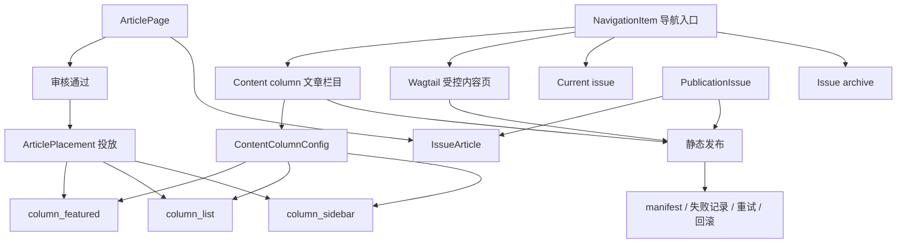

# AI Author Forum：Nature 栏目内容页调研与开发方案

> 文档日期：2026-07-31  
> 文档类型：调研结论 + 可执行开发方案  
> 适用项目：AI Author Forum CMS / Wagtail 二次开发  
> 调研对象：Nature 公开网站栏目页、当前项目预发布站点、当前本地工作区代码  
> 重要说明：本方案学习 Nature 的公开信息架构与页面组织方式，不复制 Nature 的文章、图片、品牌素材、受版权保护文案或内部实现。

---

## 1. 结论先行

用户截图反映的问题真实存在：**栏目出现在导航中并不等于栏目已经完成**。一个可交付的栏目必须同时具备：

1. 可点击且稳定的静态 URL；
2. 与栏目性质匹配的页面模板；
3. 后台可维护的栏目说明、图片、SEO 和展示规则；
4. 经审核并通过 `ArticlePlacement` 投放的真实内容；
5. 空内容、分页、筛选、下线、重建和回滚规则；
6. 静态发布清单、逐页结果和审计记录。

本项目不应继续把 `Explore content` 下的栏目统一做成“占位说明页”。推荐按栏目性质分为三类：

| 栏目类型 | 本项目栏目 | 推荐实现 |
|---|---|---|
| 文章内容栏目 | AI Article、News、Opinion、Research Analysis | `NavigationItem(CONTENT_COLUMN)` + `ContentColumnConfig` + `ArticlePlacement` + 静态栏目页 |
| 编辑内容页 | Careers、Books & Culture、Podcasts、Videos | Wagtail 受控内容页；有真实、持续更新需求前不新增复杂业务模型 |
| 出版期次 | Current issue、Browse issues | 独立 `PublicationIssue` / `IssueArticle` 数据模型 + 静态当前期次、期次详情和归档页 |

**核心原则：导航、文章类型、文章分类、投放版位和期次必须分开。** 它们可以互相关联，但不能合并成一个“万能栏目表”。

---

## 2. 调研范围与事实边界

### 2.1 公开页面调研

2026-07-31 使用项目规定的 gstack `/browse` 对以下公开页面进行了核验：

- [Nature Research articles](https://www.nature.com/nature/research-articles)
- [Nature News](https://www.nature.com/news)
- [Nature Opinion](https://www.nature.com/opinion)
- [Nature Research Analysis](https://www.nature.com/research-analysis)
- [Nature Current issue](https://www.nature.com/nature/current-issue)
- [Nature Browse issues](https://www.nature.com/nature/browse-issues)
- [Nature Collections](https://www.nature.com/nature/collections)
- [Nature Browse subjects](https://www.nature.com/nature/browse-subjects)
- [Nature Podcasts](https://www.nature.com/nature/podcasts)
- [Nature Videos](https://www.nature.com/nature/videos)

### 2.2 当前项目核验

同时核验了当前预发布站点：

- [AI Author Forum 首页](https://author.huixixi.top/)
- `/explore-content/ai-article/`
- `/explore-content/news/`
- `/explore-content/opinion/`
- `/explore-content/research-analysis/`

截至 2026-07-31，预发布栏目页仍能看到类似以下内容：

- `Simulated content is shown until final editorial material is supplied.`
- `No articles are currently placed in this section.`
- `Placeholder content block`

因此，目前页面框架已经存在，但用户所要求的“点击后有相应内容”尚未形成完整闭环。

### 2.3 部署版本边界

当前服务器是**预发布环境**，且服务器代码不等于本地最新工作区。正式开发或部署前必须先审查并合并已记录的服务器/本地差异，不能直接覆盖任一侧。

---

## 3. Nature 栏目页调研结果

### 3.1 `Research articles`：检索式文章列表页

Nature 的 Research articles 页面不是简单图文介绍页，而是完整的文章聚合页面，主要包含：

- 页面标题；
- `Article Type` 筛选；
- `Year` 筛选；
- 按发布时间排列的文章列表；
- 文章类型、开放获取标识、发布日期；
- 标题、摘要、作者；
- 可选缩略图；
- 分页与上一页/下一页。

其公开页面还显示：一个 `Research articles` 频道内部可以包含多个 Article Type。因此：

```text
内容频道 != 文章类型
```

对本项目的直接启示：

- `AI Article` 或子期刊 `Research articles` 是频道；
- `ArticlePage.article_type` 是文章属性；
- 频道展示哪些文章，应由审核状态、分类和 `ArticlePlacement` 共同决定；
- 文章进入频道后，规范详情 URL 不应改变。

### 3.2 `News`：编辑型落地页

Nature News 页面不是纯时间列表。截图和公开页面显示其典型结构为：

1. 一条重点头条；
2. 头条主图；
3. 若干次级图文卡片；
4. 右侧或后续区域的最新文章流；
5. News、News Feature、News Q&A 等子类型标签；
6. 标题、摘要、日期和图片的不同组合。

这说明 News 更适合使用**编辑型栏目模板**，而不是把所有文章卡片等权平铺。

本项目应保留固定模板，只允许运营人员配置：

- 重点稿；
- 次级推荐；
- 最新列表；
- 排序、置顶和生效时间；
- 栏目说明、SEO 和封面图。

不开放自由拖拽和任意改变页面网格。

### 3.3 `Opinion` 与 `Research Analysis`：按时间聚合的专业内容流

Nature 的 Opinion 和 Research Analysis 页面主要表现为时间倒序列表：

- 标题；
- 可选摘要；
- 文章子类型；
- 发布日期；
- 分页。

Opinion 中可见 Editorial、Comment、World View、Obituary 等子类型；Research Analysis 中可见 News & Views、Research Briefing、Clinical Briefing 等子类型。

对本项目而言，P0 不需要照搬这些子类型。现有四种 `ArticlePage.ArticleType` 已能支撑第一阶段：

- AI Article；
- News；
- Opinion；
- Research Analysis。

如果未来确有更细子类型需求，应增加独立的 `article_subtype`，不要不断扩张顶层频道或把子类型直接变成导航菜单。

### 3.4 `Current issue` 与 `Browse issues`：独立期次维度

Nature 当前期次页包含：

- Volume、Issue 编号和出版日期；
- 期次标题、封面和导语；
- Previous issue；
- Table of Contents；
- 按 Editorial、Opinion、Research 等分组的文章目录。

Browse issues 页面按 Volume 和 Issue 展示历史期次，每一期有：

- 期号；
- 日期；
- 期次标题；
- 封面说明或摘要；
- 期次详情入口。

因此，期次不能用“最新文章列表按年份分组”代替。当前本地实现从 `journal_latest` 版位读取文章，并按年份生成 Browse issues，这只能作为临时占位，不应作为最终出版模型。

### 3.5 `Collections` 与 `Subjects`：不是普通栏目

Nature 的 Collections 是人工策划集合，可有集合类型、标题、摘要、图片和发布日期；Subjects 是可多选的主题体系，文章通常可绑定多个 Subject，并支持按主题聚合。

这两者都不等于普通导航栏目：

```text
Collection = 编辑专题集合
Subject = 文章主题标签/分类维度
```

当前项目核心交付文档没有要求在本期建设完整 Collection 和 Subject 产品，因此本方案**不把它们加入当前 P0/P1 开发范围**。如果仅为了外观把菜单加上而没有数据模型和内容，会再次产生空页问题。

### 3.6 Careers、Books & Culture、Podcasts、Videos

这些入口在 Nature 中属于不同内容产品：

- Careers：职业内容和外部职业产品；
- Books & Culture：书评、文化评论等编辑内容；
- Podcasts：音频节目列表；
- Videos：视频列表，公开页面也有类型和年份筛选。

本项目当前没有职位、图书、播客、视频的独立业务闭环。为避免把项目扩展成通用媒体 CMS，第一阶段推荐使用受控 Wagtail 内容页，支持：

- 栏目介绍；
- 图片；
- 编辑推荐卡片；
- 站内文章链接或经校验的 HTTPS 外链；
- 可选音视频封面和外部播放链接；
- 静态 HTML 输出。

只有获得明确的持续更新、媒体上传、播放统计等需求后，才另行设计专门模型；本方案不提前建设这些复杂能力。

---

## 4. Nature 与本项目不应一比一复制的地方

Nature 的公开菜单在 2026-07-31 存在跨范围跳转：

- Research articles 使用期刊范围 URL：`/nature/research-articles`；
- News、Opinion、Research Analysis 使用全站范围 URL：`/news`、`/opinion`、`/research-analysis`；
- Current issue、Browse issues 使用期刊范围 URL。

这进一步证明：菜单只是入口，不代表所有页面都由同一种模型生成。

本项目应借鉴：

- 稳定导航；
- 统一视觉语言；
- 不同内容类型对应不同页面模板；
- 文章详情 URL 稳定；
- 内容与展示编排分离。

本项目不应复制：

- Nature 的文案、文章、图片和品牌标识；
- Nature 的全部频道、商业产品和功能；
- 需要运行时数据库检索的复杂筛选；
- 登录、订阅、真实搜索等本期排除能力。

---

## 5. 当前代码基础与缺口

### 5.1 已有可复用能力

当前本地工作区已经具备较好的基础：

- `NavigationSet`：主站、子期刊和默认模板；
- `NavigationGroup`：两级导航分组；
- `NavigationItem`：支持内容栏目、Wagtail 页面、当前期次、期次归档、站内和外部地址等目标；
- `ContentColumnConfig`：栏目介绍、封面、分类、筛选开关、分页、SEO 和空状态；
- `ArticlePage`：四种文章类型、审核状态、发布状态、主属期刊和相关期刊；
- `ArticlePlacement`：文章投放、版位、排序、置顶和生效时间；
- `column_featured`、`column_list`、`column_sidebar` 三类栏目版位；
- 主站和子期刊内容栏目路由；
- 静态发布 Provider、manifest 依赖和分页目标生成；
- Wagtail 用户组、权限和 `AuditLog` 基础。

### 5.2 需要修复的关键缺口

| 编号 | 当前问题 | 影响 | 处理建议 |
|---|---|---|---|
| G1 | 预发布主站四个核心栏目仍指向旧 `/explore-content/...` 占位页 | 点击后没有真实内容 | 转换为正式 `CONTENT_COLUMN`，保留兼容重定向 |
| G2 | 主站导航初始化仍把 AI Article、News、Opinion、Research Analysis 配为 `INTERNAL_PATH` | 后台栏目配置和 Placement 无法真正接管 | 数据迁移为 `CONTENT_COLUMN` 并创建 `ContentColumnConfig` |
| G3 | 当前栏目模板只有一个通用卡片网格 | News 无法形成截图中的重点稿 + 次级稿 + 最新流 | 增加受控模板变体，不开放自由拖拽 |
| G4 | 当前筛选 JavaScript 只过滤“当前静态分页中已渲染的文章” | 用户会误以为筛选覆盖全部文章 | P0 关闭误导性筛选；P1 生成静态筛选路径 |
| G5 | Current issue/Browse issues 没有真实 Issue 模型 | 不能表达卷、期、封面、期次导语和目录 | 新增 `PublicationIssue`、`IssueArticle` |
| G6 | Careers、Books、Podcasts、Videos 只有硬编码占位文案 | 后台不能正式维护内容 | 改为 Wagtail 受控内容页并纳入静态发布 |
| G7 | 没有“内容不足时隐藏菜单”的上线门槛 | 生产环境容易出现空栏目 | 增加内容就绪检查和发布阻断/警告 |
| G8 | 服务器与本地工作区存在差异 | 直接发布可能覆盖有效修改 | 开发前先完成差异审查、备份和基线归一 |

---

## 6. 目标信息架构



### 6.1 推荐导航映射

| 导航项 | `target_type` | 页面模板/数据源 |
|---|---|---|
| AI Article | `CONTENT_COLUMN` | AI Article 文章 + Placement，研究列表型 |
| News | `CONTENT_COLUMN` | News 文章 + Placement，编辑落地型 |
| Opinion | `CONTENT_COLUMN` | Opinion 文章 + Placement，时间列表型 |
| Research Analysis | `CONTENT_COLUMN` | Research Analysis 文章 + Placement，时间列表型 |
| Careers | `WAGTAIL_PAGE` | 受控内容页 |
| Books & Culture | `WAGTAIL_PAGE` | 受控内容页 |
| Podcasts | `WAGTAIL_PAGE` | 受控内容页和外部音频链接卡片 |
| Videos | `WAGTAIL_PAGE` | 受控内容页和外部视频链接卡片 |
| Current issue | `CURRENT_ISSUE` | `PublicationIssue` 当前有效记录 |
| Browse issues | `ISSUE_ARCHIVE` | `PublicationIssue` 静态归档 |

### 6.2 推荐 URL

继续保持固定 HTML 目录式 URL：

```text
/sections/ai-article/
/sections/news/
/sections/opinion/
/sections/research-analysis/
/sections/ai-article/page/2/

/journals/{journal_slug}/sections/research-articles/
/journals/{journal_slug}/sections/news-and-comment/

/explore-content/careers/
/explore-content/books-and-culture/
/explore-content/podcasts/
/explore-content/videos/

/explore-content/current-issue/
/explore-content/browse-issues/
/issues/{issue_slug}/

/journals/{journal_slug}/current-issue/
/journals/{journal_slug}/issues/
/journals/{journal_slug}/issues/{issue_slug}/

/articles/{article_slug}/
```

兼容策略：

- 旧 `/explore-content/ai-article/` 等核心文章栏目由静态发布阶段生成重定向映射，并由 Nginx 返回 HTTP `301` 到新 `/sections/.../`；
- 不改变现有文章详情规范 URL；
- 旧路径及其重定向目标必须进入静态 manifest，发布验收需核对真实 HTTP 状态码，不能只使用 HTML `meta refresh` 冒充 `301`。

---

## 7. 数据模型开发方案

### 7.1 保留现有模型职责

#### `ArticlePage`

继续负责：

- 文章正文、摘要、作者；
- AI 合著声明和责任声明；
- 文章类型；
- 主属和相关子期刊；
- 审核与静态发布状态；
- 固定文章详情页。

#### `JournalCategory`

继续负责文章业务分类和主题归类，不直接等于导航栏目。

#### `ArticlePlacement`

继续作为“审核通过后是否上前台、上哪里、以什么顺序展示”的唯一入口。禁止通过栏目页面直接查询所有审核通过文章并自动公开。

#### `NavigationItem`

只负责导航入口和目标类型，不复制文章、期次或页面内容。

### 7.2 扩展 `ContentColumnConfig`

建议在现有字段基础上增加：

```python
class ColumnTemplateVariant(models.TextChoices):
    RESEARCH_LIST = "research_list", "Research list"
    NEWS_LANDING = "news_landing", "News landing"
    CHRONOLOGICAL = "chronological", "Chronological list"

class ContentColumnConfig(models.Model):
    template_variant = models.CharField(...)
    default_sort = models.CharField(..., default="published_desc")
    minimum_publish_items = models.PositiveSmallIntegerField(default=1)
    empty_behavior = models.CharField(
        choices=["block_publish", "hide_navigation", "editorial_message"]
    )
    show_open_access_badge = models.BooleanField(default=False)
    show_authors = models.BooleanField(default=True)
    show_abstract = models.BooleanField(default=True)
```

栏目与模板建议：

| 栏目 | `template_variant` |
|---|---|
| AI Article | `research_list` |
| News | `news_landing` |
| Opinion | `chronological` |
| Research Analysis | `chronological` |
| 子期刊 Research articles | `research_list` |
| 子期刊 News & Comment | `news_landing` 或 `chronological` |

### 7.3 新增真实期次模型

建议放在 `ai_author_forum/journals/models.py`：

```python
class PublicationIssue(models.Model):
    scope = models.CharField(choices=["main_site", "journal"])
    journal = models.ForeignKey(
        "journals.Journal", null=True, blank=True, on_delete=models.PROTECT
    )
    slug = models.SlugField()
    volume_label = models.CharField(max_length=64, blank=True)
    issue_number = models.CharField(max_length=64, blank=True)
    title = models.CharField(max_length=255)
    summary = models.TextField(blank=True)
    cover_image = models.ForeignKey(
        "images.CustomImage", null=True, blank=True, on_delete=models.PROTECT
    )
    publication_date = models.DateField()
    status = models.CharField(choices=["draft", "published", "archived"])
    is_current = models.BooleanField(default=False)

class IssueArticle(models.Model):
    issue = models.ForeignKey(PublicationIssue, on_delete=models.CASCADE)
    article = models.ForeignKey("articles.ArticlePage", on_delete=models.PROTECT)
    section_label = models.CharField(max_length=120, blank=True)
    sort_order = models.PositiveIntegerField(default=0)
```

必须增加约束：

- `scope=journal` 时必须有 `journal`；
- `scope=main_site` 时 `journal` 必须为空；
- 同一主站或同一子期刊最多一条 `is_current=True`；
- 只能加入审核通过的文章；
- Issue 发布、切换当前期、下线和回滚必须写入 `AuditLog`；
- 封面图片使用 `PROTECT`，并接入素材引用检查。

### 7.4 Careers 等编辑内容页

P0/P1 不新增职位、播客和视频业务表。使用 Wagtail 页面和受控 StreamField Block：

- 标题；
- 导语；
- 富文本；
- 图片；
- 链接卡片组；
- 引用/提示块；
- 外部 HTTPS 链接；
- SEO 字段。

禁止自由 HTML 和无限制嵌入。外链应使用现有公共链接校验器。

---

## 8. 前台模板方案

### 8.1 AI Article / Research articles

页面结构：

```text
Breadcrumb
H1 + 栏目介绍
静态筛选区（启用时）
文章列表
  ├─ 类型/状态/日期
  ├─ 标题
  ├─ 摘要
  ├─ 作者/期刊
  └─ 可选缩略图
分页
```

桌面端可采用截图中的左侧元信息、中间正文信息、右侧缩略图布局；移动端改为单列，元信息置于标题上方。

### 8.2 News

固定版位：

| 版位 | 容量 | 用途 |
|---|---:|---|
| `column_featured` | 1 | 主头条 |
| `column_secondary` | 3 | 次级图文卡片 |
| `column_list` | 20/页 | 最新新闻流 |
| `column_sidebar` | 4–8 | 右侧推荐或编辑精选 |

现有项目只有 `column_featured`、`column_list`、`column_sidebar`。建议新增 `column_secondary`，容量和布局固定。

### 8.3 Opinion / Research Analysis

使用统一时间列表模板，但允许配置：

- 是否显示摘要；
- 是否显示作者；
- 是否显示图片；
- 每页数量；
- 侧栏是否启用。

默认时间倒序，手工置顶只影响明确配置的置顶内容，不改变普通文章时间顺序。

### 8.4 Current issue

页面包含：

- 卷/期/出版日期；
- 封面图；
- 期次标题与导语；
- Previous issue / Browse issues；
- 按 `IssueArticle.section_label` 分组的目录；
- 每篇文章的类型、标题、摘要、作者和日期。

### 8.5 Browse issues

按年份或 Volume 分组，卡片显示：

- Issue 编号；
- 出版日期；
- 标题；
- 封面；
- 简介；
- 详情链接。

---

## 9. 静态筛选方案

当前本地模板使用浏览器 JavaScript 对当前页卡片做隐藏/显示。这不等价于 Nature 的全量筛选：如果匹配文章位于下一页，当前页会显示“没有结果”，但实际存在结果。

### 推荐方案

P0：

- AI Article、News、Opinion、Research Analysis 首先完成真实内容和分页；
- 不显示会产生误导的全量筛选控件；
- 栏目本身已经按顶层文章类型隔离。

P1：

为实际存在的筛选组合生成固定静态路径：

```text
/sections/ai-article/year/2026/
/journals/{journal}/sections/research-articles/type/analysis/
/journals/{journal}/sections/research-articles/year/2026/page/2/
```

实现规则：

- 只生成有内容的组合；
- `<select>` 变更后跳转固定 URL，不发起数据库 API 请求；
- 每个筛选页写入 manifest；
- 筛选页记录 article、placement、column config 依赖；
- 删除筛选值时生成必要的静态重定向或 404 清理记录；
- 无 JavaScript 时仍可完整访问。

该方案满足“固定 HTML、无前台运行时文章库查询”的项目技术口径。

---

## 10. 后台业务流程

### 10.1 栏目配置

后台菜单建议：

```text
站点与栏目
├─ 主站栏目
├─ 子期刊栏目模板
├─ 子期刊栏目
├─ 编辑内容页
└─ 内容就绪检查
```

栏目配置页包含：

- 导航名称和 slug；
- 目标类型；
- 模板变体；
- 栏目导语和封面；
- SEO；
- 分页数量；
- 空内容策略；
- 最低发布内容数量；
- 筛选开关；
- 预览和发布影响。

### 10.2 文章工作流

```text
文章创建/导入
    ↓
编辑完成
    ↓
提交审核
    ↓
审核通过
    ↓
选择栏目和版位
    ↓
ArticlePlacement 生效
    ↓
静态构建预览
    ↓
发布
```

审核通过不自动进入任何栏目。

### 10.3 期次工作流

```text
创建期次草稿
    ↓
填写卷、期、封面、导语
    ↓
加入已审核文章并分组排序
    ↓
预览 Table of Contents
    ↓
发布期次
    ↓
可选切换为 Current issue
    ↓
重建当前期次、归档、期次详情和受影响文章入口
```

### 10.4 内容就绪检查

发布前检查：

- 导航目标存在；
- 栏目配置完整；
- 内容数量达到最低值；
- 所有文章审核通过；
- Placement 在有效时间内；
- 图片有替代文本且未失效；
- 文章详情静态页可构建；
- 期次内文章与期刊范围一致；
- 无空链接和重复规范 URL。

建议策略：

- 核心栏目内容不足：阻断正式发布；
- 非核心栏目内容不足：隐藏导航，页面可保留管理员预览；
- 预发布可显示明确的测试标识，但不能把模拟稿当正式内容发布。

---

## 11. 权限与审计

| 操作 | 建议角色 |
|---|---|
| 编辑栏目说明、SEO | 内容管理员、站点运营 |
| 修改核心导航目标 | 项目总负责人、超级管理员 |
| 审核文章 | 审核人员 |
| 创建和调整 Placement | 内容管理员 |
| 创建期次草稿 | 内容管理员、站点运营 |
| 发布/切换 Current issue | 发布管理员、超级管理员、项目总负责人 |
| 静态发布、重试、回滚 | 发布管理员及以上 |
| 查看日志 | 只读人员及以上 |

以下动作必须写入 `AuditLog`：

- 核心栏目目标类型变更；
- 批量复制或覆盖 120 个子期刊栏目配置；
- 文章投放和撤回；
- 期次发布、切换当前期、回滚；
- 静态发布、失败重试和回滚；
- 强制删除被栏目、期次或静态页面引用的素材尝试。

---

## 12. 静态发布与 manifest

每个栏目页目标至少记录：

```json
{
  "target_type": "managed_content_column",
  "canonical_path": "/sections/news/",
  "navigation_item_id": 123,
  "content_column_config_id": 45,
  "article_ids": [1, 2, 3],
  "placement_ids": [11, 12, 13],
  "image_ids": [21, 22],
  "generated_at": "2026-07-31T00:00:00Z"
}
```

Issue 目标还应记录：

- issue id；
- issue article ids；
- cover image id；
- current/archive/detail 路径；
- 前一期和后一期依赖。

触发规则：

| 变更 | 重建对象 |
|---|---|
| 文章正文/标题/图片 | 文章详情 + 引用该文章的栏目/首页/期次 |
| Placement 调整 | 对应栏目分页 + 首页或子期刊页 |
| 栏目配置修改 | 栏目全部分页和筛选页 |
| Navigation 修改 | 所有使用该导航集的静态页 |
| Issue 修改 | 当前期次、归档、期次详情及相关导航入口 |
| 图片修改 | 所有引用该图片的静态页 |

---

## 13. 迁移与实施步骤

### 阶段 0：基线归一和备份

1. 比较本地与服务器已知差异文件；
2. 确认哪些改动应保留；
3. 固化新的发布基线；
4. 备份数据库、媒体、静态产物和配置；
5. 禁止直接在当前服务器版本目录长期热改。

### 阶段 1（P0）：四个核心文章栏目

1. 将主站 AI Article、News、Opinion、Research Analysis 从 `INTERNAL_PATH` 迁移为 `CONTENT_COLUMN`；
2. 为每项创建 `ContentColumnConfig`；
3. 配置模板变体；
4. 新增 News 次级版位；
5. 接通 Placement 后台；
6. 移除正式页面中的 simulated/placeholder 文案；
7. 生成旧 URL 重定向映射并接入 Nginx `301`；
8. 生成栏目分页并写入 manifest。

数据迁移必须幂等：只转换匹配旧默认数据的记录，不覆盖管理员已自定义的栏目。

### 阶段 2（P1）：编辑内容页

1. 创建 Careers、Books & Culture、Podcasts、Videos 的 Wagtail 内容页；
2. 将导航目标改为 `WAGTAIL_PAGE`；
3. 接入受控 StreamField；
4. 配置内容就绪门槛；
5. 纳入静态发布和素材引用检查。

### 阶段 3（P1）：真实期次

1. 新增 `PublicationIssue`、`IssueArticle` 和迁移；
2. 增加期次后台菜单和权限；
3. 实现 Current issue、Issue detail、Browse issues 模板；
4. 将旧 `journal_latest` 推导逻辑替换为真实期次查询；
5. 增加发布、切换当前期、回滚和审计。

### 阶段 4：静态筛选与发布闭环

1. 移除/禁用只过滤当前分页的误导性 JavaScript；
2. 实现实际组合的静态筛选路径；
3. 完善 Provider 依赖；
4. 增加失败重试和回滚测试；
5. 进行 PC、移动端和无 JavaScript 验收。

---

## 14. 建议修改文件

```text
ai_author_forum/site_settings/models.py
ai_author_forum/site_settings/navigation.py
ai_author_forum/site_settings/wagtail_hooks.py
ai_author_forum/site_settings/migrations/00xx_*.py

ai_author_forum/journals/models.py
ai_author_forum/journals/migrations/00xx_publication_issue.py

ai_author_forum/placements/defaults.py
ai_author_forum/placements/migrations/00xx_column_secondary_slot.py

ai_author_forum/static_publish/frontend.py
ai_author_forum/static_publish/frontend_views.py
ai_author_forum/static_publish/providers.py
ai_author_forum/static_publish/services.py

ai_author_forum/urls.py

templates/sections/content_column_detail.html
templates/sections/research_list.html
templates/sections/news_landing.html
templates/sections/chronological_list.html
templates/journals/current_issue.html
templates/journals/issue_detail.html
templates/journals/issue_archive.html
templates/components/static_article_card.html

tests/e2e/static-publish.spec.js
```

---

## 15. 测试与验收标准

### 15.1 功能验收

- 点击每个可见栏目都返回 `200` 或正确的静态 `301`；
- 核心栏目不再显示 simulated/placeholder 文案；
- AI Article 只展示已审核且已投放的相应文章；
- News 有 1 条主头条、次级推荐和最新列表；
- Opinion、Research Analysis 能正确分页；
- 文章撤回 Placement 后不再出现在下一静态版本；
- Careers 等内容页能在后台编辑并发布固定 HTML；
- Current issue 显示真实卷期数据和目录；
- Browse issues 能进入具体期次；
- 文章详情 URL 不因栏目或期次变化而改变。

### 15.2 静态发布验收

- 关闭或隔离运行时文章数据库后，已发布前台仍可访问；
- 栏目、分页、筛选页、期次和文章详情均为静态 HTML；
- manifest 有逐页结果和完整依赖；
- 单页失败可定位、重试；
- 发布失败不切换稳定版本；
- 回滚后栏目和文章入口保持同一版本；
- 旧版本静态文件按保留策略可恢复。

### 15.3 权限验收

- 普通编辑不能修改核心导航；
- 审核人员不能直接发布静态站；
- 内容管理员可投放但不能绕过审核；
- 发布管理员可构建、发布、重试和回滚；
- 项目总负责人拥有全局最高权限；
- 高风险动作均可在 `AuditLog` 追溯。

### 15.4 视觉和可访问性验收

- PC 端栏目层级和视觉密度接近参考截图，但不复制 Nature 品牌素材；
- 移动端单列显示，导航和筛选可键盘操作；
- 标题层级正确；
- 图片有替代文本；
- 空状态不伪造文章；
- 无 JavaScript 时核心内容、分页和筛选路径仍可访问。

---

## 16. 风险与控制

| 风险 | 控制措施 |
|---|---|
| 为了“有内容”直接复制 Nature 文章和图片 | 只使用甲方自有、授权或原创内容；测试内容不得冒充正式稿 |
| 把审核通过等同于前台发布 | 必须经过 `ArticlePlacement` |
| 120 个子期刊批量覆盖个性配置 | 迁移先预览影响，默认只补缺失项，覆盖需高风险权限和审计 |
| 静态筛选页数量增长 | 只生成实际存在的组合，使用增量依赖和分页 |
| 期次模型与旧 `journal_latest` 冲突 | 先双读校验，再切换；保留可回滚迁移 |
| 图片被删除导致静态页失效 | `PROTECT` + 引用检查 + 发布前校验 |
| 服务器与本地版本不一致 | 先归一基线，再开发和部署 |
| 栏目上线但没有真实内容 | 内容就绪门槛；不足时隐藏导航或阻断正式发布 |

---

## 17. 工作量建议

以下是基于当前已有部分实现的工程量估计，不是固定交付承诺：

| 工作包 | 估计 |
|---|---:|
| 基线差异审查与迁移设计 | 1–2 人日 |
| 四个核心栏目与模板 | 3–4 人日 |
| 编辑内容页接入 | 1–2 人日 |
| 真实期次模型与页面 | 3–4 人日 |
| 静态筛选、manifest 和回滚完善 | 2–3 人日 |
| 测试、内容验收和文档 | 2–3 人日 |

可由 A 统一架构和迁移，C 处理文章与审核字段，D 处理栏目模板和 Placement，E 处理静态目标、manifest、重试回滚和 Playwright 验收；A 保留最终合并和发布决策权。

---

## 18. 最终建议

本次开发不应只做“栏目链接不报错”，而应完成以下最小闭环：

```text
导航入口
  → 正式栏目配置
  → 真实审核内容
  → ArticlePlacement 投放
  → 匹配栏目性质的固定模板
  → 静态 HTML 构建
  → manifest / 重试 / 回滚
  → 权限和 AuditLog
```

优先完成 AI Article、News、Opinion、Research Analysis 四个核心文章栏目；随后完成 Careers、Books & Culture、Podcasts、Videos 的受控内容页，以及真实 Current issue/Browse issues。这样既能达到用户截图中“点击栏目后有对应内容”的体验，又不会破坏项目“固定模板、审核与投放分离、静态发布、无运行时文章库查询”的核心技术口径。

