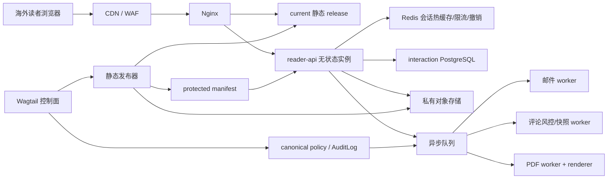

# 02 系统架构

## 1. 当前基线与差距

现有项目使用 Django 6、Wagtail 7、PostgreSQL、Redis、Celery、Webpack、Gunicorn、Nginx 和不可变静态 release。下列现状必须在实现前处理：

- `ArticlePage.static_slug` 是可变路径标识，缺少供互动数据引用的不可变公开 UUID；
- `/media/` 由 Nginx 公开提供，不能放受控 PDF；
- Nginx 当前把普通前台请求代理到 Python `static-frontend`，该服务每次请求读取 manifest 和整个文件，是高流量 P0 瓶颈；
- 当前单个 Celery worker 并发为 2，不能同时承担静态发布、邮件、评论快照和 PDF 渲染；
- 当前 Gunicorn 默认 2 个 worker，不能作为容量承诺；
- 当前 `/healthz/` 会检查依赖，不是纯进程存活探针；互动服务需要独立 `livez` 和 `readyz`。

这些是实施输入，不代表本功能已经存在。

## 2. 逻辑架构



### 2.1 控制面

现有 `web` 服务继续拥有 canonical `ArticlePage`、期刊、编辑任命、文章互动政策、静态发布任务和平台 `AuditLog`。政策变更通过统一 service 完成对象级权限、expected version、审计和 outbox 写入，不能在 form、hook 或 command 中直接更新字段。

### 2.2 互动数据面

`reader-api` 只处理读者身份、评论、举报、分享事件和下载授权。它不查询文章正文，不参与审核或投放。公开 API 以 `article_public_id` 识别文章，并只接受由当前活动 manifest 投影出的文章能力。

### 2.3 数据库边界

建议从第一阶段配置两个 Django database alias：

- `default`：现有 CMS、canonical policy、静态/受保护 manifest、`AuditLog` 和控制面 outbox；
- `interactions`：`ReaderIdentity`、验证挑战、读者会话、评论、举报、审核事件、能力投影和读者行为事件。

两库之间禁止数据库外键。互动数据使用 `article_public_id`、`journal_id`、`release_version` 等值引用。database router 和迁移测试必须保证互动模型不会误建到 `default`，控制面模型不会误建到 `interactions`。

两库更新采用 outbox + 幂等消费者，不伪装成跨库 ACID。安全方向的禁用操作优先写入 Redis deny/revocation 投影；即使异步消费者延迟，API 也要 fail closed。短时已签发对象存储 URL 存在最长 5 分钟的不可撤销窗口，后台必须明确展示。

## 3. 静态发布集成

构建输入冻结时增加：

- `ArticlePage.public_id`；
- 文章和期刊的评论/下载有效政策；
- 当前 approved revision 与 release version；
- PDF 打印所需正文、作者、许可和 canonical URL；
- 互动前端静态资源版本。

构建输出分为：

```text
public release
  HTML/CSS/JS/images/manifest.json

protected release
  PDFs/protected-manifest.json/checksums

runtime projection
  article_public_id -> active release + comments policy + download policy
```

只有公共页面完整性、protected manifest、PDF 校验和和能力投影前置校验都成功，才允许原子激活新 `current`。评论内容不进入文章 release；评论公开视图使用独立版本化 JSON 快照，更新评论时不重建文章。

回滚只能选择已验证的公共 manifest 与配对 protected manifest。活动 release 变更通过 outbox 更新运行时投影；API 在投影版本不匹配时拒绝下载，评论读取可降级到最近已验证快照。

## 4. 请求路由

Nginx 目标路由：

```text
/static/                    -> Nginx immutable assets
/protected-download/...     -> Nginx internal only，浏览器不可直接命中
/reader-api/v1/...          -> reader-api upstream
/admin/...                  -> Wagtail web
/healthz/ /readyz/          -> web compatibility probes
/reader-api/livez           -> reader-api process probe
/reader-api/readyz          -> reader-api dependency readiness
/                             -> Nginx try_files /srv/published/current
```

普通静态命中不得进入 Python。仅 301 兼容映射或静态缺失处理可以进入轻量 fallback；redirect map 应在激活时生成给 Nginx/CDN，而不是每请求解析完整 manifest。

## 5. 队列隔离

至少拆分以下 Celery queue：

| 队列 | 任务 | 资源特性 |
| --- | --- | --- |
| `reader_email` | 魔法链接、事务通知 | 外部 I/O，重试与去重 |
| `reader_comments` | 风控、快照、审核通知 | 低延迟，允许积压降级 |
| `reader_pdf` | Chromium PDF 渲染与校验 | CPU/内存高，低并发隔离 |
| `static_publish` | 现有冻结构建与激活 | 高风险串行/受控并发 |

首期可以继续用 Redis broker，但生产增长阶段应评估 RabbitMQ 或托管队列的持久化、死信和隔离能力。无论 broker 选择，数据库 outbox 是业务事实，任务消息不是唯一事实源。

## 6. 一致性规则

- 邮箱验证消费、读者身份激活和 session 创建在 `interactions` 单事务完成；
- 评论创建和 `CommentModerationEvent(created)` 同事务；快照异步最终一致；
- 政策 desired state、`AuditLog` 和 control-plane outbox 在 `default` 单事务；运行时投影异步幂等应用；
- PDF 文件先写临时对象并校验，再创建不可变产物记录；manifest 激活后才可授权；
- 所有消费者以 `event_id` 去重，允许至少一次投递；
- API 响应返回 `request_id` 和资源 `version`，客户端不得靠时间推断一致性。

## 7. 演进边界

首期不拆独立代码仓库、不引入 Kafka、不为每个期刊建数据库。持续流量达到分库门槛后，`interactions` 可迁移到独立 PostgreSQL 集群；评论公开快照可上对象存储/CDN；写路径按 `article_public_id` 或 `journal_id` 分片。公开 API、UUID 和事件契约在首期就固定，避免扩容时重写前端。
