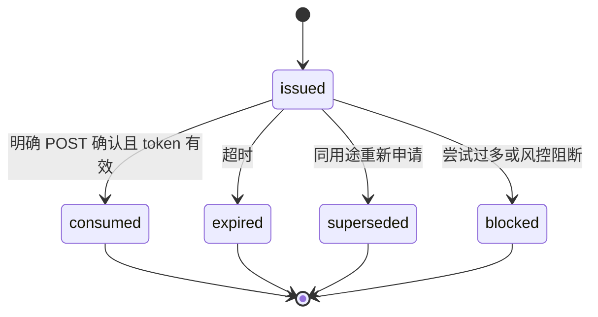
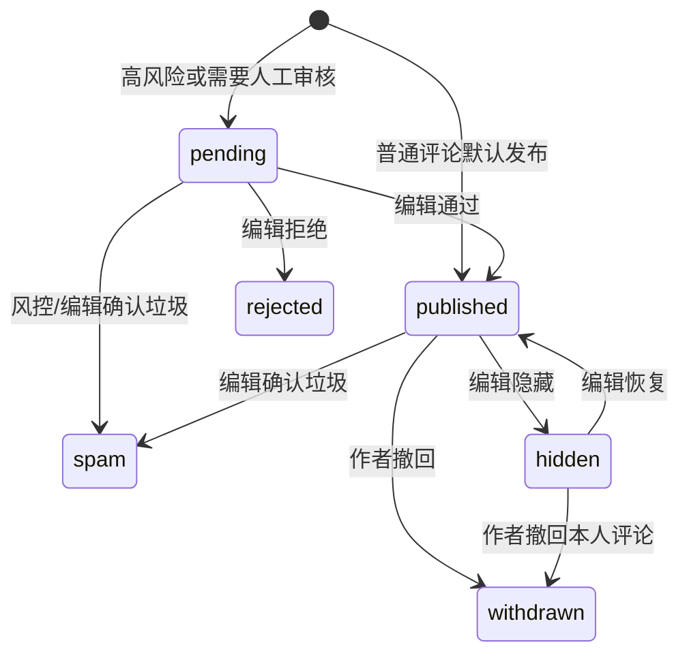

# 03 领域模型与状态机

## 1. 建模原则

- canonical 文章、期刊和发布事实继续属于 `default` 数据库；
- 读者身份和评论属于 `interactions` 数据库；
- 跨库只保存不可变或稳定值引用，不建立外键；
- 邮箱、token、IP 等敏感数据不进入普通审计 metadata；
- 所有公开对象使用 UUID/ULID，不暴露连续数据库主键；
- 撤回、隐藏、拒绝和举报保留不可变事件，不物理删除业务证据；
- 时间统一存 UTC，前端按 locale 展示。

## 2. 控制面模型（`default`）

### 2.1 `ArticlePage` 增量字段

| 字段 | 类型 | 约束/用途 |
| --- | --- | --- |
| `public_id` | `UUIDField` | `default=uuid4, unique, editable=False, db_index`；互动永久主键 |

迁移必须先 nullable 回填，再添加非空和唯一约束；不能在单个大事务内锁表生成所有 UUID。`static_slug` 继续只负责 URL，不得用于新评论关联。

### 2.2 `JournalInteractionPolicy`

| 字段 | 说明 |
| --- | --- |
| `journal` | one-to-one `Journal` |
| `default_comments_mode` | `open` / `read_only` / `hidden` |
| `default_pdf_download_enabled` | 默认是否允许 PDF |
| `version` | 乐观锁版本，从 1 单调递增 |
| `updated_by`, `updated_at` | 最近修改信息 |

### 2.3 `ArticleInteractionPolicy`

| 字段 | 说明 |
| --- | --- |
| `article` | one-to-one canonical `ArticlePage` |
| `comments_policy` | `inherit` / `open` / `read_only` / `hidden` |
| `pdf_download_policy` | `inherit` / `enabled` / `disabled` |
| `version` | expected-version 并发控制 |
| `updated_by`, `updated_at` | 最近修改信息 |

有效政策由期刊默认与文章 override 合并。文章 `hidden` 不删除评论；只控制公开投影。政策字段不属于正文 revision，但必须进入静态构建冻结快照、审计和能力投影。

### 2.4 `ProtectedArtifact` 与 `ProtectedManifest`

`ProtectedArtifact` 保存 `article_public_id`、`approved_revision_id`、`release_version`、locale、对象 key、字节数、MIME、SHA-256、渲染器版本和创建时间。对象 key 唯一且不可覆盖。

`ProtectedManifest` 与一个 `StaticManifest.version` 一一配对，保存 manifest JSON、整体 SHA-256、校验状态和激活关联。已经激活的 manifest 不允许更新；修复生成新 release。

### 2.5 `ControlPlaneOutbox`

保存不可变 `event_id`、event type、aggregate id/version、payload、created at、published at 和 retry count。业务事务只写 outbox；分发器至少一次投递，消费者按 `event_id` 幂等。

## 3. 互动数据面模型（`interactions`）

### 3.1 `ReaderIdentity`

| 字段 | 说明 |
| --- | --- |
| `public_id` | 对外 UUID |
| `email_ciphertext` | 应用层信封加密后的邮箱 |
| `email_lookup_hmac` | 规范化邮箱 HMAC，唯一查找，不使用裸 SHA-256 |
| `email_key_version` | 密钥轮换版本 |
| `email_verified_at` | 最近验证时间 |
| `display_name` | 必填公开昵称，独立于邮箱 |
| `status` | `active` / `suspended` / `deleted` |
| `created_at`, `updated_at` | 时间戳 |

规范化只做安全的首尾空白清除和域名小写/IDNA，不擅自删除 `+tag` 或点号。是否区分邮箱本地部分大小写采用稳定配置，并在上线前迁移测试。

### 3.2 `EmailVerificationChallenge`

保存 challenge UUID、邮箱 lookup HMAC、加密邮箱、token hash、purpose、expires at、consumed at、attempt count、request fingerprint hash 和 created at。明文 token 只出现在邮件中，不落库。默认 15 分钟、单次消费；再次申请使同邮箱同 purpose 的旧未消费 challenge 失效。

### 3.3 `ReaderSession`

保存 session UUID、reader id、secret hash、created at、last seen at、expires at、revoked at 和 coarse risk metadata。Cookie 只含高熵 opaque secret，服务端只存 hash。默认绝对有效期 30 天、空闲 14 天；敏感政策可要求重新验证。不得用浏览器 localStorage 保存 session token。

### 3.4 `ArticleCapabilityProjection`

保存 `article_public_id`、primary journal id、active release、published revision、comments mode、download enabled、protected artifact id、policy version、projection version 和 applied at。它是运行时授权依据，不是 canonical 配置。

### 3.5 `Comment`

| 字段 | 说明 |
| --- | --- |
| `public_id` | UUID/ULID，对外 ID |
| `article_public_id`, `journal_id` | 值引用，均建组合索引 |
| `reader_id` | `ReaderIdentity` 外键（同库） |
| `parent_id`, `root_id` | 同文章回复关系；最大两层 |
| `body_plaintext` | 规范化纯文本 |
| `body_sha256` | 去重/风控辅助，不替代内容 |
| `state` | `pending` / `published` / `hidden` / `withdrawn` / `rejected` / `spam` |
| `risk_score`, `risk_labels` | 非敏感风控结果 |
| `version` | 撤回/审核并发控制 |
| `created_at`, `published_at`, `updated_at` | 时间戳 |

数据库约束确保 parent 与 child 的 `article_public_id` 一致，或由事务内锁定 service 强制并由一致性任务巡检。公开序列化永不返回 reader email、IP、内部风险细节。

### 3.6 `CommentModerationEvent`

不可变事件，保存 comment id、from/to state、action、actor type、后台 actor user id 或 reader id、reason code、note、request/event id、created at。`update()` 和 `delete()` 必须禁止。

### 3.7 `CommentReport`

保存 report UUID、comment id、reporter reader id、reason code、说明、状态、created at。对 `(comment_id, reporter_id, active)` 做唯一约束；重复请求返回原报告。举报内容不自动改变评论状态，达到阈值时可以触发重新风控或待处理队列。

### 3.8 行为与快照

- `ReaderActionEvent`：只记录最小化的 `share_opened`、`link_copied`、`download_granted`/`download_started`，按月分区并设置保留期；
- `CommentSnapshot`：article id、snapshot version、对象 key、ETag、comment count、created at；公开 JSON 不含 PII；
- `InteractionOutbox`：评论变化、审核、邮件等数据面事件，和对应写事务一起提交。

## 4. 状态机

### 4.1 邮箱挑战



GET 邮件链接只展示确认页，不消费 token，避免邮件安全扫描器提前使链接失效。

### 4.2 评论



终态 `withdrawn`、`rejected`、`spam` 不恢复正文公开。误判垃圾需要通过新事件进入 `published` 的例外必须由超级管理员携带原因，并在实现评审中显式开启；首期默认不提供。

### 4.3 评论区政策

```text
open      -> 可读公开评论，可创建评论/回复
read_only -> 可读公开评论，禁止创建评论/回复
hidden    -> 前台不加载评论，禁止创建评论/回复
```

期刊默认和文章 override 合并后得到有效状态。文章不在活动 release 时，运行时强制等价 `hidden + download disabled`。

### 4.4 PDF 产物

```text
requested -> rendering -> validating -> ready -> activated -> retired
               |              |
               +-> failed <---+
```

`ready` 只表示文件通过校验；只有配对 protected manifest 随公共 release 激活后才是 `activated`。失败不得留下可授权对象。

## 5. 索引与保留

首期必要索引：

- comment `(article_public_id, state, created_at, public_id)`；
- comment `(root_id, created_at, public_id)`；
- report `(comment_id, status, created_at)`；
- session `(secret_hash)`、`(reader_id, revoked_at, expires_at)`；
- capability `(article_public_id)`；
- action event `(created_at, event_type)` 分区键。

事件量未达到大表门槛前不要机械分区 `Comment`；先用真实执行计划、表大小和维护成本决定。行为事件与短期验证数据天然按时间删除，适合从第一阶段按月分区或采用自动 TTL 作业。
