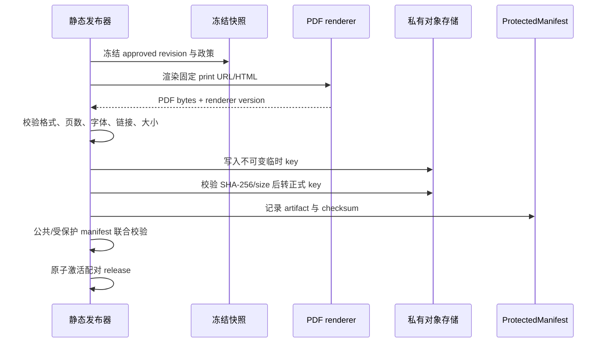

# 06 PDF 下载与分享

> 实施状态（2026-08-17）：本文件 PDF 构建、私有存储、protected manifest、联合激活、短时 grant、S3/X-Accel、HEAD/Range 和失败关闭契约已在 RI-07 完成；分享 UI、最小事件和前端意图恢复已在 RI-08 完成。

## 1. PDF 业务边界

PDF 是正式静态 release 的受保护衍生产物，不是 Wagtail 上传附件。它只能从冻结的 approved revision、有效投放和发布快照生成，不能实时读取最新草稿，也不能在读者请求时临时渲染。

内容权利已由项目方确认。实现仍应在 PDF 中输出文章许可/版权声明、canonical URL、文章 ID 和 release version，便于版本追溯；这不是对权利状态的替代判断。

## 2. 生成流程



`pdf-renderer` 使用固定 digest 的 Chromium/Playwright 镜像、固定字体包、locale 和打印 CSS。禁止加载公网字体、脚本、追踪像素和未纳入快照的远程图片。所有输入 URL 只允许内部一次性构建地址，防止 SSRF。

推荐对象 key：

```text
protected/releases/{release_version}/articles/{article_public_id}/{locale}/article.pdf
```

不得覆盖已有 key；重试产生新构建临时 key，验证后由新 manifest 引用。

## 3. PDF 内容

至少包含：文章标题、作者、期刊、发布日期、正文、引用/脚注、AI 参与说明（如有）、许可/版权、canonical URL、`article_public_id`、release version 和生成时间。页面应有页码、页眉/页脚和可访问文档标题。

首期不做按读者邮箱生成水印。个性化 PDF 会破坏缓存、增加渲染成本并扩大邮箱泄露面。所有获准读者下载同一 release 的同一不可变文件。

## 4. 产物验证

联合激活前必须验证：

- MIME 和文件头是合法 PDF，不是错误 HTML；
- 文件非空、页数大于 0、大小低于配置上限；
- 关键标题/作者文本可提取，字体未缺失成方框；
- 所有冻结图片可解析，禁止外部网络依赖；
- SHA-256、字节数与 protected manifest 一致；
- 文章 ID、approved revision 和 release 三者匹配；
- enabled 文章的必需 PDF 全部 ready；任一必需产物失败则 release 不激活。

如果产品允许 PDF 可选降级，必须另开决策并在页面清楚显示；首期默认严格失败，避免页面宣称可下载但产物缺失。

## 5. 私有存储

### 5.1 对象存储

- bucket/container 默认私有，启用阻止公共访问；
- 服务身份只有所需 prefix 的 `GetObject`/`PutObject`，读写身份分离；
- 服务端加密、版本控制、生命周期和访问日志按环境配置；
- 不配置公共 CDN origin；如使用 CDN signed URL/cookie，仍需短 TTL 和专用私有源；
- CORS 只允许正式站点域名和 GET/HEAD；
- presigned URL 是 bearer token，默认 5 分钟，不进入日志或 Referer。

AWS 官方对 presigned URL 的权限和有效期说明见 [S3 presigned URL 文档](https://docs.aws.amazon.com/AmazonS3/latest/userguide/using-presigned-url.html)。其他 S3 兼容实现必须单独验证过期、Range、Content-Disposition 和签名行为。

### 5.2 文件系统备选

如果当前环境使用共享 volume：PDF 存在 Web 不可直接映射的目录。`reader-api` 授权后返回受控端点，端点校验一次性 grant 并设置：

```text
X-Accel-Redirect: /_protected_pdf/{object_key}
Content-Type: application/pdf
Content-Disposition: attachment; filename*=UTF-8''...
Cache-Control: private, no-store
```

Nginx 的 `/_protected_pdf/` 必须 `internal`，且用规范化 key/映射表防路径穿越。大文件传输、HEAD 和 Range 由 Nginx 处理，不由 Python `read_bytes()`。

## 6. 下载授权

`POST /download-grants` 的检查顺序：

1. reader session 有效且身份 active；
2. 原子限流通过；
3. `ArticleCapabilityProjection` 指向活动 release；
4. 文章在活动 manifest 且 download enabled；
5. protected artifact 与同一 release/revision 匹配且 checksum verified；
6. 创建短时 grant/event，签发 URL或 internal token；
7. 返回 `no-store` 响应。

授权和实际传输分开计数。系统可准确记录“签发”，但对象存储直传时“完整下载”需要 CDN/对象访问日志异步汇总，不能把签发数宣称为完成下载数。

文件名由服务端生成并剔除控制字符、路径分隔符和危险扩展；最终扩展固定 `.pdf`。响应设置 `X-Content-Type-Options: nosniff`。

## 7. 政策与发布

- `inherit` 从 primary journal 默认值计算；
- disabled -> enabled：创建构建任务，PDF 与新 release 激活后生效；
- enabled -> disabled：先在运行时 revocation 拒绝新 grant，再发布移除按钮的新 release；
- 修改正文导致 approved revision 失效时，旧 PDF 不能继续作为当前文章下载；
- rollback 激活旧 release 时必须同时切换配对 protected manifest；
- 旧产物按 release 保留策略归档，不能被当前 grant 引用。

## 8. 分享实现

RI-08 已按以下顺序实现并通过 Web Share/Clipboard/只读 URL、取消、故障、键盘和移动端验收；完整部署证据见 `docs/operations/reader-interactions-ri08-20260817T1121+0800.zh-CN.md`。

静态页面展示统一 Share command：

1. 已有 reader session 时，支持浏览器调用 `navigator.share({title, text, url})`；
2. 不支持 Web Share API 时，使用 Clipboard API复制 canonical URL；
3. Clipboard API失败时显示可选择的只读 URL输入框；
4. 未验证时先完成邮箱验证，再由读者重新点击，不自动触发分享；
5. 成功/取消后 best-effort 发送最小 `share-event`。

系统分享面板由操作系统决定可用目标，应用不承诺出现特定平台。因为文章 URL 是公开的，服务端不能阻止开发者工具、浏览器地址栏或手工复制；“验证后可分享”只能作为站内按钮资格和统计边界，不能描述为内容防转发。

## 9. PDF/分享验收

- 未验证、policy disabled、文章非活动、revision 不匹配均不能拿到 PDF URL；
- 任意猜测 `/media/`、对象 key 或 internal path 都不能下载；
- 链接过期、session 撤销和 release 切换行为符合规定窗口；
- 1GB 以内配置上限的测试文件由 Nginx/对象存储流式传输，Web worker 内存不随文件线性增长；实际业务上限另行配置；
- PDF 在 Chromium、Safari Preview、常见移动 PDF 阅读器可打开；
- system share 不支持时自然回退复制，取消分享不显示为成功；
- 分享事件不包含接收者或第三方账号。
