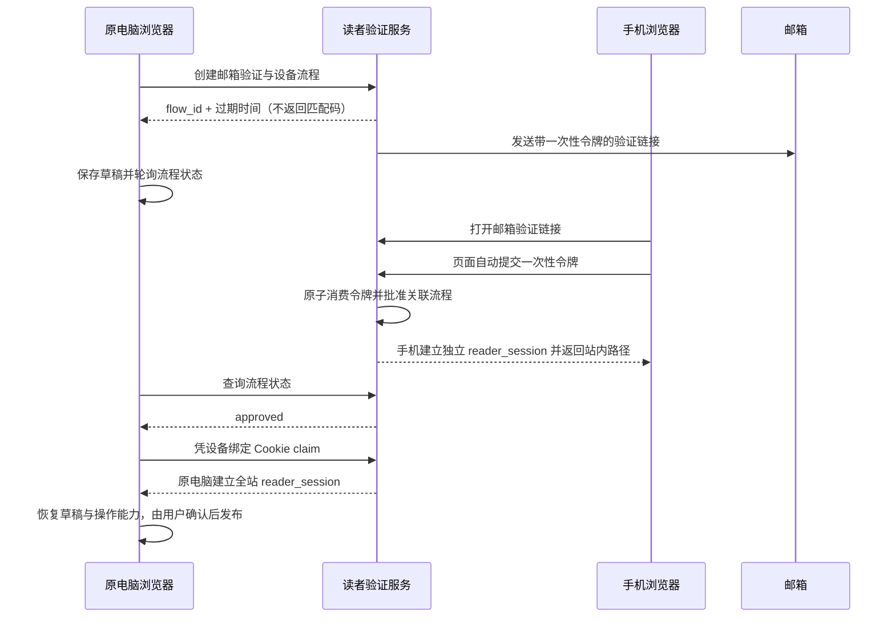

# 跨设备邮箱自动验证与全站读者会话方案

## 1. 文档状态

- **方案名称**：邮箱链接自动批准原请求设备
- **适用场景**：读者在电脑发起评论验证，在手机或其他设备打开邮箱链接
- **当前状态**：已确认并实施
- **产品决策**：用户不需要查找、抄写或输入匹配码；打开邮箱链接后自动批准发起请求的电脑
- **会话范围**：验证成功后，当前浏览器的读者会话对全站所有正式文章生效，不按文章重复验证
- **关联功能**：评论、分享、PDF 下载共用同一读者会话门禁

本文档取代此前要求用户手工输入电脑匹配码的交互方案。服务端可以暂时保留配对码哈希和旧客户端兼容校验，但新接口不得返回配对码，新页面不得展示或要求输入配对码。

## 2. 问题与目标

旧流程存在两个直接问题：

1. 电脑页面没有明确显示匹配码，手机验证页却要求输入匹配码，用户无法完成操作。
2. 用户完成一次邮箱验证后，不清楚会话是否只对当前文章有效，容易在其他文章重复验证。

最终目标：

- 电脑发起验证后保留评论草稿并轮询短期设备流程。
- 手机打开邮件链接后自动消费一次性令牌，不再出现昵称或匹配码输入框。
- 邮件令牌验证成功后自动批准对应的原始设备流程。
- 原电脑凭设备绑定 Cookie 领取自己的 `reader_session`，无需刷新或再次输入信息。
- 验证成功只恢复评论草稿和操作能力，不自动提交评论。
- 同一浏览器随后访问任何正式文章时，都复用这个全站读者会话。
- 手机和电脑分别持有独立会话，不复制 Cookie，也不把会话密钥放进 URL。

## 3. 会话语义

“全局验证”指同一浏览器、同一站点内的全站会话，不是永久登录，也不是把某个邮箱自动授权给所有设备：

- `reader_session` Cookie 的路径为 `/reader-api/`，所有文章的读者 API 请求都会携带它。
- 文章能力接口依据有效读者会话和当前文章投影决定是否允许评论，不把验证结果绑定到发起验证的文章 ID。
- 默认绝对有效期为 30 天，默认空闲有效期为 14 天；以运行环境的 `READER_SESSION_ABSOLUTE_SECONDS` 和 `READER_SESSION_IDLE_SECONDS` 为准。
- 退出、会话过期、管理员撤销或风险策略阻断后，需要重新验证。
- 新浏览器或另一台未参与本次流程的设备不会自动获得电脑会话。

## 4. 核心流程



状态机保持为：

```text
pending
  ├─ approved ──> claimed
  ├─ expired
  ├─ cancelled
  ├─ superseded
  └─ denied（仅旧客户端错误码兼容路径）
```

`status` 和 `claim` 必须同时校验 `flow_id` 与原电脑的短期设备绑定 Cookie。仅持有邮件链接的第三方不能把会话领取到任意电脑。

## 5. 服务端数据与兼容性

继续使用 `ReaderDeviceFlow`：

| 字段 | 用途 |
| --- | --- |
| `public_id` | 对外使用的高熵流程 ID |
| `challenge_id` | 唯一关联邮件验证挑战 |
| `origin_cookie_hash` | 绑定发起流程的原电脑 |
| `user_code_hash` | 旧客户端兼容字段；新交互不返回、不展示、不要求输入 |
| `purpose` | `comment`、`share`、`download` 或 `session` |
| `return_path` | 验证完成后的站内相对路径 |
| `reader_id` | 验证成功后的读者身份 |
| `status` | 流程状态 |
| `expires_at` | 默认 15 分钟的绝对过期时间 |
| `approved_at` / `claimed_at` | 批准与领取审计时间 |
| `claimed_session_ciphertext` | 支持领取请求幂等重放，不向页面暴露 |

兼容规则：

- 旧客户端若仍提交 `user_code`，服务端继续校验并保留失败次数限制。
- 新客户端不提交 `user_code` 时，有效的一次性邮件令牌直接批准与该挑战唯一关联的设备流程。
- 已消费挑战的相同令牌重放返回原有会话结果，不重复创建身份或会话。
- 不需要新增模型字段或迁移。

## 6. HTTP 接口

所有验证响应使用 `Cache-Control: no-store`。

### 6.1 创建验证流程

`POST /reader-api/v1/email-verifications/`

成功响应：

```json
{
  "accepted": true,
  "flow_id": "11111111-1111-4111-8111-111111111111",
  "expires_in": 900,
  "interval": 5
}
```

要求：

- 响应不得包含 `user_code`。
- 同时设置短期、`HttpOnly`、`Secure`、`SameSite=Lax` 的设备绑定 Cookie。
- 邮箱格式错误、站外 `return_to` 或被中性拒绝的请求保持 `202 {"accepted": true}`，前端必须提示请求未启动，不能伪装成已发送邮件。
- 邮件令牌放在 URL fragment 中，服务端 GET、访问日志和 `Referer` 不接收该令牌。

### 6.2 自动消费邮件链接

`POST /reader-api/v1/email-verifications/{challenge_id}/consume/`

新客户端请求：

```json
{
  "token": "邮箱链接中的一次性令牌"
}
```

验证页加载 fragment 中的令牌后立即自动提交。失败时显示明确错误和“继续验证”重试按钮；页面不包含显示名称或匹配码输入框。

服务端必须：

1. 校验令牌、挑战状态、用途、过期时间和站内返回路径。
2. 使用事务与行锁消费挑战并批准唯一关联的设备流程。
3. 为打开邮件链接的浏览器建立独立 `reader_session`。
4. 不返回原电脑设备 Cookie、评论正文或任何会话密钥。
5. 对相同有效消费结果提供幂等重放。

### 6.3 原电脑查询和领取

- `GET /reader-api/v1/device-flows/{flow_id}/status/`
- `POST /reader-api/v1/device-flows/{flow_id}/claim/`

两个接口都要求原电脑设备绑定 Cookie。`claim` 只能处理 `approved` 流程，并只向当前原电脑写入 `reader_session`。已领取流程允许安全重试，但不得重复创建会话。

## 7. 前端交互

### 7.1 原电脑

- 用户只输入一次邮箱。
- 邮箱输入表单以固定悬浮对话框打开，带明确的“取消/关闭”按钮，不把验证流程插入文章正文布局。
- 发送成功后显示“请打开验证邮件，此电脑将自动解锁”，不显示匹配码。
- 显示有效期、等待状态、重新发送和取消操作。
- 页面后台时暂停轮询，回到前台立即继续。
- 评论草稿保存在当前电脑的 `sessionStorage`，按文章和流程隔离。
- `claim` 成功后刷新会话和当前文章能力，恢复草稿并聚焦原操作。
- 不自动提交评论、分享或下载。

### 7.2 邮件打开设备

- 显示脱敏邮箱。
- 页面自动验证，不要求昵称和匹配码。
- 成功后跳回站内文章；失败时提供明确重试状态。
- 不显示或接收原电脑 Cookie、评论正文或设备绑定秘密。

### 7.3 其他文章

- 当前浏览器进入其他正式文章后，先探测同一个 `/reader-api/v1/session/`。
- 会话有效且文章评论模式为 `open` 时，评论框直接可用，验证面板保持隐藏。
- 文章自身为只读、隐藏、尚未正式投放或能力投影未生效时，仍按文章策略拒绝写入；这不代表邮箱验证失效。

## 8. 安全与隐私要求

1. 邮件令牌高熵、短时、单次使用，只出现在 URL fragment 和自动 POST 请求体。
2. 原电脑领取仍依赖不可由邮件链接携带的设备绑定 Cookie。
3. 验证、查询和领取接口执行 CSRF、Origin、限速和事务行锁校验。
4. 会话 Cookie 保持 `HttpOnly`、`Secure`、`SameSite=Lax`，不扩大 Domain。
5. 验证页面设置 `no-store`、`no-referrer`、`frame-ancestors 'none'` 与 `base-uri 'none'`。
6. 日志不得记录邮箱明文、完整令牌、旧配对码、Cookie 或评论正文。
7. `return_path` 只允许本站文章和期刊路径，拒绝外部 URL 与协议相对 URL。
8. 打开链接只批准该挑战已绑定的原电脑流程，不授权任意后来设备领取该流程。
9. 重新发送会替代旧流程；过期、取消、替代和拒绝状态不可领取。

## 9. 验收标准

### 9.1 必须通过

- 创建接口返回 `flow_id`，但不返回 `user_code`。
- 原电脑页面和邮件验证页面均不存在匹配码输入或展示。
- 手机打开带有效 fragment 令牌的链接后自动发送一次 consume 请求。
- consume 请求不含 `user_code` 也能批准流程。
- 原电脑随后自动完成 status -> claim，评论草稿保留且不自动发布。
- 手机与原电脑会话 Cookie 不同。
- 原电脑访问第二篇正式文章时评论框直接可用，不再次显示邮箱验证。
- 同一个挑战重复消费、同一个流程重复领取都不创建重复会话。
- 错误令牌、过期流程、缺少原设备 Cookie、站外返回路径均失败。

### 9.2 验证要求

- 后端单元/集成测试覆盖无匹配码消费、幂等重放、设备绑定、过期和并发。
- 能力 API 测试使用两个不同文章 UUID，证明同一会话均为 `can_comment=true` 且 `verification_required=false`。
- 双浏览器 E2E 覆盖手机自动消费、原电脑领取、草稿恢复、手动发布和跳转第二篇文章。
- 发布前执行 Django 完整测试、前端构建和 Playwright 全量测试。
- 按正式链路生成新的不可变静态 release 与 manifest，原子激活后验证三个健康端点。

## 10. 发布与回滚

按项目发布规约执行：

```text
构建镜像 -> 迁移检查/执行 -> collectstatic -> build_static_site
  -> manifest 完整性校验 -> current 原子激活 -> 服务更新 -> 健康检查
```

构建或校验失败时不得激活新 release。回滚只切换到已有完整 manifest，并记录 `AuditLog`。部署记录需包含应用版本、静态 release、manifest 摘要、测试结果、健康检查和已知限制。

## 11. 明确取舍

- 采用邮件链接自动批准，是本轮已确认的产品决策，用来消除用户无法找到匹配码的阻塞。
- 设备绑定 Cookie 继续保护原电脑领取，避免把会话令牌通过邮件跨设备传递。
- 全站生效采用有期限的浏览器会话，不采用数据库中的永久“邮箱已验证即可授权任意设备”。
- 验证完成不自动提交评论，避免用户在内容变化后发生非预期发布。
- 内部旧配对码字段暂时保留以兼容已发出的旧页面和客户端；后续清理必须单独迁移并先确认无旧流量。
