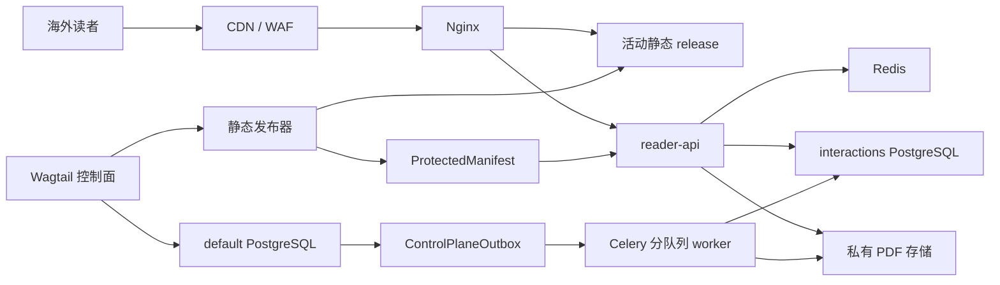
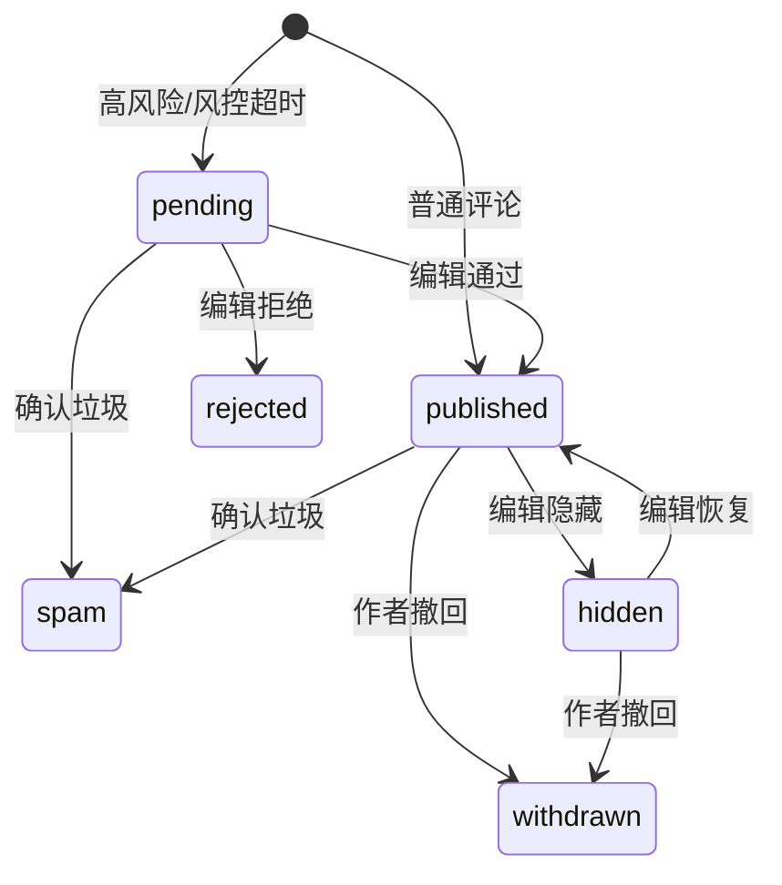

# 读者互动、受控 PDF 与分享：AI 可执行开发任务书

> 规范版本：v1.0  
> 基线日期：2026-08-14  
> 适用仓库：`/opt/ai-author-forum-test-current`  
> 基线提交：`b6555c3`（实施时以当前工作区为准）  
> 状态：产品决策已确认；RI-00 至 RI-08 已完成；RI-09 工程验收完成但项目审批阻塞；RI-10 未开始  
> 用法：把本文件和仓库交给 AI，指定一个 `RI-*` 任务卡执行；任务卡按顺序实施

## 0. 本文件的权威性和 AI 执行规则

本文件是本功能的单文件实施基线。AI 不需要依赖其他读者互动文档才能理解需求；分册只用于补充解释。发生冲突时按以下优先级处理：

1. 仓库根目录及子目录 `AGENTS.md`；
2. 现有 CMS 正式数据链路、权限和不可变发布规则；
3. 本文件；
4. `docs/reader-interactions/` 其他分册；
5. 历史草稿或第三方产品默认行为。

AI 每次只能实施一个任务卡，除非用户明确要求合并。每个任务开始前必须：

1. 完整阅读 `AGENTS.md`、本文件及任务涉及的现有代码；
2. 运行 `git status --short --branch`，保留用户已有修改；
3. 核对任务依赖的前序卡已经完成，不能用临时代码伪造依赖；
4. 将任务拆成可验证步骤，不顺手重构无关模块；
5. 将“规划能力”和“已上线能力”严格区分。

每个任务完成后必须：

- 更新本文件对应任务状态或实现文档，但不能擅自修改产品规则；
- 运行任务卡列出的测试以及 `AGENTS.md` 最低检查；
- 按仓库当前明确的部署入口立即部署并执行健康检查；
- 报告修改文件、迁移、命令、结果、release/image 标识和已知限制；
- 不得只给方案、不写代码，也不得把未部署表述为完成。

AI 必须停止并请求项目方决策的情况：生产域名/凭据/部署目标无法从环境确认；需要破坏性迁移或删除历史评论；需要改变本文确认的评论发布策略、三类编辑权限、PDF 格式或分享边界；需要绕过审核、投放、manifest 或审计；现有用户修改与任务发生无法安全合并的冲突。

直接启动开发时只需向 AI 发送以下指令，并替换任务编号：

```text
请在 /opt/ai-author-forum-test-current 中严格遵守 AGENTS.md 和
docs/reader-interactions/AI-IMPLEMENTATION-SPEC.zh-CN.md，实施任务卡 RI-00。
先核对前序依赖和现有工作区，再完成代码、迁移、测试、部署、健康检查和任务状态更新。
不得合并后续任务卡，不得改变已确认产品规则；遇到任务书规定的停止条件时向我报告。
```

## 1. 已确认产品需求

### 1.1 读者资格

- 文章正文公开阅读，不要求登录；
- 评论、站内分享按钮和 PDF 下载要求读者提供并验证邮箱；
- 使用邮箱魔法链接，不要求密码，不做社交登录；
- 邮箱私密，公开昵称必填；读者身份与后台 `User` 完全隔离；
- 暂不做订阅、营销邮件、关注、点赞、私信或用户画像。

### 1.2 评论

- 评论区位于文章底部；
- 普通评论立即公开并接受事后审核；命中高风险规则时先进入待审；
- 支持一层回复，即最大深度为 2；
- 支持举报、作者撤回本人评论、编辑隐藏/恢复、通过/拒绝待审评论、标记垃圾；
- 支持关闭单篇评论区：`open`、`read_only`、`hidden`；
- 只允许纯文本和换行，不解析 Markdown/HTML，不支持图片、附件或可点击链接；
- 撤回且已有回复时保留“作者已撤回”占位，不展示原文；
- 关闭评论区不删除历史评论。

### 1.3 PDF 下载

- 唯一下载格式是 PDF；
- 只生成并下载当前正式发布 release 对应的 approved revision；
- 期刊有默认值，文章支持 `inherit`、`enabled`、`disabled`；
- 主编辑、常务副编辑、副编辑三类有效任命都能管理本刊文章下载权限；
- PDF 存私有位置，不得放入公开 `/media/`；
- 下载通过短时授权，默认 5 分钟；
- 禁用后立即停止签发新链接，已有链接存在最多 5 分钟残余窗口；
- 首期不做个性化邮箱水印或 DRM。

### 1.4 分享

- 第一阶段只使用 `navigator.share()` 系统分享面板和复制 canonical URL；
- 系统不读取通讯录，不收集接收者，不代发邮件、短信、微信、WhatsApp 或社交消息；
- 系统分享不可用时回退 Clipboard，再回退可选择的只读 URL；
- 公开 URL 可被手工复制，因此邮箱资格只能约束站内按钮和站内事件，不能宣称防转发。

### 1.5 地区和规模

- 主要读者在境外，开发团队在国内；
- 当前无流量基线，禁止承诺未经压测的固定 QPS；
- 架构必须支持 CDN、无状态横向扩容、独立互动数据库、队列隔离、私有对象存储和热点评论快照；
- 动态互动服务全部故障时，静态文章仍可阅读。

## 2. 不可破坏的项目边界

正式文章链路固定为：

```text
导入暂存 -> canonical ArticlePage 草稿/revision -> 审核 -> 正式投放
  -> 冻结构建快照 -> 不可变 manifest -> current 原子激活
```

实现必须遵守：

- 唯一正式文章模型：`ai_author_forum.articles.models.ArticlePage`；
- 唯一正式投放模型：`ai_author_forum.placements.models.ArticlePlacement`；
- `journals.StaticArticle` 和旧 `news.ArticlePage` 不能成为互动正式文章来源；
- 评论不能修改文章 revision、审核、投放或 publication status；
- PDF 不能读取草稿或“最新但未审核”内容；
- 新 release 失败不得影响旧 `current`；
- 已激活 manifest 不原地修改，修复必须产生新 release；
- 回滚只激活已验证旧 manifest；
- 期刊对象授权只来自有效 `JournalEditorAssignment`，旧 Group 和菜单隐藏不能授权；
- 超级管理员不能借互动功能绕过主编辑终审。

## 3. 当前仓库基线和必须解决的差距

### 3.1 已有技术

| 层 | 当前实现 |
| --- | --- |
| CMS | Django 6.0、Wagtail 7.4 |
| 数据库 | PostgreSQL 生产、SQLite 开发测试兼容 |
| 缓存/队列 | Redis、Celery 5.6 |
| 前端 | Webpack 5、SASS/Tailwind、原生 JavaScript |
| E2E | Playwright 1.61 |
| Web | Gunicorn、Nginx、Docker Compose |
| 发布 | 冻结快照、不可变 `StaticManifest`、原子 `current` |
| 权限 | `JournalEditorAssignment` + service 对象级检查 |
| 审计 | 不可更新/删除的 `site_settings.AuditLog` |

### 3.2 P0 差距

- `ArticlePage` 只有可变 `static_slug`，缺少互动使用的不可变 UUID；
- Nginx 当前把普通 `/` 请求代理给 Python `static-frontend`，后者每次读取 manifest 和整个文件；高流量前必须改为 Nginx `try_files/sendfile`；
- `/media/` 是公开路径，不能用于受控 PDF；
- production Compose 的 Web 启动命令会在每个副本执行 migrate/collectstatic，应改成一次性 release job；
- 当前只有一个 Celery worker、并发 2，不能混跑邮件、评论、PDF 和静态发布；
- 当前 `/healthz/` 同时检查依赖；新服务必须提供纯存活 `livez` 和依赖 `readyz`；
- 当前 cache get/set 限流模式不是原子的，读者 API必须使用 Redis 原子算法。

## 4. 最终技术选择

采用项目内自建，不把 Twikoo、Artalk、Waline 或 Coral 作为核心服务。原因是一个已验证邮箱必须统一控制评论、分享和 PDF，并复用现有文章状态、期刊 RBAC、审计和 manifest。第三方系统会引入第二套身份、后台和文章键。

目标栈：

| 组件 | 选择 |
| --- | --- |
| 控制面 | 新 Django app `ai_author_forum.reader_access`，使用 `default` 数据库 |
| 互动数据面 | 新 Django app `ai_author_forum.reader_interactions`，使用 `interactions` 数据库 |
| 动态服务 | 同仓库独立 `reader-api` 容器，无状态，多副本 |
| 会话 | PostgreSQL 权威记录；Redis 只做热缓存、撤销和限流 |
| 邮件 | Django Email backend adapter + Celery `reader_email` 队列 |
| 评论 | PostgreSQL + Redis + 版本化公开 JSON 快照 |
| PDF | 专用 `reader_pdf` worker 镜像，固定 Python Playwright/Chromium |
| 文件 | 私有 S3 兼容对象存储；共享文件系统时用 Nginx internal/X-Accel |
| 边缘 | 海外 CDN/WAF + Nginx 静态直出 |
| 观测 | 结构化日志、指标、request/event/command id；OpenTelemetry 可渐进接入 |

首期保持一个代码仓库，不引入 Kafka，不按期刊建库，不拆独立微服务仓库。运行进程和数据连接池必须可独立扩容。

## 5. 总体架构和一致性



数据库边界：

- `default`：现有 CMS、互动政策、PDF/受保护 manifest、`AuditLog`、控制面 outbox 和 moderation command；
- `interactions`：读者身份、验证挑战、会话、评论、举报、审核事件、能力投影、下载 grant、行为事件和数据面 outbox；
- 两库禁止外键，只用 `article_public_id`、`journal_id`、`release_version` 和 actor id 值引用；
- 跨库使用 transactional outbox + 至少一次投递 + `event_id` 幂等；不伪装成分布式 ACID；
- 安全禁用优先写 Redis deny/revocation，再由 outbox 收敛投影；API版本不匹配时 fail closed。

## 6. 精确代码改动地图

新增：

```text
ai_author_forum/reader_access/
  apps.py
  models.py
  services.py
  permissions.py
  outbox.py
  tasks.py
  admin_forms.py
  wagtail_hooks.py
  migrations/
  tests/

ai_author_forum/reader_interactions/
  apps.py
  models.py
  managers.py
  services/
    identity.py
    comments.py
    capabilities.py
    downloads.py
    moderation.py
    rate_limits.py
  api/
    urls.py
    views.py
    schemas.py
    errors.py
  crypto.py
  email.py
  outbox.py
  tasks.py
  routers.py
  health_views.py
  migrations/
  tests/

templates/reader_interactions/
  verify_email.html
  email/magic_link.txt
  email/magic_link.html
  pdf/article.html

static_src/javascript/reader-interactions/
  bootstrap.js
  session.js
  comments.js
  share.js
  download.js

static_src/sass/components/_reader-interactions.scss
docker/pdf-worker/Dockerfile
requirements-pdf.txt
```

修改：

- `ai_author_forum/settings/base.py`：apps、第二数据库、router、邮件/互动配置、Celery routes；
- `ai_author_forum/settings/dev.py`：console email、开发 interactions DB；
- `ai_author_forum/settings/production.py`：生产必需配置与安全检查；
- `ai_author_forum/urls.py`：在 `core_urlpatterns` 挂 `/reader-api/v1/` 和验证确认页；
- `ai_author_forum/articles/models.py`：新增 `public_id`，不能改变审核状态机；
- `ai_author_forum/articles/services.py`：静态上下文加入安全互动 DTO；
- `ai_author_forum/static_publish/frontend.py`：冻结/输出 article public id 和有效政策；
- `ai_author_forum/static_publish/services.py`、`models.py`：protected artifact/manifest 联合校验和激活；
- `ai_author_forum/site_settings/models.py`：为评论治理增加 `AuditAction.MODERATE`，政策继续使用 `CONFIGURE`，发布继续使用 `PUBLISH/ROLLBACK/RETRY`；
- `templates/articles/article_page.html`：文章底部挂载点，不实时查询评论；
- `static_src/javascript/main.js`、`static_src/sass/main.scss`：加载 bootstrap 和样式；
- `docker/nginx.conf`：`reader-api` upstream、静态 `try_files`、internal PDF；
- `docker-compose.production.yml`：reader-api、分队列 worker、pdf worker、一次性迁移约定；
- `.env.*.example`、`README.md` 和相关 `docs/`：配置与运维说明；
- `requirements.txt`：只加入通用运行依赖；PDF 浏览器依赖放 `requirements-pdf.txt`。

## 7. 数据模型契约

### 7.1 `default` 数据库

#### `ArticlePage.public_id`

```text
UUIDField(default=uuid4, unique=True, editable=False, db_index=True)
```

使用 expand/contract：先 nullable、分批回填、检查无 null/重复、建唯一约束、再 non-null。迁移不得修改 review/publication status、approved revision、投放或 manifest。

#### `JournalInteractionPolicy`

```text
journal OneToOne Journal PROTECT
default_comments_mode open|read_only|hidden default=open
default_pdf_download_enabled Boolean default=True
version PositiveBigInteger default=1
updated_by FK User PROTECT
updated_at DateTime
```

#### `ArticleInteractionPolicy`

```text
article OneToOne ArticlePage PROTECT
comments_policy inherit|open|read_only|hidden default=inherit
pdf_download_policy inherit|enabled|disabled default=inherit
version PositiveBigInteger default=1
updated_by FK User PROTECT
updated_at DateTime
```

#### `ProtectedArtifact`

字段：UUID、`article_public_id`、approved revision id、release version、locale、object key、MIME、bytes、SHA-256、renderer version、status `requested|rendering|validating|ready|activated|failed|retired`、error code、created/updated。唯一约束 `(article_public_id, release_version, locale)`；激活后不可改变 key/checksum/size/revision。

#### `ProtectedManifest`

与 `StaticManifest` 一对一，保存 version、files JSON、SHA-256、validation status、created at。激活后不可更新/删除；回滚必须与公共 manifest 成对。

#### `ControlPlaneOutbox`

字段：event UUID unique、type、aggregate type/id/version、payload JSON、created、published、attempts、last error。业务事务只写 outbox；发布状态更新使用受控 manager。

#### `ModerationCommand`

字段：command UUID unique、comment UUID、journal id、article UUID、action、expected version、reason、note、actor user FK、status `pending|applied|failed|unknown`、remote event id、request id、created/completed。创建时同事务写 `AuditLog(status=started)`。

### 7.2 `interactions` 数据库

#### `ReaderIdentity`

```text
public_id UUID unique
email_ciphertext Binary/Text
email_lookup_hmac Char(64) unique
email_key_version PositiveSmallInteger
email_verified_at DateTime
display_name Char(80)
status active|suspended|deleted
version PositiveBigInteger default=1
created_at / updated_at
```

邮箱规范化仅 trim、域名小写和 IDNA；不能擅自去除 Gmail 点号或 `+tag`。公开 API永不返回 email。

#### `EmailVerificationChallenge`

字段：UUID、email ciphertext/HMAC、token hash、purpose `comment|download|share|session`、return path、status `issued|consumed|expired|superseded|blocked`、expires、consumed、attempts、request fingerprint HMAC、created。token 明文不落库；15 分钟；新申请废弃同邮箱同 purpose 的旧 challenge。

#### `ReaderSession`

字段：UUID、reader FK、secret hash unique、created、last seen、idle expires、absolute expires、revoked、risk metadata。Cookie 只含 opaque secret；默认绝对 30 天、空闲 14 天。

#### `ArticleCapabilityProjection`

字段：article UUID unique、journal id、active release、approved revision id、comments mode、download enabled、protected artifact UUID nullable、policy version、projection version、applied at。版本只能单调增加。

#### `Comment`

字段：UUID、article UUID、journal id、reader FK、parent FK nullable、root FK、body plaintext、body SHA-256、state `pending|published|hidden|withdrawn|rejected|spam`、risk score/labels、version、request UUID unique、created/published/updated。最大深度 2；parent 必须同文章；正文默认 2 至 2000 Unicode 字符并设置字节上限。

索引：

```text
(article_public_id, state, created_at, public_id)
(root_id, created_at, public_id)
(reader_id, created_at)
```

#### `CommentModerationEvent`

不可变：UUID、comment、from/to state、action、actor type `reader|editor|system`、actor id 值、reason、note、command/request id、created。manager 禁止 update/delete。

#### `CommentReport`

字段：UUID、comment、reporter、reason `spam|harassment|hate|privacy|misinformation|other`、说明、status `open|resolved|dismissed`、created/resolved。一个 reader 对同一 comment 只能有一条 active report。

#### `IdempotencyRecord`

字段：reader、scope、key hash、request hash、response status/body、expires。唯一 `(reader, scope, key_hash)`；相同 key 不同 request hash 返回 409。

#### `DownloadGrant`

字段：UUID、article UUID、reader、release、artifact UUID、token hash nullable、status `issued|consumed|expired`、expires、created、consumed。S3 grant 记录签发事实；X-Accel token 默认一次性。

#### 事件和 outbox

`ReaderActionEvent` 只记录 share/copy/download 最小事件，按月分区或保留 90 天；`InteractionOutbox` 与写事务同提交；`CommentSnapshot` 记录 article、version、object key、ETag、count、created。

评论快照只包含已经公开且脱敏的数据，使用独立公开 snapshot storage/CDN；不得与私有 PDF bucket、读者附件或控制面备份混用。active snapshot pointer 短缓存，具体版本对象不可变。

## 8. 状态和业务规则

### 8.1 评论



规则：

- `withdrawn`、`rejected`、`spam` 首期不恢复；
- 作者不能把自己的撤回伪装成删除历史事件；
- 编辑不能执行 `withdrawn`，只能隐藏/拒绝/垃圾；
- 风控不可用时高风险未知评论进入 `pending`；
- 评论区 `read_only` 禁止新评论/回复但保留公开读取；`hidden` 同时禁止读取和写入；
- 政策关闭与提交并发时，事务重新读取 projection/revocation version，关闭优先；
- 前端与序列化只输出纯文本，URL 字符串不自动链接。

### 8.2 有效政策

```text
effective = article override != inherit ? article override : journal default
article not in active manifest => comments=hidden, download=false
artifact release/revision mismatch => download=false
global emergency flag disabled => corresponding write/grant=false
```

### 8.3 PDF

`requested -> rendering -> validating -> ready -> activated -> retired`，任何阶段可到 `failed`。`ready` 不能下载；只有与活动公共 manifest 配对的 `activated` artifact 可授权。

## 9. 权限契约

后台对象范围以 `ArticlePage.primary_journal` 为准。

| 动作 | 匿名 | 已验证读者 | 三类本刊编辑 | 超级管理员 |
| --- | ---: | ---: | ---: | ---: |
| 阅读文章/公开评论 | 是 | 是 | 是 | 是 |
| 评论/回复 | 否 | open 时 | 需另建 reader 身份 | 需另建 reader 身份 |
| 撤回 | 否 | 仅本人 | 否 | 否 |
| 举报 | 否 | 是 | 可作为 reader | 可作为 reader |
| 审核/隐藏/恢复/垃圾 | 否 | 否 | 本刊 | 应急全站，必填原因 |
| 开关评论区 | 否 | 否 | 本刊 | 应急全站，必填原因 |
| 修改 PDF 政策 | 否 | 否 | 本刊 | 应急全站，必填原因 |
| 查看完整邮箱 | 否 | 仅自己的安全流程 | 默认否 | 独立权限且审计 |

三类编辑指有效 `chief_editor`、`executive_editor`、`associate_editor`。本功能不要求副编辑额外拥有 `article_maintenance` responsibility。所有权限在菜单、queryset、view 和 service 重复校验；旧 Group、Django permission、`is_superuser` 或客户端角色参数不能旁路期刊范围。任命、用户或期刊失效后 POST 立即拒绝。

## 10. 公共 API 契约

前缀 `/reader-api/v1/`，同源 JSON UTF-8，时间 RFC 3339 UTC。写请求需要 CSRF；除验证申请/消费外需要 reader session；资源写需要 `Idempotency-Key`。响应包含 `X-Request-ID`，列表用 opaque cursor。

### 10.1 响应格式

```json
{"data": {}, "request_id": "01J..."}
```

```json
{
  "error": {
    "code": "comments_closed",
    "message": "Comments are closed for this article.",
    "field_errors": {}
  },
  "request_id": "01J..."
}
```

客户端只按稳定 `code` 分支。核心错误码：`authentication_required`、`email_verification_required`、`session_expired`、`reader_suspended`、`article_not_active`、`comments_closed`、`comments_hidden`、`download_disabled`、`artifact_not_ready`、`stale_policy`、`stale_version`、`invalid_comment`、`reply_depth_exceeded`、`not_comment_owner`、`already_reported`、`rate_limited`、`service_degraded`。

### 10.2 身份

| 方法 | 路径 | 结果 |
| --- | --- | --- |
| GET | `/session` | 匿名也返回 200 和 `authenticated=false` |
| POST | `/email-verifications` | 始终中立 202，异步发邮件 |
| GET | `/verify-email/` | 只展示中立确认页，不消费 token |
| POST | `/email-verifications/{challenge}/consume` | 单次消费，创建身份/session |
| PATCH | `/session/profile` | 设置昵称，带 expected version |
| POST | `/session/logout` | 幂等撤销、清 Cookie |

申请 body：

```json
{"email":"reader@example.org","return_to":"/articles/example/","intent":"download"}
```

`return_to` 只允许本站相对路径。邮件链接 GET 不产生副作用，确认 POST 后消费，避免邮件扫描器提前失效。

### 10.3 能力

`GET /articles/{article_public_id}/capabilities` 返回 active release、comments mode、PDF available、当前 session 是否可操作和 `verification_required`。缓存必须被 Redis deny/revocation version 覆盖。

### 10.4 评论

| 方法 | 路径 |
| --- | --- |
| GET | `/articles/{id}/comments?cursor=&limit=` |
| POST | `/articles/{id}/comments` |
| POST | `/articles/{id}/comments/{comment_id}/replies` |
| POST | `/articles/{id}/comments/{comment_id}/withdrawal` |
| POST | `/articles/{id}/comments/{comment_id}/reports` |

创建 body：

```json
{"body":"A concise response.","expected_policy_version":7}
```

普通评论返回 `201 state=published`，待审返回 `202 state=pending`，政策并发关闭返回 `409`，校验失败 `422`，限流 `429 + Retry-After`。GET 使用 ETag；默认根评论和回复均按 `created_at ASC, public_id ASC` 稳定排序。

### 10.5 下载/分享

- `POST /articles/{id}/download-grants`：返回 5 分钟 presigned URL或一次性站内 URL，`Cache-Control: no-store`；
- `POST /articles/{id}/share-events`：只接受 `system_share|copy_link` 和 `completed|cancelled|failed`，不接收接收者。

浏览器必须在用户手势内先调用 `navigator.share`，完成后 best-effort 上报；不能为了等埋点而丢失 transient activation。

### 10.6 内部接口

私网/mTLS 或短期服务凭据：

- `PUT /internal/v1/article-capabilities/{id}`；
- `POST /internal/v1/moderation-commands`；
- `GET /internal/v1/moderation-commands/{command_id}`；
- `POST /internal/v1/comment-snapshots/rebuild`。

内部接口同样校验 version、scope 和幂等，不能信任客户端角色。

## 11. 前端契约

文章模板底部输出：

```html
<section
  id="reader-interactions"
  data-article-id="56b0d9b2-..."
  data-release="20260814T120000Z-abcd1234"
  data-locale="en"
  aria-labelledby="reader-interactions-heading"
>
  <h2 id="reader-interactions-heading">Comments</h2>
  <div data-reader-interactions-root></div>
</section>
```

要求：

- 静态模板不查询评论数据库；
- bootstrap 接近视口时懒加载评论 bundle；
- JavaScript/API故障不影响正文、导航和 canonical URL；
- 正文使用 `textContent`，不使用 `innerHTML`；
- 撤回/隐藏后原文不能留在 DOM 或 data attribute；
- 验证前草稿仅暂存在 sessionStorage 且有短 TTL，验证后由用户再次提交；
- 回复表单有焦点管理，状态用 `aria-live=polite`；
- 触控目标至少 44x44 CSS px，移动端无水平溢出；
- system share、copy、举报、撤回必须有成功/失败状态，不能只靠颜色。

## 12. 邮箱、会话和密码学

- token 使用 `secrets.token_urlsafe(32)` 或等强度随机源；
- 库内保存带 server pepper 的 SHA-256/HMAC token hash，不保存明文；
- email lookup 使用独立 HMAC-SHA256 key，不能用裸 SHA-256；
- email ciphertext 通过 `EmailProtector` 接口；首期实现 versioned MultiFernet，密钥由 secret manager 注入，首 key 写入、全部 key 解密；
- 新增 `cryptography` 版本范围并锁定；KMS adapter 可以后续替换，模型保留 key version；
- Cookie：`HttpOnly; Secure; SameSite=Lax; Path=/reader-api/`；不使用 localStorage；
- CSRF 使用 Django 官方机制并校验 Origin/Host；CORS 默认不开放凭据跨域；
- 验证页设置 `Referrer-Policy: no-referrer`，消费后清除 URL token；
- 原始 email、token、Cookie、comment body、presigned URL不得进入日志、trace、metrics label 或 `AuditLog.metadata`。

生产邮件通过 Django Email backend adapter 发送，任务进入 `reader_email` 队列。开发使用 console/Mailpit。正式域配置 SPF、DKIM、DMARC，跟踪 accepted/delivered/bounce/complaint，但 metrics 不带 email label。

## 13. 反滥用和隐私

Redis 限流必须使用 Lua/token bucket 或成熟原子实现。初始阈值全部配置化：

| 动作 | 默认基线 |
| --- | --- |
| 验证申请 | 每 IP 5/小时、每 email HMAC 3/小时、全局熔断 |
| 验证消费 | 每 challenge 5 次，成功立即失效 |
| 评论/回复 | 每 reader 10 秒 1 条、20/小时、100/日 |
| 举报 | 每 reader/comment 1 条、20/日 |
| 下载 grant | 每 reader/article 5/小时、50/日 |
| 分享事件 | 同 reader/article/类型 1 分钟合并，允许丢弃 |

阈值上线后由压测和误伤数据调整。Redis 不可用时，文章/评论快照可读；验证消费、评论写、举报和下载 grant fail closed。

本地同步硬规则检查长度、控制字符、重复、层级、频率和封禁；可插拔 risk adapter 有严格超时。低风险发布，中高风险/超时 pending，明确自动攻击可 spam。外部风控默认不发送 email 或原始 IP。

建议保留：challenge 过期后 24 小时、撤销 session 安全元数据 30 天、原始 IP最多 30 天、行为事件 90 天后聚合/删除。评论与审核按内容治理政策保留；身份删除时可匿名化评论作者。正式周期必须由项目方隐私负责人确认，本文不替代法律意见。

## 14. PDF 生成和私有下载

PDF 从冻结 approved revision 构建，不在读者请求时渲染。专用 `requirements-pdf.txt` 锁定与前端 E2E 同系列的 Python Playwright；`docker/pdf-worker/Dockerfile` 固定基础镜像 digest、Chromium 和字体。

流程：

```text
冻结文章/政策/资源
  -> 创建 ProtectedArtifact(requested)
  -> reader_pdf worker 使用 pdf/article.html + page.set_content()
  -> page.pdf()
  -> 校验 PDF header/MIME/页数/大小/关键文本/字体/SHA-256
  -> 写私有不可变 object key
  -> ready
  -> public + protected manifest 联合校验
  -> activated
```

对象 key：

```text
protected/releases/{release_version}/articles/{article_public_id}/{locale}/article.pdf
```

PDF 至少包含标题、作者、期刊、发布日期、正文、引用/脚注、AI 参与声明、许可/版权、canonical URL、article UUID 和 release。渲染器禁止公网和 cloud metadata，所有图片来自冻结输入；超时、CPU、内存和进程数受限。

对象存储 bucket 默认私有，写/签发身份分离。共享文件系统备选使用 Nginx：

```text
X-Accel-Redirect: /_protected_pdf/{validated_key}
Content-Type: application/pdf
Content-Disposition: attachment; filename*=UTF-8''...
Cache-Control: private, no-store
X-Content-Type-Options: nosniff
```

`/_protected_pdf/` 必须 `internal`。Range/HEAD/字节传输由 Nginx 或对象存储完成，Python 不 `read_bytes()` 发送大文件。

## 15. 静态发布集成

冻结输入增加 article UUID、有效互动政策、approved revision、release、PDF 内容和前端资源版本。构建输出：

```text
public release: HTML/CSS/JS/images/manifest.json
protected release: PDF/protected-manifest.json/checksums
runtime projection: article UUID -> active release/policy/artifact
comment snapshots: 独立版本化 JSON，不属于文章 release
```

只有 public manifest、所有 enabled PDF、protected manifest 和能力投影前置校验通过，才能激活。激活/失败/重试/回滚写 `AuditLog`。enabled -> disabled 先 runtime deny，再构建移除按钮；disabled -> enabled 只有新 PDF 与新 release 激活后生效。

评论变化只刷新评论 snapshot，不调用 `build_static_site`。回滚必须公共/受保护 manifest 配对；投影未收敛时 PDF fail closed。

## 16. 高流量、可靠性和观测

### 16.1 上线必做

- CDN/WAF 在主要海外区域；
- Nginx `try_files /srv/published/current` + `sendfile`，普通文章不进入 Python；
- 至少 2 个 reader-api 实例，独立 DB 用户/连接上限；
- `reader_email`、`reader_comments`、`reader_pdf`、`static_publish` 队列和 worker 隔离；
- PostgreSQL interactions 逻辑库、Redis、私有对象存储均有备份/监控；
- capability 版本化缓存、deny key、热点 single-flight、ETag；
- 评论 JSON 快照可迁移到对象存储/CDN；
- PDF 不占 Web worker 内存/带宽。

### 16.2 扩展顺序

Launch：上述基线。Growth：PgBouncer、互动 DB 独立实例、Redis HA、评论快照 CDN、读副本。High traffic：多可用区、事件分区、durable broker、热点拆分。Multi-region 只有业务确认 RTO/RPO 和预算后实施。

表分区只用于真实大表；先测执行计划和表大小。负载测试必须覆盖正常、峰值、冷缓存、单篇热点、邮件变慢、Redis 故障和 PDF 批构建。生产持续负载默认不超过实测饱和点 50%，短峰不超过 70%。

### 16.3 降级

| 故障 | 行为 |
| --- | --- |
| reader-api/互动 DB | 文章可读；评论可回退快照；写入和下载拒绝 |
| Redis | 文章/快照可读；敏感写 fail closed |
| 邮件 | 现有 session 可用；新验证排队/切备用 |
| 风控 | 新评论 pending |
| PDF renderer | 旧活动 PDF可用；新 release 不激活 |
| 对象存储 | 下载暂不可用，不让 Web 代理文件 |

### 16.4 指标和探针

指标：CDN hit、origin RPS/带宽、API p50/p95/p99/错误码、DB连接/锁/慢查询、Redis延迟/eviction/限流、各队列 oldest age/retry、邮件 delivery/bounce、评论状态/审核 backlog/snapshot lag、PDF duration/failure/bytes、对象存储错误和成本。禁止 PII/高基数 label。

`livez` 只检查进程；`readyz` 检查数据库、Redis、迁移版本和必要依赖。静态、API、邮件和下载从主要海外区域做 synthetic。

## 17. 配置和部署契约

新增环境变量（example 文件必须同步）：

```text
INTERACTIONS_DATABASE_URL
READER_INTERACTIONS_ENABLED
READER_EMAIL_VERIFICATION_ENABLED
READER_COMMENTS_WRITE_ENABLED
READER_PDF_GRANTS_ENABLED
READER_SHARE_UI_ENABLED
READER_SESSION_COOKIE_NAME
READER_SESSION_ABSOLUTE_SECONDS
READER_SESSION_IDLE_SECONDS
READER_EMAIL_LOOKUP_KEY
READER_EMAIL_ENCRYPTION_KEYS
READER_TOKEN_PEPPER
READER_MAGIC_LINK_TTL_SECONDS
READER_PUBLIC_BASE_URL
READER_EMAIL_FROM
READER_PRIVATE_STORAGE_BACKEND
READER_PRIVATE_STORAGE_ROOT
READER_S3_BUCKET
READER_S3_ENDPOINT_URL
READER_S3_REGION
READER_S3_ACCESS_KEY_ID
READER_S3_SECRET_ACCESS_KEY
READER_COMMENT_SNAPSHOT_STORAGE_BACKEND
READER_COMMENT_SNAPSHOT_ROOT
READER_COMMENT_SNAPSHOT_BASE_URL
READER_DOWNLOAD_GRANT_TTL_SECONDS
READER_RISK_BACKEND
```

生产 settings 对必需 secret 使用启动检查，不提供不安全默认值。开发 settings 使用独立 SQLite interactions DB、console email 和本地私有目录。

Celery routes：

```text
reader_interactions.tasks.send_magic_link -> reader_email
reader_interactions.tasks.refresh_comment_snapshot -> reader_comments
reader_interactions.tasks.apply_capability_projection -> reader_comments
reader_access.tasks.render_pdf -> reader_pdf
static_publish.* -> static_publish
```

部署顺序：构建/扫描镜像 -> 备份/恢复点 -> default/interactions expand migration job -> collectstatic -> 部署 reader-api/worker（开关关）-> 健康检查 -> 构建公共+PDF+protected manifest -> 联合校验 -> 原子激活 -> 小范围开邮箱/评论/PDF/分享 -> 海外 synthetic -> 扩灰度。

API兼容当前和上一活动静态 release。数据库先 expand，contract 延后完整回滚窗口。应用回滚先停写/授权开关，再回滚镜像；不做破坏性 downgrade。

## 18. 测试矩阵

### 18.1 单元/集成

- UUID 回填和 slug 变更关联；
- database router、两库迁移、禁止跨库 FK；
- email 规范化/HMAC/加密轮换、token 单次/过期/重放；
- session 轮换、空闲/绝对过期、撤销；
- policy 合并、expected version、deny 优先；
- 评论纯文本、长度/字节、层级、状态、撤回占位；
- 举报和 Idempotency-Key；
- 三类角色、本刊范围、失效任命、旧 Group 拒绝；
- Redis 原子限流和故障 fail closed；
- outbox 重复投递、投影版本倒退拒绝；
- moderation command 成功/超时/对账；
- PDF 校验、私有存储、过期 grant、Range/X-Accel；
- public/protected manifest 激活和回滚。

并发/锁测试必须在 PostgreSQL 执行，SQLite 不能作为生产并发验收。

### 18.2 E2E

- 匿名读文章，互动全故障正文仍可用；
- 评论/下载/分享邮箱验证与安全返回；
- 普通发布、高风险待审、回复、举报、本人撤回；
- open/read-only/hidden；
- 三类编辑本刊操作和跨刊 403；
- PDF 下载、过期、禁用、release 回滚；
- Web Share/Clipboard/失败回退；
- 桌面、移动、键盘、焦点、长文本、屏幕阅读器；
- CSP、无第三方脚本、无 token Referer。

### 18.3 每次任务最低命令

```bash
source .venv/bin/activate
python manage.py check
python manage.py makemigrations --check --dry-run
pytest <affected tests>
npm run build:prod                         # 涉及前端/静态资源
npm run test:e2e                           # 发布前和用户流程变更
```

发布前运行完整 pytest、完整 E2E、真实 PostgreSQL/Redis/Celery/Nginx/对象存储联合验收，以及对应负载/安全/恢复测试。

## 19. AI 实施任务卡

任务状态初始均为 `pending`。AI 完成一张卡后，把状态改为 `completed`，写入实现提交/release 和验证结果；不能一次把未做的卡全部标完成。

### RI-00：基线与部署护栏

状态：`completed`

实现记录（2026-08-17）：

- 基线：`b6555c3`；部署标识：`ri00-20260817T001649+0800`；未新增数据库迁移；
- Web/镜像默认命令只启动 Gunicorn，迁移、cache table 和 `collectstatic` 只由显式 `release` profile 一次性执行；
- 固化 `static_publish`、`reader_email`、`reader_comments`、`reader_pdf` 队列路由，现有 worker 仅监听 `static_publish`；
- 六个读者互动开关在 settings、Compose 和全部 `.env.*.example` 中默认关闭；新增无依赖 `/livez/`，保留 `/healthz/`、`/readyz/` 和静态健康语义；
- 验证：`check`、迁移 dry-run、Compose production/local 解析、11 项阶段测试、779 项完整 pytest 与 396 项 subtests、生产 Webpack、29 项 Playwright E2E 均通过；SQLite 下 3 项既有 PostgreSQL 并发测试按条件跳过；
- 部署：`ai-author-forum-test`；一次性 release job 成功；`/livez/`、`/healthz/`、`/readyz/`、`/__static_health__/` 均为 200；活动公共 manifest 保持 `20260810T092216112247Z-job90` 且 `failed=0`，未绕过发布链路生成新内容 release。

目标：固化基线检查、迁移 job、队列命名、feature flags 和部署记录格式，不增加用户可见功能。

主要文件：settings、Compose、`.env.*.example`、health、部署文档和测试。

完成标准：Web 多副本启动不再并发迁移；现有 health/ready/static health 正常；现有完整测试/E2E通过；开关默认关闭；部署可回滚。

### RI-01：文章 UUID 与 Nginx 静态直出

状态：`completed`；依赖：RI-00。

实现记录（2026-08-17）：

- 基线：`b6555c3`；部署标识：`ri01-20260817T010146+0800`；数据库按 `0016 expand -> 0017 分批回填 -> 0018 校验/唯一 -> 0019 contract` 两阶段部署；
- 1217 篇文章 UUID 的 null/重复均为 0，回填连续重跑两次 UUID 摘要不变；slug 修改、旧 revision 和直接修改 UUID 的保护测试通过；文章审核/投放字段摘要在迁移和发布前后保持 `553e805b...16b6` / `545ca486...5097`；
- 新 release 生成 manifest 纳管的 `.nginx-direct-ready` 和 `.nginx-redirects/<output_path>.redirect`；Nginx 使用 `try_files`/`sendfile` 直出普通页面，旧 release、301 和静态健康继续回退无数据库 `static-frontend`；内部标记固定 404，目录穿越固定 400；
- 验证：Django check、迁移 dry-run、生产 Webpack、114 项受影响测试、794 项完整 pytest 与 396 项 subtests、4 项真实 PostgreSQL 迁移/行锁测试、30 项 Playwright E2E 均通过；SQLite 下 3 项 PostgreSQL 行锁测试按条件跳过，并已由 PostgreSQL 结果补足；
- 部署：`ai-author-forum-test`；全量 job91 因既有内容就绪缺口按规则失败并写入审计，未激活；选择性不可变 release `20260816T171349272216Z-job92` 从已验证 job90 冻结基底生成并原子激活，3910/3910 本次 targets 成功、manifest `failed=0`、完整性校验通过；四个健康端点均为 200；
- 已知限制：job90 中 36 个双语页面对应 18 篇当前 provider 不再允许构建的历史文章，只能原样继承，不能绕过审核/投放门禁补写 UUID DOM 属性；这些页面仍由 Nginx 静态直出，后续互动能力必须 fail closed，待正式数据修复后由新 release 重建。

目标：安全增加 `ArticlePage.public_id`；普通前台由 Nginx 直接读活动 release。

关键测试：分批回填幂等、null/重复为零、slug 改变 UUID不变、旧 release 兼容、目录穿越、301、current 原子切换、桌面/移动静态 E2E。

完成标准：首页/文章响应不经 Python且含 release 标识；审核/投放/manifest 数据未改变。

### RI-02：双数据库和领域骨架

状态：`completed`；依赖：RI-01。

实现记录（2026-08-17）：

- 基线：`b6555c3`；部署标识：`ri02-20260817T021439+0800`；default 与 interactions 均应用 `0001_initial`，无 contract downgrade；
- 新增 `reader_access` 控制面和 `reader_interactions` 数据面模型、迁移、database router、outbox 受控投递 manager、不可变事件/manifest 约束及后台只读 admin；两库不含跨库外键；
- 开关保持全部关闭；生产 Compose 固定先迁移 `default`、再迁移 `interactions`，Web/worker 启动日志只有 Gunicorn/Celery 运行进程；CI、SQLite 开发环境和 PostgreSQL 集成均分别迁移/检查；
- 验证：Django check、`makemigrations --check --dry-run`、双 SQLite 迁移检查、11 项真实 PostgreSQL 双库模型测试、808 项完整 pytest 与 396 项 subtests、30 项 Playwright E2E、生产 Webpack 均通过；SQLite 下 3 项既有 PostgreSQL 行锁测试按条件跳过；
- 正式库基线及部署后摘要保持不变：1217 篇文章摘要 `a2ce4248957f1b26fb4d8a01dedd9c64772104d55527a42f00f2d7399d531f5d`，1499 条投放摘要 `9308d41ba9592f2cf388446af51a663227a793c012d9ab141d320740149ccb83`，manifest 摘要 `e47e5290a7b06ed36d609aa9c21c9e06aa0361e5548d1d68131f1486457628d4`；
- 备份/恢复：部署前 custom dump `default d23e83b9...080f5`、`interactions 4fd5d461...05b7f`，部署后独立 dump `default 0dbad4a9...6cfc5`、`interactions 345d019f...ac19c`；分别恢复到隔离库，`migrate --check`、1217/1499 业务计数和 6/12 表边界检查通过，临时库已删除，正式库与备份保留；
- 部署：`ai-author-forum-test`；web `sha256:ddcb1178eb1fad71eb742b66e6d9e4b8070ba0b3bfe22325a649611bf2717cd4`，worker `sha256:fd1e8888d20d596b4d104844c49bc65a070220e9c6542b555af2834ed2798da3`，static-frontend `sha256:fbf4fab9e21cf3d9af5fed5ba6a639b9da3e8ecbbe1211b8367e13e75fd7e150`；活动公共 manifest 仍为 `20260816T171349272216Z-job92`；内部 `/livez/`、`/healthz/`、`/readyz/` 和 `/__static_health__/` 均为 200，首页仍由 Nginx 直出；
- 已知限制：这只是领域骨架，邮箱验证、评论 API、政策编辑、PDF 渲染/授权、分享和对账尚未实现；所有读者互动开关必须继续保持关闭，不能把骨架表当作可用互动功能。

目标：创建 `reader_access`、`reader_interactions`、database router、全部基础模型、outbox、manager 不可变约束和 admin 只读骨架。

关键测试：两数据库迁移、router、无跨库 FK、outbox 幂等、不可变 event/manifest、SQLite dev 与 PostgreSQL integration。

完成标准：开关关闭时对现有站点零行为变化；两库独立备份/恢复步骤可执行。

### RI-03：邮箱验证和 reader session

状态：`completed`；依赖：RI-02。

实现记录（2026-08-17）：

- 部署标识：`ri03-20260817T0326+0800`；新增版本化邮箱加密/HMAC、fragment 魔法链接、原子限流、reader session、幂等 profile/logout、CSRF、加密邮件 outbox、`reader_email` 专用 worker 和 retention cleanup；迁移 `reader_interactions.0002_one_issued_challenge_per_purpose` 已应用。
- 验证：`check`、migration dry-run、Black/isort/Ruff、RI-03 定向测试、真实 PostgreSQL 并发/Redis/Celery/SMTP 联合验收、847 项完整 pytest（5 skipped）、30 项 Playwright E2E、生产 Webpack 均通过；缺 secret、故障、扫描器 GET、过期/重放、开放重定向、CSRF、日志脱敏和密钥轮换验收通过。
- 部署：`ai-author-forum-test`；release image `a4d4cd26...`，web `96ceb33e...`，worker `6b677755...`，reader-email-worker `8fb0711d...`，static-frontend `5ef23bc9...`；四个健康端点均为 200，reader API 匿名态 200 且 `no-store`；活动公共 manifest 仍为 `20260816T171349272216Z-job92`。
- 发布护栏：公共 `build_static_site` 因既有内容就绪缺口生成 job 93 failure/start 审计并拒绝激活，旧 current 未改变；未绕过审核、正式投放或 manifest 校验。双库 post-deploy 备份、隔离恢复、双 `migrate --check`、1217/1499 业务计数和 6/12 表边界检查通过。
- 详细命令、镜像、dump SHA256 和限制见 `docs/operations/reader-interactions-ri03-20260817T0342+0800.zh-CN.md`。

目标：实现加密/HMAC、魔法链接、GET 确认/POST 消费、昵称、session、注销、邮件队列和原子限流。

关键测试：邮箱枚举时间/响应、token 过期/重放/扫描器、开放重定向、CSRF、Cookie、密钥轮换、日志脱敏、Redis/邮件故障。

完成标准：测试邮箱端到端验证成功；生产 secret 缺失时 ready/启动失败；PII 不出现在日志。

### RI-04：政策、能力投影与后台权限

状态：`completed`；依赖：RI-03。

实现记录（2026-08-17）：

- 部署标识：`ri04-20260817T0438+0800`；控制面政策服务、三类本刊编辑对象级权限、Redis deny/version fail-closed、ControlPlaneOutbox 单调投影、capability API、service-token 内部接口和 desired/applying/effective 后台均已实现。
- 验证：67 项阶段测试、真实 PostgreSQL 双库并发 2 passed、真实 Redis Lua、861 项完整 pytest（7 skipped）、32 项 Playwright（30 passed/2 skipped）、生产 Webpack 均通过；旧 Group、`is_superuser`、跨刊、失效任命、expected version、重复/倒退投影和审计事务均有验收。
- 部署：`ai-author-forum-test` 五个应用容器使用 candidate `sha256:c813ecb0...`，新增 `reader-comments-worker` 仅监听 `reader_comments`；`/livez/`、`/healthz/`、`/readyz/`、`/__static_health__/` 均 200；公共 manifest 仍为 `20260816T171349272216Z-job92`。
- 详细命令、备份 SHA256、队列和限制见 `docs/operations/reader-interactions-ri04-20260817T0438+0800.zh-CN.md`。

目标：实现 journal/article policy、effective policy、capability API、outbox 投影、deny key 和三类编辑后台。

关键测试：三类角色本刊允许、跨刊/旧 Group拒绝、expected version、任命失效、投影重复/倒退、文章非活动 fail closed、AuditLog 同事务。

完成标准：关闭评论或下载无需等待静态构建即可阻止新写/grant；后台显示 desired/applying/effective。

### RI-05：评论、回复、举报和公开快照

状态：`completed`；依赖：RI-04。

实现记录（2026-08-17）：

- 评论/回复/举报/作者撤回服务、纯文本与风险待审、幂等、限流、稳定 cursor/ETag、Redis cache、版本化 immutable snapshot 和 `reader_comments` 队列已实现；政策关闭、Redis/能力故障、暂停身份和风险超时均按 fail-closed/pending 规则处理。
- 文章底部新增无 PII 挂载点与懒加载评论 bundle；使用 `textContent` 渲染，支持桌面/移动、键盘焦点、字符计数、aria-live、回复、举报和本人撤回；静态正文不依赖互动服务。
- 验证：`check`、迁移 dry-run、Ruff/Black、17 项 RI-05 定向测试、876 项完整 pytest（10 skipped，408 subtests）、真实 PostgreSQL 3 项并发、真实 Redis Lua/cache 验收、生产 Webpack、33 项 Playwright（31 passed/2 skipped）均通过。
- 部署记录、镜像 digest、健康检查、双库备份/恢复和已知限制见 `docs/operations/reader-interactions-ri05-20260817T0555+0800.zh-CN.md`；公共静态 current 保持原已验证 release，未绕过内容 readiness 或 manifest 门禁。

目标：实现评论 API、默认发布/风险前审、两层回复、举报、作者撤回、ETag/cursor、Redis cache 和版本化 snapshot。

关键测试：纯文本/XSS/Unicode、重复/幂等、层级、政策并发关闭、撤回占位、热点 single-flight、快照最终一致、DB/Redis/风控故障。

完成标准：文章底部桌面/移动流程完整；动态服务故障文章可读；普通评论和 pending 行为符合需求。

### RI-06：审核后台与跨库审计

状态：`completed`；依赖：RI-05。

实现记录（2026-08-17）：

- 待审/举报/全部评论 Wagtail 工作区、五类审核动作、expected version、幂等、批量部分失败和三类本刊编辑对象级权限已实现；
- default `ModerationCommand + AuditLog(started)` 与 interactions 行锁状态变更、不可变 event/outbox 通过显式跨库 command 串联；unknown 不显示成功，reconciliation 只按同 command event 补齐；
- 审计字段覆盖版本、状态、release、command/event/request 和错误类别，不包含正文、邮箱、token、session、下载 URL 或原始 IP；
- 验证：RI-06 SQLite 4 passed、真实 PostgreSQL 双库 5 passed、完整 pytest 880 passed（11 skipped，409 subtests）、生产 Webpack、33 项 Playwright（31 passed/2 skipped）均通过；
- 部署：`ai-author-forum-test` 最终 digest `sha256:10440ea83f6359715e58df79caab8cdaaf6d486933414bc7b19e3e3facb7a1fb`，三项 expand migration 已应用，四个健康端点 200；备份/恢复、队列和完整证据见 `docs/operations/reader-interactions-ri06-20260817T084217+0800.zh-CN.md`。

目标：实现待审/举报/全部评论后台，隐藏/恢复/通过/拒绝/垃圾、批量操作、ModerationCommand 和 reconciliation。

关键测试：expected version 并发、命令幂等/超时/unknown、事件不可变、AuditLog started/success/failure、批量部分失败、PII 脱敏。

完成标准：三类编辑只治理本刊；有害评论可及时隐藏；跨库审计失败可告警和补齐，未知不显示成功。

### RI-07：PDF 构建、protected manifest 和下载

状态：`completed`；依赖：RI-04、RI-00。

目标：专用 PDF worker、冻结模板、私有存储、artifact/manifest、联合激活、presigned/X-Accel grant。

关键测试：草稿拒绝、revision/release 不匹配、PDF header/页数/字体/checksum、renderer 断网/超时、私有路径、过期、Range、大文件内存、启停政策、配对回滚。

完成标准：PDF 不在 `/media/`；Python 不传文件 bytes；任一必需 PDF失败保留旧 current。

实现记录（2026-08-17）：

- 冻结 approved revision、policy、release 和前端资源摘要后，由固定 Playwright/Chromium digest 的 `reader_pdf` worker 断网渲染；本地图片转 data URI，草稿、revision/release/locale 或政策不匹配均拒绝；
- PDF 校验 header/EOF、大小、页数、标题/UUID/release、嵌入字体和 SHA-256，写入 `protected/releases/...` 私有不可变对象；所有 enabled PDF 和 protected manifest 完整后才联合激活；
- 静态发布先保留未激活候选，PDF/Redis capability 前置校验失败或超时不切换旧 `current`；回滚要求旧 public/protected pair 完整，投影未收敛时下载 fail closed；
- 已验证 session 仅可为当前活动 release、approved revision、enabled policy 和 activated artifact 获取 5 分钟 grant；Redis 执行每读者每文章每小时 5 次、每读者每日 50 次原子限流，故障 fail closed；
- filesystem 使用一次性 HMAC token 和 `X-Accel-Redirect`，S3 使用短时 presigned URL；Nginx internal 路径承载 HEAD/Range/bytes，Python 响应体为空，下载 token 路径在 Nginx 与 Django 日志中脱敏；
- 验证：阶段测试 76 passed、发布/安全测试 66 passed、真实 PostgreSQL 38 passed、真实 Chromium 1 passed、全量 pytest 898 passed（12 skipped，410 subtests）、Webpack 与 33 项 Playwright 均通过；部署证据见 `docs/operations/reader-interactions-ri07-20260817T1004+0800.zh-CN.md`。

### RI-08：统一前端和分享

状态：`completed`；依赖：RI-03、RI-05、RI-07。

目标：整合 session gate、评论、下载、Web Share、Clipboard、意图恢复、可访问性和本地静态 bundle。

关键测试：支持/不支持/取消分享、Clipboard 失败、验证恢复但不自动提交、CSP、无 JS、键盘、移动、长文本、API降级。

完成标准：系统不代发消息、不收接收者；所有三项能力共用一个邮箱资格；文章正文始终稳定。

实现记录（2026-08-17）：

- 文章底部以本地静态 bundle 统一挂载评论、系统分享、复制链接和 PDF 下载；session/capability 只探测一次，三类受控动作共用同一个已验证邮箱资格和验证表单；
- `navigator.share()` 保持在原始 click 用户手势内、任何 `await`/fetch 之前调用；不支持时保留复制入口，Clipboard 失败时展示、聚焦并选择只读 canonical URL；系统不收集接收者、目标账号或消息正文；
- 分享事件只接受 `system_share|copy_link` 与 `completed|cancelled|failed`，同 reader/article/类型一分钟合并；写入最小 `ReaderActionEvent` 和 outbox，投递失败不阻塞读者动作；
- 评论草稿和动作 intent 仅以 15 分钟 TTL 写入 `sessionStorage`；验证返回后只恢复草稿和焦点，绝不自动提交评论、分享或下载；API/存储/CSP/Clipboard 降级均保持静态正文与 canonical 可读；
- 新增 same-origin CSP、键盘/44px 触控目标、390px 无横向溢出、Web Share 支持/取消/异常、Clipboard 成功/失败、无 JS 和 API 故障 E2E；中英文受控 UI 文案均已补齐；
- 验证：真实 PostgreSQL 22 passed（另 3 subtests）、定向 61 passed、完整 pytest 906 passed（12 skipped，410 subtests）、生产 Webpack、37 项 Playwright（35 passed/2 skipped）、Ruff/Black、Django check 和 migration dry-run 均通过；最终正式 selective release job96 为 3910/3910 succeeded、8867 manifest files、0 failed，并原子激活；中间 job95 保持不可变且已由 job96 替代。完整证据见 `docs/operations/reader-interactions-ri08-20260817T1121+0800.zh-CN.md`。

### RI-09：安全、容量、观测和演练

状态：`blocked`；工程实现、测试和测试环境演练已通过，等待第 23 节生产参数与项目方审批；依赖：RI-03 至 RI-08。

目标：完成 WAF/限流参数、结构化日志、指标、告警、海外 synthetic、负载/故障/恢复/安全测试和 runbook。

关键测试：冷缓存、单篇热点、邮件变慢、DB/Redis/对象存储故障、缓存击穿、邮件轰炸、IDOR/XSS/CSRF/路径穿越、备份恢复。

完成标准：记录饱和点和 50%/70%安全容量；SLO/RPO/RTO/预算经项目方批准；值班可停写/停邮件/停下载/回滚。

实现记录（2026-08-17）：

- 已实现 Nginx 分层 WAF/连接/请求体/超时控制、编码路径穿越拒绝、应用原子多维限流、双 web 副本与隔离 worker 资源边界；结构化日志按固定字段输出并脱敏 token、Cookie、邮箱、正文和 presigned URL；
- 已提供 service-token 保护且不记录访问路径的 Prometheus 指标，覆盖稳定 route、延迟/错误、依赖、连接、队列、评论/审核/快照、PDF 与 manifest/projection 一致性；关键告警均带 owner/runbook，邮件、对象存储和成本告警等待 RI-10 正式 provider/exporter 接入；
- synthetic 和容量命令支持“内部 origin + 显式正式 Host”；测试环境 synthetic 全项通过。容量阶梯记录了热点、冷读、API 和 WAF 混合流量的首次饱和点及 50%/70%安全值；这些是本机候选值，不得替代主要海外区域证据或生产流量预算；
- PostgreSQL/Redis 暂停演练证明静态正文不依赖互动链路；修复了 Redis 暂停时 readiness 协议读取无界等待，使其在 6 秒内返回 503；不可写私有存储、慢 SMTP、缓存 single-flight、邮件轰炸、CSRF 和路径穿越均已演练；
- 完整 pytest 919 passed（12 skipped，410 subtests）、Playwright 35 passed/2 skipped、真实 PostgreSQL 并发与真实 Redis 原子性检查通过；双库备份恢复到隔离临时库后数量一致且零残留。部署镜像、容量与恢复证据见 `docs/operations/reader-interactions-ri09-20260817T1309+0800.zh-CN.md`；
- 未完成项：正式域名/主要海外区域、事务邮件与私有对象存储/CDN、SLO/RPO/RTO/预算、保留周期、值班/应急联系人及项目方签字尚未提供；当前测试环境互动开关保持关闭，互动库角色仍是共享且 `rolconnlimit=-1`。依据第 23 节不得据此进入 RI-10。

### RI-10：生产灰度和最终验收

状态：`pending`；依赖：全部前序卡。

目标：生产配置审查、完整测试、期刊 allowlist 灰度、海外验证、扩大流量和交付签署。

完成标准：本文件第 20 节全部通过；公共/protected manifest、镜像、迁移、压测和审计可追溯；产品、编辑、安全/隐私、运维签署。

## 20. 最终验收矩阵

| ID | 验收条件 |
| --- | --- |
| AC-01 | 匿名访客在 reader-api、Redis、互动 DB 全部不可用时仍能阅读静态文章 |
| AC-02 | 一个邮箱魔法链接 session 同时用于评论、分享按钮和 PDF 下载 |
| AC-03 | 普通评论立即公开，高风险/风控超时评论只对本人显示 pending |
| AC-04 | 只允许纯文本和换行；HTML/Markdown 不执行，URL 不自动链接 |
| AC-05 | 支持一层回复、举报、本人撤回；有回复撤回显示占位 |
| AC-06 | 编辑可隐藏/恢复/审核；关闭单篇后禁止新评论/回复 |
| AC-07 | 三类有效编辑都能管理本刊评论/PDF，不能访问其他期刊 |
| AC-08 | 旧 Group、全局 permission、客户端角色和失效任命不能旁路 |
| AC-09 | 只有活动 manifest 的 approved revision 且 policy enabled 可签发 PDF |
| AC-10 | PDF 私有、短链过期、禁用停止新 grant，Web/Python 不传大文件 |
| AC-11 | public/protected manifest 联合激活，失败保留旧 current，回滚成对 |
| AC-12 | 分享只调用系统面板/复制，不代发、不收接收者 |
| AC-13 | 邮箱/token/session/presigned URL不进入日志、trace、metrics/AuditLog |
| AC-14 | 所有写接口有 CSRF、原子限流、幂等和稳定错误码 |
| AC-15 | 评论、审核、政策、发布和下载关键动作可审计、可对账 |
| AC-16 | 桌面、移动、键盘、屏幕阅读器和长文本验收通过 |
| AC-17 | 完整 pytest/E2E、PostgreSQL 并发、安全、负载、恢复、回滚通过 |
| AC-18 | 生产持续/峰值负载在已测容量安全区间，关键告警和 runbook 可用 |

## 21. 全功能 Definition of Done

- 本文产品规则全部有实现、自动测试和运维手册；
- canonical 审核、投放、冻结构建、manifest 和回滚未被绕过；
- 数据库 schema、API 和静态前端满足 N/N-1 回滚兼容；
- 两库迁移、备份、恢复和 outbox reconciliation 可操作；
- 三类编辑权限、跨刊拒绝和读者所有权均由服务端验证；
- 文章在互动过载/故障时仍由 CDN/Nginx 提供；
- PII、token、session 和下载 URL通过脱敏审计；
- 真实 PostgreSQL/Redis/Celery/Nginx/对象存储/邮件联合验收通过；
- public/protected manifest、Git SHA、镜像 digest、migration 和发布审计可追溯；
- 没有把 TODO、feature flag 关闭、假 provider 或 skipped 关键测试表述成已完成。

## 22. AI 每张任务卡的最终报告模板

```markdown
结果：完成 / 阻塞

实现：
- 行为变化
- 关键设计决定

修改：
- 文件路径：用途
- 迁移：编号与数据影响

验证：
- 命令：结果
- 跳过/警告：原因和风险

部署：
- 目标环境
- Git SHA / image digest / migration / manifest version
- healthz / readyz / static health
- 回滚点

剩余：
- 已知限制或下一张任务卡
```

## 23. 生产开放前必须由项目方提供的参数

这些参数不阻塞 RI-00 至开发环境实现，但阻塞 RI-10：正式域名与主要用户地区、事务邮件供应商和发件域、私有对象存储/CDN、隐私主体和政策 URL、客服/滥用邮箱、最终数据保留周期、SLO/RPO/RTO、预算、值班和应急联系人。AI 不得猜测这些生产参数。
