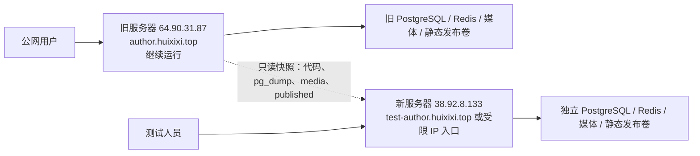

# AI Author Forum 旧服务器到测试服务器迁移方案

> 编制日期：2026-08-02（Asia/Shanghai）  
> 目标：保留旧服务器持续运行，不进行流量切换；将其可验证副本迁移到 `38.92.8.133`，作为独立测试环境。  
> 旧服务器：按项目 2026-07-31 部署快照推定为 `64.90.31.87`，执行前必须重新核验。  
> 重要：本方案不包含、也不要求复制仓库根目录 `.env` 中的服务器密码；所有新环境密钥必须重新生成。

## 1. 结论与推荐模式

采用 **一次性基线克隆 + 后续按需刷新数据**，而不是主备、双写或 DNS 切换。



核心原则：

1. **旧服务器零停机**：不停止旧 Web、Worker、PostgreSQL、Redis、Nginx，不修改旧 DNS。
2. **绝不共享中间件**：新服务器不能连接旧数据库或旧 Redis；使用 `MIDDLEWARE_MODE=local`。
3. **不复制 Redis**：Redis 中可能存在 Celery 延迟任务和缓存，复制会导致测试环境重放旧任务。
4. **代码以旧服务器实际稳定发布目录为准**：本地工作区当前有大量未提交/并发改动，不能把本地目录直接当作服务器版本。
5. **测试环境不可被搜索引擎收录**：Django 设置 `SEO_NOINDEX=true`，宿主机 Nginx 再添加 `X-Robots-Tag`；最好同时启用 Basic Auth 或 IP 白名单。
6. **测试环境使用独立密钥**：重新生成 Django `SECRET_KEY`、PostgreSQL 密码、Basic Auth 密码；不得直接复制旧服务器环境文件。
7. **先不开 Worker**：数据库恢复和站点核验完成后，再启动新服务器 Worker。
8. **不降低静态发布就绪校验**：保留 `STATIC_PUBLISH_ENFORCE_CONTENT_READINESS=true`。2026-07-31 快照中全站构建曾被 1087 项 blocker 正确阻断，测试环境也不能绕过。

## 2. 推荐的新服务器命名与隔离

| 项目 | 推荐值 |
|---|---|
| Compose project | `ai-author-forum-test` |
| 代码版本目录 | `/opt/ai-author-forum-test-<UTC时间戳>` |
| 稳定软链接 | `/opt/ai-author-forum-test-current` |
| 私有环境文件 | `/opt/ai-author-forum-test-shared/.env.test` |
| 迁移包目录 | `/opt/ai-author-forum-test-imports/<UTC时间戳>` |
| 备份目录 | `/opt/ai-author-forum-test-backups/` |
| 容器入口 | `127.0.0.1:18080` |
| 测试域名 | 建议 `test-author.huixixi.top` |
| PostgreSQL | `pgvector/pgvector:pg15`，独立命名卷 |
| Redis | `redis:7.2-alpine`，独立命名卷，不导入旧 Redis 数据 |

测试服务器使用现有三份 Compose 文件组合：

```bash
docker compose \
  --project-name ai-author-forum-test \
  --env-file /opt/ai-author-forum-test-shared/.env.test \
  -f docker-compose.production.yml \
  -f docker-compose.local-middleware.yml \
  -f docker-compose.preproduction.yml \
  "$@"
```

必须始终显式带 `--project-name ai-author-forum-test`，以确保卷、网络和容器不会与其他项目重名。

## 3. 迁移对象与禁止迁移对象

### 3.1 必须迁移

- 旧服务器 `/opt/ai-author-forum-current` 当前实际指向的发布代码。
- `.release-version`、Compose 文件、Dockerfile、容器 Nginx 配置及应用代码。
- PostgreSQL 一致性逻辑备份（`pg_dump -Fc`）。
- `media-data` 卷。
- `published-data` 卷，包括 releases、current、manifest 和逐页结果。
- 数据量、文件量、活动 manifest、容器镜像和代码包的校验信息。

### 3.2 不应直接迁移

- 旧 Redis 数据、Celery 队列和缓存。
- 旧服务器 `.env.preproduction`、仓库根目录 `.env` 或任何 SSH 密码。
- 旧服务器 TLS 私钥。测试域名应单独签发证书。
- `/opt/ai-author-forum-deploy.lock`、PID、socket、临时日志和 SSH tunnel 文件。
- 本地未提交工作区，除非另行做一次明确的测试版本发布。
- PostgreSQL/Redis Docker 原始卷目录的文件级复制。数据库应使用 `pg_dump/pg_restore`。

## 4. 阶段一：迁移前只读核验

项目部署状态文档是 **2026-07-31 的历史快照**；当前日期为 **2026-08-02**，不能直接把历史目录、manifest、证书状态当作当前事实。

### 4.1 旧服务器核验

```bash
date --iso-8601=seconds
timedatectl status
readlink -f /opt/ai-author-forum-current
docker compose ls
docker ps --format 'table {{.Names}}\t{{.Image}}\t{{.Status}}\t{{.Ports}}'
df -h / /opt
free -h
sudo nginx -t
curl -fsS https://author.huixixi.top/healthz/
```

记录但不要在聊天或日志中输出：

- 当前发布目录。
- 当前 Compose project 名称。
- database、redis、web、worker、static-frontend、nginx 容器 ID。
- Web 容器挂载的 `media-data`、`published-data`、`static-data` 实际卷名。
- 当前 active manifest 和静态文件数。
- 当前数据库镜像大版本、Redis 大版本。

查卷名时通过容器挂载反查，不凭名称猜测：

```bash
OLD_PROJECT='<核验得到的旧 Compose project>'
WEB_CID="$(docker ps -q \
  --filter "label=com.docker.compose.project=${OLD_PROJECT}" \
  --filter 'label=com.docker.compose.service=web' | head -n1)"

[ -n "$WEB_CID" ] || { echo 'web container not found'; exit 1; }

docker inspect "$WEB_CID" \
  --format '{{range .Mounts}}{{println .Destination .Name}}{{end}}'
```

### 4.2 新服务器预检

```bash
date --iso-8601=seconds
timedatectl status
cat /etc/os-release
uname -a
df -h / /opt
free -h
nproc
docker version
docker compose version
sudo nginx -t
```

建议资源：

- 最低：4 vCPU、8 GiB RAM、100 GiB 磁盘。
- 磁盘至少保留“当前数据库 + media + published + Docker 镜像”总量的 3 倍，以容纳导入包、运行卷和回滚备份。
- NTP 必须同步，时区统一为 `Asia/Shanghai`；旧服务器 2026-07-31 曾记录系统日期偏差，迁移前要重点复核。

如果新服务器尚未安装 Docker Engine、Compose plugin 和宿主机 Nginx，应先按其实际 Linux 发行版完成安装。数据库与 Redis 端口不得开放到公网。

## 5. 阶段二：在旧服务器制作不停机快照

### 5.1 一致性策略

推荐安排一个 10～20 分钟的“变更静默窗口”：

- 网站仍然正常对外服务，不停止任何容器。
- 暂时不要在后台执行文章导入、图片删除、静态发布、回滚或大量内容修改。
- 普通前台访问不受影响。

若不能安排静默窗口，则使用：

1. 第一次复制 media；
2. 执行数据库 `pg_dump`；
3. 第二次增量复制 media，且不删除第一次已复制的文件；
4. 单独锁定并记录某个 active static release。

这样数据库快照引用的新增媒体大概率能在第二遍进入迁移包；额外媒体文件留在测试环境通常无害。

### 5.2 快照目录

```bash
STAMP="$(date -u +%Y%m%dT%H%M%SZ)"
SNAP="/opt/ai-author-forum-migration-${STAMP}"
CURRENT="$(readlink -f /opt/ai-author-forum-current)"

case "$CURRENT" in
  /opt/ai-author-forum-*) ;;
  *) echo "unexpected current release: $CURRENT"; exit 1 ;;
esac

sudo install -d -m 0700 "$SNAP"
printf '%s\n' "$CURRENT" | sudo tee "$SNAP/source-release.txt" >/dev/null
```

### 5.3 代码包

不要把私有环境文件打入迁移包：

```bash
sudo tar \
  --exclude='.git' \
  --exclude='.env' \
  --exclude='.env.*' \
  --exclude='tmp' \
  --exclude='.deploy-*' \
  --exclude='*.pid' \
  -C "$CURRENT" \
  -czf "$SNAP/code.tar.gz" .
```

`.env.example` 等示例文件被排除并不影响部署；新服务器从本方案创建独立 `.env.test`。

### 5.4 PostgreSQL 逻辑备份

先精确定位旧项目 database 容器：

```bash
DB_CID="$(docker ps -q \
  --filter "label=com.docker.compose.project=${OLD_PROJECT}" \
  --filter 'label=com.docker.compose.service=database' | head -n1)"

[ -n "$DB_CID" ] || { echo 'database container not found'; exit 1; }

docker exec "$DB_CID" sh -c \
  'pg_dump -U "$POSTGRES_USER" -d "$POSTGRES_DB" -Fc' \
  > "$SNAP/database.dump"
```

`pg_dump` 使用 PostgreSQL MVCC 一致性快照，正常情况下不会停止旧站点读写。

校验：

```bash
docker exec -i "$DB_CID" pg_restore --list < "$SNAP/database.dump" >/dev/null
```

### 5.5 media 与 published 归档

从 `docker inspect "$WEB_CID"` 输出中取得准确卷名，然后进行强校验：

```bash
MEDIA_VOL='<核验得到的 /data/media 卷名>'
PUBLISHED_VOL='<核验得到的 /data/published 卷名>'

[ -n "$MEDIA_VOL" ] && docker volume inspect "$MEDIA_VOL" >/dev/null
[ -n "$PUBLISHED_VOL" ] && docker volume inspect "$PUBLISHED_VOL" >/dev/null
```

使用只读挂载归档：

```bash
docker run --rm \
  --mount "type=volume,src=${MEDIA_VOL},dst=/source,readonly" \
  --mount "type=bind,src=${SNAP},dst=/backup" \
  alpine:3.20 sh -c 'tar -C /source -czf /backup/media.tar.gz .'

docker run --rm \
  --mount "type=volume,src=${PUBLISHED_VOL},dst=/source,readonly" \
  --mount "type=bind,src=${SNAP},dst=/backup" \
  alpine:3.20 sh -c 'tar -C /source -czf /backup/published.tar.gz .'

gzip -t "$SNAP/media.tar.gz"
gzip -t "$SNAP/published.tar.gz"
tar -tzf "$SNAP/media.tar.gz" >/dev/null
tar -tzf "$SNAP/published.tar.gz" >/dev/null
```

如果旧服务器不能或不应临时拉取 `alpine:3.20`，可使用已经存在且包含 `tar` 的受信任本地镜像。

### 5.6 生成校验清单

```bash
(
  cd "$SNAP"
  sha256sum code.tar.gz database.dump media.tar.gz published.tar.gz > SHA256SUMS
  du -sh code.tar.gz database.dump media.tar.gz published.tar.gz > SIZES.txt
)
```

迁移包中可以包含：容器镜像名、容器状态、active manifest、数据库表数量统计；不得包含环境变量值或密码。

## 6. 阶段三：传输到新服务器

优先使用 SSH key 和 `rsync`；不要在命令行中写密码。

```bash
rsync -aH --partial --info=progress2 \
  "$SNAP/" \
  root@38.92.8.133:"/opt/ai-author-forum-test-imports/${STAMP}/"
```

如果旧服务器不能直接访问新服务器，则通过受控本地机器中转两次。到达新服务器后必须先校验：

```bash
cd "/opt/ai-author-forum-test-imports/${STAMP}"
sha256sum -c SHA256SUMS
```

任何一项失败都应重新传输对应文件，不进入恢复阶段。

## 7. 阶段四：构建新服务器独立测试环境

### 7.1 解压代码并创建稳定软链接

```bash
RELEASE="/opt/ai-author-forum-test-${STAMP}"
IMPORT="/opt/ai-author-forum-test-imports/${STAMP}"

sudo install -d -m 0755 "$RELEASE"
sudo tar -xzf "$IMPORT/code.tar.gz" -C "$RELEASE"
sudo ln -sfn "$RELEASE" /opt/ai-author-forum-test-current
```

不要复用 `/opt/ai-author-forum-current`，避免未来运维人员把测试环境误认成正式环境。

### 7.2 创建私有 `.env.test`

```bash
sudo install -d -m 0700 /opt/ai-author-forum-test-shared
sudo install -m 0600 /dev/null /opt/ai-author-forum-test-shared/.env.test
```

建议内容如下，所有占位符在服务器上本地替换：

```dotenv
SECRET_KEY=<新生成的独立长随机值>
MIDDLEWARE_MODE=local
POSTGRES_PASSWORD=<新生成的独立数据库密码>
DATABASE_URL=postgresql://ai_author_forum:<URL编码后的新密码>@database:5432/ai_author_forum
CACHE_BACKEND=django.core.cache.backends.redis.RedisCache
CACHE_LOCATION=redis://redis:6379/1
CELERY_BROKER_URL=redis://redis:6379/0
CELERY_RESULT_BACKEND=redis://redis:6379/0

ALLOWED_HOSTS=38.92.8.133,test-author.huixixi.top
CSRF_TRUSTED_ORIGINS=https://test-author.huixixi.top,http://38.92.8.133
WAGTAILADMIN_BASE_URL=https://test-author.huixixi.top

SECURE_SSL_REDIRECT=true
SESSION_COOKIE_SECURE=true
CSRF_COOKIE_SECURE=true
SECURE_HSTS_SECONDS=0
SECURE_HSTS_INCLUDE_SUBDOMAINS=false
SECURE_HSTS_PRELOAD=false
STATIC_PUBLISH_HEALTHCHECK_BROKER=true
STATIC_PUBLISH_BROKER_HEALTHCHECK_TIMEOUT=2

# 该值会展开为 127.0.0.1:18080:80，使容器 Nginx 仅供宿主机反代访问。
HTTP_PORT=127.0.0.1:18080
```

如果测试域名和 HTTPS 尚未就绪，首次仅通过 IP 验证时临时使用：

```dotenv
WAGTAILADMIN_BASE_URL=http://38.92.8.133
SECURE_SSL_REDIRECT=false
SESSION_COOKIE_SECURE=false
CSRF_COOKIE_SECURE=false
```

域名证书完成后必须改回 HTTPS 配置。

### 7.3 添加测试环境 Overlay

现有 `docker-compose.production.yml` 只向容器传入固定环境变量。仅把 `SEO_NOINDEX` 等变量写进 `.env.test` 不会自动生效，因此在新服务器发布目录创建 `docker-compose.test.yml`：

```yaml
services:
  web:
    environment:
      SEO_NOINDEX: "true"
      TIME_ZONE: "Asia/Shanghai"
      CELERY_TASK_DEFAULT_QUEUE: "ai-author-forum-test"
      STATIC_PUBLISH_ENFORCE_CONTENT_READINESS: "true"
      STATIC_PUBLISH_AUTO_ON_PLACEMENT_CHANGE: "false"

  worker:
    environment:
      SEO_NOINDEX: "true"
      TIME_ZONE: "Asia/Shanghai"
      CELERY_TASK_DEFAULT_QUEUE: "ai-author-forum-test"
      STATIC_PUBLISH_ENFORCE_CONTENT_READINESS: "true"
      STATIC_PUBLISH_AUTO_ON_PLACEMENT_CHANGE: "false"
```

首次核验后，如果确实要测试投放自动发布，再把 `STATIC_PUBLISH_AUTO_ON_PLACEMENT_CHANGE` 改成 `true` 并重建 Web/Worker。

### 7.4 定义统一命令变量

```bash
cd /opt/ai-author-forum-test-current

compose_test() {
  docker compose \
    --project-name ai-author-forum-test \
    --env-file /opt/ai-author-forum-test-shared/.env.test \
    -f docker-compose.production.yml \
    -f docker-compose.local-middleware.yml \
    -f docker-compose.preproduction.yml \
    -f docker-compose.test.yml \
    "$@"
}

compose_test config >/dev/null
```

`compose_test config` 的输出可能展开密钥；只检查退出码，不把完整输出贴入日志或聊天。

## 8. 阶段五：恢复数据库和文件

### 8.1 只启动数据库和空 Redis

```bash
compose_test pull database redis nginx
compose_test build web worker static-frontend
compose_test up -d database redis
compose_test ps
```

此时不要启动 Web 和 Worker。

### 8.2 创建应用卷但不启动应用

```bash
compose_test create web worker static-frontend nginx
WEB_CID="$(compose_test ps -aq web)"
[ -n "$WEB_CID" ] || { echo 'test web container not created'; exit 1; }

docker inspect "$WEB_CID" \
  --format '{{range .Mounts}}{{println .Destination .Name}}{{end}}'
```

记录新测试项目的 `/data/media` 和 `/data/published` 实际卷名，并确认卷名以 `ai-author-forum-test_` 开头。

### 8.3 恢复 media 与 published

仅允许向刚创建的空测试卷解压，不覆盖任何其他项目卷：

```bash
TEST_MEDIA_VOL='<新测试环境 /data/media 卷名>'
TEST_PUBLISHED_VOL='<新测试环境 /data/published 卷名>'

case "$TEST_MEDIA_VOL" in ai-author-forum-test_*) ;; *) exit 1 ;; esac
case "$TEST_PUBLISHED_VOL" in ai-author-forum-test_*) ;; *) exit 1 ;; esac

docker run --rm \
  --mount "type=volume,src=${TEST_MEDIA_VOL},dst=/target" \
  --mount "type=bind,src=${IMPORT},dst=/backup,readonly" \
  alpine:3.20 sh -c 'tar -xzf /backup/media.tar.gz -C /target'

docker run --rm \
  --mount "type=volume,src=${TEST_PUBLISHED_VOL},dst=/target" \
  --mount "type=bind,src=${IMPORT},dst=/backup,readonly" \
  alpine:3.20 sh -c 'tar -xzf /backup/published.tar.gz -C /target'
```

不要对来源不明或未校验的卷执行清空命令。如需重做恢复，应删除并重新创建 **已严格确认属于 `ai-author-forum-test` 的测试卷**，而不是在卷内盲目递归删除。

### 8.4 恢复 PostgreSQL

```bash
DB_CID="$(compose_test ps -q database)"
[ -n "$DB_CID" ] || { echo 'test database container not running'; exit 1; }

# 新环境数据库尚无业务数据时，重建空库。
docker exec "$DB_CID" sh -c \
  'dropdb -U "$POSTGRES_USER" --if-exists "$POSTGRES_DB" && createdb -U "$POSTGRES_USER" "$POSTGRES_DB"'

docker exec -i "$DB_CID" sh -c \
  'pg_restore -U "$POSTGRES_USER" -d "$POSTGRES_DB" --no-owner --no-privileges' \
  < "$IMPORT/database.dump"
```

恢复错误必须人工检查；不能仅因为 `pg_restore` 返回了若干 warning 就默认成功。

### 8.5 数据库迁移和站点域名调整

```bash
compose_test run --rm --no-deps web python manage.py migrate --noinput
compose_test run --rm --no-deps web python manage.py createcachetable
compose_test run --rm --no-deps web python manage.py collectstatic --noinput
```

更新 **克隆数据库** 中 Wagtail 默认站点域名，绝不能在旧数据库上执行：

```bash
compose_test run --rm --no-deps web python manage.py shell -c '
from wagtail.models import Site
site = Site.objects.filter(is_default_site=True).first()
assert site is not None
site.hostname = "test-author.huixixi.top"
site.port = 443
site.save(update_fields=["hostname", "port"])
print(site.hostname, site.port)
'
```

如果暂时只用 IP 和 HTTP，将 hostname/port 临时设为 `38.92.8.133`/`80`，域名启用后再更新。

新 `SECRET_KEY` 会使旧服务器会话不可复用。建议在新服务器创建或重置专用测试管理员账号，不要把密码写入 Git 或命令历史：

```bash
compose_test run --rm --no-deps web python manage.py changepassword <测试管理员用户名>
```

## 9. 阶段六：分级启动，避免任务误执行

### 9.1 第一阶段：不启动 Worker

```bash
compose_test up -d web static-frontend nginx
compose_test ps
curl -fsS -H 'Host: test-author.huixixi.top' http://127.0.0.1:18080/healthz/
curl -I -H 'Host: test-author.huixixi.top' http://127.0.0.1:18080/admin/
```

此时检查：

- Web 和 static-frontend 均 healthy。
- `/healthz/` 返回 200。
- `/admin/` 返回 302 到登录页。
- 首页与已有固定 HTML 页面可访问。
- media 文件可访问。
- active manifest 与迁移快照一致。
- 测试数据库内没有连接旧服务器的主机名。
- Redis 是空的新 Redis。
- 旧服务器日志和页面仍正常。

数据库克隆可能带有历史 queued/running 发布记录，但旧 Redis 任务没有被复制。启动 Worker 前应在后台检查这些状态，必要时按测试审计流程将陈旧记录标注为失败或取消；不要伪造成功记录。

### 9.2 第二阶段：启动 Worker

确认没有待重放任务后：

```bash
compose_test up -d worker
compose_test ps
compose_test logs --since=10m worker
```

先执行一个小范围、可回滚的选择性静态发布，不要立即执行全站发布。保留内容就绪检查，检查：

- Celery 任务只进入新 Redis。
- 新发布只修改 `ai-author-forum-test` 的 `published-data`。
- 新增 started/success 或 failure 审计记录。
- 旧服务器 active manifest 未变化。

## 10. 阶段七：宿主机 Nginx、域名与 HTTPS

### 10.1 DNS

为测试环境创建独立记录：

```text
test-author.huixixi.top  A  38.92.8.133
```

不要修改 `author.huixixi.top` 的 A 记录，因此旧服务器流量不会受影响。

DNS 生效前可用本机 hosts 文件定向测试域名，或临时使用 IP。不要给测试环境使用正式域名证书和正式域名 server_name。

### 10.2 宿主机 Nginx 防护

建议测试站同时启用 Basic Auth 或办公 IP 白名单，并始终添加搜索引擎禁止头：

```nginx
server {
    listen 80;
    server_name test-author.huixixi.top;

    add_header X-Robots-Tag "noindex, nofollow, noarchive" always;

    location / {
        return 301 https://$host$request_uri;
    }
}

server {
    listen 443 ssl http2;
    server_name test-author.huixixi.top;

    ssl_certificate     /etc/letsencrypt/live/test-author.huixixi.top/fullchain.pem;
    ssl_certificate_key /etc/letsencrypt/live/test-author.huixixi.top/privkey.pem;

    add_header X-Robots-Tag "noindex, nofollow, noarchive" always;

    auth_basic "AI Author Forum Test";
    auth_basic_user_file /etc/nginx/.htpasswd-ai-author-forum-test;

    client_max_body_size 256m;

    location / {
        proxy_pass http://127.0.0.1:18080;
        proxy_set_header Host $host;
        proxy_set_header X-Real-IP $remote_addr;
        proxy_set_header X-Forwarded-For $proxy_add_x_forwarded_for;
        proxy_set_header X-Forwarded-Proto https;
    }
}
```

证书应在 DNS 指向新服务器并验证无误后单独签发。签发前不要启用强制 HTTPS 配置。`SECURE_HSTS_INCLUDE_SUBDOMAINS` 和 `SECURE_HSTS_PRELOAD` 在测试环境保持 false。

防火墙原则：

- 对公网仅开放 SSH、HTTP、HTTPS。
- `5432`、`6379`、`18080` 不对公网开放。
- SSH 优先限制来源 IP并使用密钥登录。

## 11. 验收清单

### 11.1 旧服务器无影响

- `https://author.huixixi.top/`、`/healthz/`、核心栏目、静态页面仍返回预期状态。
- 旧 Web、Worker、PostgreSQL、Redis、Nginx 容器没有被重启或重建。
- 旧 active manifest 未因测试操作变化。
- 旧数据库不存在测试环境唯一标记数据。
- 旧服务器最近日志没有迁移引发的 error/fatal/critical/traceback/exception。

### 11.2 新服务器基础验收

- 所有容器属于 Compose project `ai-author-forum-test`。
- database/redis/web/static-frontend healthy；worker 在人工允许后才启动。
- `python manage.py check --deploy` 无阻断错误。
- 首页、`/healthz/`、`/admin/`、Careers、Books & Culture、Podcasts、Videos 及抽样文章/子期刊页面可访问。
- 数据库关键模型数量与快照记录一致。
- media 文件数量/总大小与归档记录一致。
- published active manifest 可读取，固定 HTML 不依赖数据库运行时查询。
- 测试域名、Wagtail Site、`ALLOWED_HOSTS`、CSRF origin 和 `WAGTAILADMIN_BASE_URL` 均指向测试环境。
- 响应包含 `X-Robots-Tag: noindex, nofollow, noarchive`。
- 未开放 PostgreSQL、Redis 和 18080 到公网。
- 新服务器静态发布的 AuditLog、失败记录、manifest、重试和回滚均可工作。

### 11.3 隔离性验收

在新环境创建一个明确带时间戳的测试记录，例如 `TEST-ONLY-20260802-...`：

- 新数据库能查到。
- 旧数据库查不到。
- 新 Redis 出现测试队列活动时，旧 Redis无对应变化。
- 新 published manifest 变化时，旧 active manifest 不变。
- 删除测试记录也必须遵循业务权限和审计机制，不绕过后台审计。

## 12. 回滚与清理

本方案没有切换正式流量，因此新服务器失败不会要求旧服务器回滚；旧服务器始终是稳定服务源。

### 12.1 新服务器应用回滚

- 停止 `ai-author-forum-test` Compose project。
- 将 `/opt/ai-author-forum-test-current` 指回上一测试版本目录。
- 使用新服务器的测试备份恢复数据库、media 和 published。
- 重新启动并执行同一验收清单。

### 12.2 完全废弃测试环境

只有在严格确认 Compose project 和卷归属后，才可停止并清理测试环境。禁止对模糊匹配、空变量或 `/opt` 上的计算路径执行递归删除。

旧服务器的任何目录、卷、镜像、数据库或 Redis 都不参与测试环境清理。

## 13. 后续数据刷新策略

新服务器主要用于测试，建议采用手工、可审计的刷新方式：

1. 新服务器先备份当前测试数据库/media/published。
2. 关闭新服务器 Worker，禁止测试写入。
3. 从旧服务器重新制作 `pg_dump + media + published` 快照。
4. 校验 SHA256 后恢复到新测试卷。
5. 重新修改 Wagtail Site 为测试域名。
6. 保留新环境独立 SECRET_KEY、数据库密码、Nginx Basic Auth 和 TLS 证书。
7. 核验陈旧任务状态后再启动 Worker。

不建议：

- PostgreSQL 持续流复制，因为测试写入会与只读副本目标冲突。
- 主从切换或双写，因为本次没有灾备切换需求。
- 新环境直接读取旧数据库，因为任何测试写入、迁移或后台操作都可能污染现网。
- 自动每天覆盖测试库，除非已有数据脱敏、备份、通知和审计流程。

## 14. 推荐执行顺序

1. 核验旧服务器当前发布目录、Compose project、容器、卷和 active manifest。
2. 核验新服务器系统时间、磁盘、内存、Docker、Compose、Nginx 和防火墙。
3. 创建测试域名或准备 hosts 定向。
4. 在旧服务器不停机生成代码、数据库、media、published 快照及 SHA256。
5. 传输到 `38.92.8.133` 并验证 SHA256。
6. 创建独立代码目录、软链接、`.env.test` 和 `docker-compose.test.yml`。
7. 只启动新 PostgreSQL/Redis，恢复数据库和文件卷。
8. 修改克隆数据库中的 Wagtail Site 域名，运行 migrate/collectstatic。
9. 不启动 Worker，先启动 Web/static-frontend/nginx 做基础验收。
10. 配置宿主机 Nginx、Basic Auth/noindex、DNS 和 HTTPS。
11. 检查陈旧任务后启动 Worker，执行小范围选择性发布与回滚测试。
12. 验证旧服务器完全未受影响，并保存迁移报告、校验值和新服务器黄金备份。

## 15. 本次方案的明确边界

- 本文是迁移执行方案，尚未对 `38.92.8.133` 执行任何安装、传输、恢复、DNS 或防火墙操作。
- 旧服务器当前真实目录、Compose project、active manifest 和数据量必须在执行当日重新获取。
- 旧服务器 2026-07-31 部署快照中记录的 `/opt/ai-author-forum-20260731T161843Z-media-deps` 和 job15 不能未经核验直接视为 2026-08-02 的当前状态。
- 所有密码、SSH 信息和私钥只允许在服务器私有配置中受控保存，严禁提交 Git、写入本文件或回显到命令输出。
